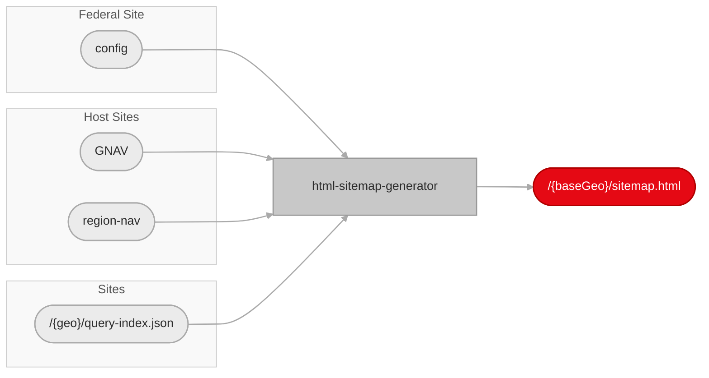

# HTML Sitemap Generator

A Node.js pipeline that builds localized HTML sitemap pages for Adobe sites and promotes them through DA and AEM.

This README is the primary orientation and operator guide for the generator. It owns:

- why the generator exists
- the product model and page shape
- the stage architecture
- the public CLI and config interface
- auth, outputs, and day-to-day usage

See [SPEC.md](./SPEC.md) for the supplementary behavioral reference:

- detailed fetch, transform, and rendering rules
- source inventory context and architectural snapshots
- fallback behavior, warning conditions, and normalization rules

## Why

Crawlers and LLM agents need a navigable, indexable HTML entry point for Adobe's localized pages. XML sitemaps alone do not provide human-readable titles, regional grouping, or easy movement between localized surfaces.

This matters even more during Project Lingo, where Adobe is consolidating country-first structures into language-first structures. The sitemap pages are intended to surface the smaller set of indexable pages clearly and consistently so discovery remains strong while redundant regional content shrinks.

Primary audiences:

- Googlebot and other search crawlers
- LLM agents that benefit from explicit regional navigation
- humans who land on these pages directly

## Product Model

Each supported subdomain gets a family of sitemap pages:

- one page for the default/root base geo
- one page for each additional base geo that qualifies for output

Each sitemap page has two sections:

1. Base-geo links from GNAV
2. Extended-geo links from each extended geo's query indices

### Terminology

| Term | Definition |
|------|-----------|
| **Geo** | A locale or region code such as `fr`, `be_en`, `ch_fr` |
| **Base Geo** | A geo with its own dedicated `sitemap.html` |
| **Extended Geo** | A geo whose unique pages are surfaced within a base geo's sitemap instead of getting its own page |

### Page Emission Rule

A base geo emits sitemap output only when at least one base-geo query index from any configured site returns indexable URLs.

If all query indices for a base geo:

- 404
- fail in a skippable way
- or return no indexable rows

then that base geo does not emit a sitemap page.

This rule affects both:

- whether a base-geo local output folder exists after `extract`
- whether downstream stages have anything to transform or promote

## Page Semantics

### Section 1: Base Geo Links

This section is derived from GNAV structure.

- H3 groups top-level categories
- H4 groups subcategories
- links preserve navigational grouping as closely as possible

### Section 2: Extended Geo Links

This section contains extended-geo pages grouped by geo label.

Within a single extended geo, entries from different site families (e.g. `cc`, `da-cc`) that resolve to the same canonical path are collapsed: legacy `cc` paths with a trailing `.html` and modern `da-*` paths without are treated as the same page, with the `da-*` variant preferred.

Extended-geo entries are NOT deduplicated against the base geo. A page that exists at both `/fr/foo` and `/lu_fr/foo` will appear in both the base section and under the extended geo group.

- geo labels come from `page-copy.label`; a trailing ` - <language>` qualifier is stripped at render time

### Title cleanup

Page titles from query-index rows and GNAV links are normalized by stripping trailing Adobe-branding suffixes such as `| Adobe`, `- Adobe`, `– Adobe Substance 3D`, or `| adobe.com`. The rule looks for the last whitespace-bounded `|`, `-`, en-dash, or em-dash and only strips when "adobe" appears in the trailing segment, so legitimate subtitles like `Acrobat Pro - DC` are preserved. The original pre-cleanup value is exposed as `originalTitle` on each link in `sitemap.json` and `sitemap-links.csv` for auditing. See SPEC's [Title cleanup](SPEC.md#title-cleanup) for the full algorithm and examples.

## Architecture

The pipeline is described in terms of `stages`. In GitHub Actions, those stages may later be mapped to one or more workflow `steps` or jobs, but the generator's contract remains stage-oriented.

### Inputs and Outputs



### Pipeline Overview

The diagram below is intentionally minimal: stage names and flow only. File names, config keys, and other artifacts are listed in [Stage details](#stage-details) so the graph stays easy to read in editors and exports.

```mermaid
%%{
  init: {
    "theme": "base",
    "flowchart": {
      "htmlLabels": false,
      "padding": 24,
      "nodeSpacing": 50,
      "rankSpacing": 52
    },
    "themeVariables": {
      "fontSize": "15px",
      "lineColor": "#555555",
      "primaryTextColor": "#2C2C2C",
      "clusterBkg": "#FAFAFA",
      "clusterBorder": "#CCCCCC",
      "titleColor": "#555555",
      "edgeLabelBackground": "#FFFFFF",
      "edgeLabelColor": "#555555"
    }
  }
}%%
flowchart LR

  subgraph GHA["GitHub"]
    Extract["extract\nGNAV · query indices · region-nav"]
    TransformData["transform-data\nsitemap.json"]
    TransformDA["transform-da\nsitemap.html"]
    Diff["diff\nlocal ↔ DA"]
  end

  subgraph DA["DA"]
    Push["push\nda.live"]
  end

  subgraph AEM["AEM"]
    Preview["preview\naem.page"]
    Publish["publish\naem.live"]
  end

  Extract       --> TransformData
  TransformData --> TransformDA
  TransformDA   --> Diff
  Diff          -.-> Push
  Push          --> Preview
  Preview       --> Publish

  linkStyle default stroke:#AAAAAA,stroke-width:1.5px

  style Extract       fill:#EBEBEB,stroke:#AAAAAA,stroke-width:1.5px,color:#2C2C2C
  style TransformData fill:#EBEBEB,stroke:#AAAAAA,stroke-width:1.5px,color:#2C2C2C
  style TransformDA   fill:#EBEBEB,stroke:#AAAAAA,stroke-width:1.5px,color:#2C2C2C
  style Diff          fill:#EBEBEB,stroke:#AAAAAA,stroke-width:1.5px,color:#2C2C2C
  style Push          fill:#C8C8C8,stroke:#999999,stroke-width:1.5px,color:#2C2C2C
  style Preview       fill:#C8C8C8,stroke:#999999,stroke-width:1.5px,color:#2C2C2C
  style Publish       fill:#E50914,stroke:#B00000,stroke-width:1.5px,color:#FFFFFF

  style GHA fill:#F9F9F9,stroke:#CCCCCC,stroke-width:1px
  style DA  fill:#F9F9F9,stroke:#CCCCCC,stroke-width:1px
  style AEM fill:#F9F9F9,stroke:#CCCCCC,stroke-width:1px
```



### Stage Details

| Stage | Artifacts / focus |
|-------|-------------------|
| **Config** | `config`, `query-index-map`, `geo-map`, `page-copy` |
| **GNAV** | `fragments`, `placeholders` |
| **Query indices** | `query-index.json` paths (per site x geo) |
| **Region-nav** | `regions.html` fragment |
| **extract** | Config snapshot; GNAV fragments + manifest; placeholders; query indices; region-nav HTML; persisted under `_extract/` |
| **transform-data** | `sitemap.json` |
| **transform-da** | `sitemap.html`; `manifest.json`; `manifest.csv` (per subdomain) |
| **diff** | Read-only: compares local `sitemap.html` to DA |
| **push** | Uploads `sitemap.html` to DA |
| **preview** | Promotes path in AEM preview |
| **publish** | Promotes path in AEM live |

Interpretation:

- `extract` fetches remote sources and persists them locally for deterministic downstream transforms
- `transform-data` converts extracted inputs into normalized sitemap page data (`sitemap.json`)
- `transform-da` renders HTML from normalized data and writes per-subdomain manifests
- `diff` compares local HTML against what is currently in DA; read-only
- `push` uploads changed pages to DA; skips unchanged pages unless `--force` is set
- `preview` and `publish` promote the corresponding remote document path in AEM
- only geos with a non-empty `stage` in the config are eligible for delivery; `stage` selects how far each geo travels (`push`, `preview`, or `publish`)

## Prerequisites

- Node.js 24 or higher

## Setup

```bash
cd .github/workflows/html-sitemap
npm install
```

From the repo root:

```bash
npm --prefix .github/workflows/html-sitemap install
npm --prefix .github/workflows/html-sitemap run typecheck
npm --prefix .github/workflows/html-sitemap run test
```

## Environment

Only `diff`, `push`, `preview`, and `publish` require auth.

```bash
# DA auth for service account / production automation
# Used when no direct DA bearer token override is provided.
ROLLING_IMPORT_IMS_URL=https://...
ROLLING_IMPORT_CLIENT_ID=...
ROLLING_IMPORT_CLIENT_SECRET=...
ROLLING_IMPORT_CODE=...
ROLLING_IMPORT_GRANT_TYPE=authorization_code

# Direct DA bearer token for local/manual runs
DA_SOURCE_TOKEN=...
DA_TOKEN=...

# AEM admin tokens for preview + publish
# Use the raw auth_token cookie value from https://admin.hlx.page/profile
# Resolved per site in this order (first match wins):
#   AEM_ADMIN_TOKEN_ADOBECOM_{SITE}  (e.g. AEM_ADMIN_TOKEN_ADOBECOM_DA_BACOM)
#   AEM_ADMIN_TOKEN_{SITE}           (e.g. AEM_ADMIN_TOKEN_DA_BACOM)
#   AEM_ADMIN_TOKEN                  (shared fallback)
#   AEM_TOKEN                        (shared fallback)
#   HLX_ADMIN_TOKEN                  (legacy fallback)
AEM_ADMIN_TOKEN_ADOBECOM_DA_BACOM=...
AEM_ADMIN_TOKEN_ADOBECOM_DA_CC=...
```

## CLI

Run help:

```bash
node .github/workflows/html-sitemap/generate.ts --help
```

Usage:

```text
node --env-file=.env generate.ts [stage] [mode] [options]
node --env-file=.env generate.ts --stages <list> [options]
```

`--env-file` is resolved relative to the current shell working directory, not relative to `.github/workflows/html-sitemap/`.

Canonical stage ids:

- `clean`
- `extract`
- `transform-data`
- `transform-da`
- `diff`
- `push`
- `preview`
- `publish`

Convenience shortcuts:

- `transform data` -> `transform-data`
- `transform da` -> `transform-da`
- `transform` -> `transform-data`, then `transform-da`

Rules:

- Positional stage mode and `--stages` are mutually exclusive.
- `--stages` accepts comma-separated canonical stage ids.
- Multi-stage execution order is normalized in code.
- Delivery stages are fail-fast in multi-stage runs:
  - a `push` failure stops the pipeline before `preview` or `publish`
  - a `preview` failure stops the pipeline before `publish`
- No stage selection prints help and exits non-zero.

Options:

- `--config <url|path>`: sitemap config JSON
- `--output <dir>`: local output root
- `--subdomain <name>`: filter to `www` or `business`
- `--geo <prefix>`: filter to a single base geo (development use; see note below)
- `--da-root <path>`: remote DA/AEM document root for `diff`, `push`, `preview`, `publish`
- `--force`: push even if remote content is unchanged (bypasses change detection)
- `--stages <list>`: comma-separated canonical stage ids
- `-h`, `--help`: print help

`--geo default` and `--geo root` both target the empty/root base geo.

`--subdomain` is safe to use in production — subdomains are independent and have separate manifests and output directories.

`--geo` is intended for local development and debugging. The per-subdomain manifest only reflects the geos generated in that run. Production runs should omit `--geo` to generate complete manifests and let the config `stage` field control which pages get promoted.

Examples:

```bash
# Extract + transform locally
node --env-file=.env .github/workflows/html-sitemap/generate.ts extract --subdomain www --geo fr
node --env-file=.env .github/workflows/html-sitemap/generate.ts transform --subdomain www --geo fr

# Explicit multi-stage run
node --env-file=.env .github/workflows/html-sitemap/generate.ts --stages extract,transform-data,transform-da --subdomain business

# Delivery stages
node --env-file=.env .github/workflows/html-sitemap/generate.ts push --subdomain business --geo default --da-root /drafts/hgpa/html-sitemap
node --env-file=.env .github/workflows/html-sitemap/generate.ts preview --subdomain business --geo default --da-root /drafts/hgpa/html-sitemap
node --env-file=.env .github/workflows/html-sitemap/generate.ts publish --subdomain business --geo default --da-root /drafts/hgpa/html-sitemap
```

## Input Contract

The generator reads a multi-sheet JSON config file. Default:

- `https://main--federal--adobecom.aem.live/federal/assets/data/html-sitemap.json`

Override with `--config <url|path>`.

The live config JSON is the source of truth for query-index paths, geo mappings, deployment eligibility, and page copy:

- [`html-sitemap.json`](https://main--federal--adobecom.aem.live/federal/assets/data/html-sitemap.json)

That means current site lists and country coverage should be read from config first. `SPEC.md` may retain snapshots for architectural context, but the config is authoritative when they differ.

Expected top-level sheets:

- `config`
- `query-index-map`
- `geo-map`
- `page-copy`

The format is compatible with AEM multi-sheet JSON:

- https://www.aem.live/developer/spreadsheets#multi-sheet-format

### `config`

Maps each subdomain to its production domain, host site, and behavior settings.

| Field | Required | Description |
|-------|----------|-------------|
| `subdomain` | yes | Short name used as the output directory and filter key (`business`, `www`) |
| `domain` | yes | Production domain (`business.adobe.com`, `www.adobe.com`) |
| `site` | yes | Host site / repo name for AEM origin URLs (`da-bacom`, `da-cc`) |
| `extendedSitemap` | yes | `language` — include only the base geo's mapped extended geos; `all` — include every extended geo in the subdomain |
| `template` | no | DA template filename; defaults to `da-sitemap.html` |

### `query-index-map`

Maps each site to its query-index path.

| Field | Required | Description |
|-------|----------|-------------|
| `subdomain` | yes | Subdomain this row belongs to (falls back to `domain` field if absent) |
| `site` | yes | Site / repo name (`da-bacom`, `cc`, `edu`, etc.) |
| `queryIndexPath` | yes | Path to the query-index JSON on the site origin |
| `enabled` | no | Set to `true`, `1`, `yes`, or `on` to include in extraction; defaults to disabled when empty or omitted |

### `geo-map`

Maps each base geo to its language, extended-geo assignments, and how far the pipeline should deploy it.

| Field | Required | Description |
|-------|----------|-------------|
| `subdomain` | yes | Subdomain this row belongs to (falls back to `domain` field if absent) |
| `baseGeo` | no | Geo code for the base geo; empty string or omitted for the root geo |
| `language` | yes | Language code for this base geo (`en`, `fr`, `ja`, etc.) |
| `extendedGeos` | no | Comma-separated list of extended geo codes assigned to this base geo |
| `stage` | no | Deployment stage: `push`, `preview`, `publish`, or empty (extract & transform only). Case-insensitive. |
| `note` | no | Free-form editorial notes; not consumed by the pipeline |

`stage` is the maximum stage the pipeline will reach for this geo:

- empty or absent — extract and transform only; no DA upload, no AEM preview, no AEM publish
- `push` — also upload to DA
- `preview` — also trigger AEM preview
- `publish` — also trigger AEM publish

All geos are still extracted and transformed regardless of `stage`, preserving full data, manifests, and the ability to inspect any geo locally — `stage` only gates the delivery stages (`push`, `preview`, `publish`).

### `page-copy`

Per-(subdomain, geo) page copy. Provides geo labels and localized page titles.

| Field | Required | Description |
|-------|----------|-------------|
| `subdomain` | yes | Subdomain this row belongs to (falls back to `domain` field if absent) |
| `geo` | no | Geo code; matches a `baseGeo` or `extendedGeo` from `geo-map`. Empty string or omitted for the default/root sitemap. |
| `label` | no | Human-readable region label shown as the heading for each extended-geo group. A trailing `- <language>` qualifier is stripped at render time. |
| `pageTitle` | no | Localized `<h1>` and HTML `<title>` for the rendered sitemap; defaults to `Sitemap` when empty or row is missing. May contain `{{placeholders}}` resolved from the extracted placeholder map. |

For backwards compatibility a `baseGeo` cell is read as `geo` when `geo` is absent.

### Example

```json
{
  "config": {
    "data": [
      { "subdomain": "business", "domain": "business.adobe.com", "site": "da-bacom", "extendedSitemap": "all" },
      { "subdomain": "www", "domain": "www.adobe.com", "site": "da-cc", "extendedSitemap": "language", "template": "da-sitemap.html" }
    ]
  },
  "query-index-map": {
    "data": [
      { "subdomain": "business", "site": "da-bacom", "queryIndexPath": "/query-index.json", "enabled": "true" },
      { "subdomain": "www", "site": "cc", "queryIndexPath": "/cc-shared/assets/query-index.json", "enabled": "false" }
    ]
  },
  "geo-map": {
    "data": [
      { "subdomain": "business", "baseGeo": "", "language": "en", "extendedGeos": "ca, nl", "stage": "preview", "note": "" },
      { "subdomain": "business", "baseGeo": "fr", "language": "fr", "extendedGeos": "ca_fr, ch_fr", "stage": "publish", "note": "lingo phase 1" }
    ]
  },
  "page-copy": {
    "data": [
      { "subdomain": "business", "geo": "", "label": "", "pageTitle": "Sitemap" },
      { "subdomain": "business", "geo": "fr", "label": "France", "pageTitle": "Plan du site" }
    ]
  }
}
```

See [SPEC.md](./SPEC.md#source-inventory) for the live catalog snapshots showing current site and geo data.

## Output Contract

All stages read and write under a single local output root. Default:

- `tmp/html-sitemap`

Paths below are relative to that root.

Representative layout:

```text
/html-sitemap
  html-sitemap.json
    /business
      /_extract
        /gnav
          gnav.html
          products.html
          manifest.json
        regions.html
        placeholders.json
        /da-bacom
          query-index.json
    sitemap.json
    sitemap.html
    manifest.json
    manifest.csv
    /fr
      /_extract
        /gnav
          gnav.html
          manifest.json
        regions.html
        placeholders.json
        /da-bacom
          query-index.json
        /extended
          /ca_fr
            /da-bacom
              query-index.json
      sitemap.json
      sitemap.html
```

### File Formats

`html-sitemap.json`

- Local copy of the resolved config input
- Written by `extract`

`_extract/gnav/*.html`

- Raw GNAV fragment HTML persisted from source `.plain.html`
- Written by `extract`

`_extract/gnav/manifest.json`

- Directory-level manifest for persisted GNAV artifacts
- Maps local files back to source provenance and fragment role
- Written by `extract`

`_extract/placeholders.json`

- Raw placeholders payload used later by transform
- Written by `extract`

`_extract/**/query-index.json`

- Raw query-index payloads fetched per site and geo
- Written by `extract`

`sitemap.json`

- Normalized intermediate data for one sitemap page
- Written by `transform-data`
- Consumed by `transform-da`
- Defines the render contract for the final sitemap page
- Uses `page-copy.label` values for `extendedGeoLinks[*].title`, stripping any trailing ` - <language>` suffix; falls back to `Intl.DisplayNames`-generated labels when the page-copy row is absent

Shape:

```json
{
  "subdomain": "business",
  "baseGeo": "",
  "domain": "business.adobe.com",
  "sections": {
    "baseGeoLinks": [
      {
        "heading": "Products",
        "groups": [
          {
            "subheading": "Featured",
            "links": [{ "title": "Adobe Commerce", "url": "https://business.adobe.com/products/commerce", "path": "/products/commerce" }]
          }
        ]
      }
    ],
    "extendedGeoLinks": [
      {
        "geo": "br",
        "title": "Brazil",
        "links": [{ "title": "Adobe Firefly", "url": "https://business.adobe.com/br/products/firefly", "path": "/br/products/firefly" }]
      }
    ]
  }
}
```

| Section | Structure |
|---------|-----------|
| `baseGeoLinks` | Array of GNAV sections, each with a `heading` and `groups[]` of `{ subheading, links[] }` |
| `extendedGeoLinks` | Array of `{ geo, title, links[] }` groups for extended-geo pages |

Each `link` has `title`, `originalTitle` (pre-cleanup raw title), `url` (canonical production URL), `path` (URL pathname), and an optional `originUrl` (provenance — the GNAV fragment or query-index URL the link was extracted from).

`sitemap.html`

- DA-compatible HTML source document for one sitemap page
- Written by `transform-da`
- Consumed by `push`, `preview`, and `publish`
- This HTML document is the reference render output for the generator
- The editable template at `templates/da-sitemap.html` is the primary DA page reference
- Template selection may be set per subdomain in the `config` sheet; if omitted it defaults to `da-sitemap.html`
- See [Template Language](#template-language) for the template syntax reference

The rendered HTML includes `data-*` attributes on iterated elements for monitoring and programmatic access:

| Attribute | Location | Value |
|-----------|----------|-------|
| `data-section-index` | GNAV section container (`baseGeoLinks`) | Zero-based section index |
| `data-link-index` | Individual `<a>` elements within sections and extended geo groups | Zero-based link index within its parent loop |
| `data-group-index` | Extended geo group container (`extendedGeoLinks`) | Zero-based group index |

These attributes are stable for the same inputs and can be used to locate specific items by position without parsing the full DOM.

`manifest.json`

- Per-subdomain build manifest summarizing every generated page
- Written by `transform-da` at `{subdomain}/manifest.json`
- Deterministic: same inputs always produce the same manifest, safe to diff across runs
- Diffing two manifests reveals which pages changed (hash differs), were added, or removed

Top-level shape:

```json
{
  "subdomain": "business",
  "pageCount": 11,
  "pages": [
    {
      "baseGeo": "",
      "domain": "business.adobe.com",
      "stage": "publish",
      "sha256": "a1b2c3d4...",
      "baseGeoSectionCount": 6,
      "baseGeoLinkCount": 42,
      "extendedGeoGroupCount": 3,
      "extendedGeoLinkCount": 15,
      "totalLinkCount": 57
    }
  ]
}
```

Page entry fields:

| Field | Meaning |
|-------|---------|
| `baseGeo` | Geo code for this page (empty string = root) |
| `domain` | Production domain |
| `stage` | Deployment stage from `geo-map` (`push`, `preview`, `publish`, or empty) |
| `sha256` | SHA-256 hash of the `sitemap.html` content (UTF-8 bytes) |
| `baseGeoSectionCount` | Number of GNAV navigation sections (section 1 groups) |
| `baseGeoLinkCount` | Total links across all section 1 groups |
| `extendedGeoGroupCount` | Number of extended geo groups (section 2) |
| `extendedGeoLinkCount` | Total links across all section 2 groups |
| `totalLinkCount` | Sum of all link counts |

Pages are sorted by `baseGeo` for stable ordering. Pages that were skipped (no `sitemap.html`) are excluded.

`manifest.csv`

- CSV mirror of the `manifest.json` pages array
- Written by `transform-da` at `{subdomain}/manifest.csv`
- One header row followed by one row per page, same sort order as JSON
- Intended for stakeholders who prefer tabular data over JSON

## Stage Contract

### `clean`

Reads:

- nothing

Writes:

- removes the local `--output` directory

Conditions:

- local-only
- does not remove anything from DA or AEM

### `extract`

Reads:

- config from `--config`
- remote GNAV, placeholders, and query-index sources

Writes:

- `html-sitemap.json`
- `_extract/gnav/*.html`
- `_extract/gnav/manifest.json`
- `_extract/regions.html`
- `_extract/placeholders.json`
- `_extract/**/query-index.json`

Conditions that affect output:

- A base geo gets local output only if at least one base-geo query index succeeds and returns indexable rows.
- Extended-geo query indices are written under the owning base geo’s `_extract/extended/...`.
- Paginated query-index responses are fully fetched using `total`, `offset`, and `limit` before the merged payload is written locally.
- Region-nav fragment extraction is best-effort and may warn/skip without aborting extraction.
- Missing remote resources warn and continue.

### `transform-data`

Reads:

- previously extracted `_extract` artifacts for each eligible base geo

Writes:

- `sitemap.json`

Conditions that affect output:

- runs only for base geos that already have eligible extracted input
- extended-geo links are subject to intra-geo `cc`/`da-*` collapsing and `extendedSitemap` rules
- extended-geo group titles come from `page-copy.label`, with any trailing ` - <language>` suffix stripped; falls back to `Intl.DisplayNames`-generated labels when the page-copy row is absent

### `transform-da`

Reads:

- `sitemap.json`

Writes:

- `sitemap.html`
- `manifest.json` (per subdomain)
- `manifest.csv` (per subdomain)

Conditions that affect output:

- runs only where `sitemap.json` exists
- output is a DA HTML source document, not a DA-specific JSON format
- render semantics come from `sitemap.json` plus the DA page shell, not from old browser-specific sitemap blocks
- page copy comes from the `page-copy` sheet and can resolve `{{variable}}` placeholders against extracted placeholders data

### `diff`

Reads:

- local `sitemap.html` for each eligible geo
- remote DA source document at the corresponding `--da-root` path

Writes:

- nothing (read-only comparison)
- prints per-geo status: `changed`, `unchanged`, or `new` (not yet in DA)

Conditions that affect output:

- requires `--da-root`
- requires DA auth env vars
- skips geos with no local `sitemap.html`
- skips geos whose `stage` in `geo-map` does not reach `push` (i.e. empty stage)
- compares the SHA-256 hash of local content against remote content fetched from DA
- a missing remote document is reported as `new`, not as an error

This stage is a dry-run companion to `push` — it shows what would change without writing anything. In multi-stage runs, `diff` can precede `push` to log which pages will be updated.

### `push`

Reads:

- local `sitemap.html`
- remote DA source document (for change detection)

Writes:

- remote DA source document rooted at `--da-root`
- DA edit URLs for uploaded documents in stage output

Conditions that affect output:

- requires `--da-root`
- requires DA auth env vars
- skips geos with no local `sitemap.html`
- skips geos whose `stage` in `geo-map` does not reach `push` (i.e. empty stage)
- compares local content hash against remote before uploading; skips unchanged pages to preserve remote document timestamps
- `--force` bypasses the change detection and always uploads

### `preview`

Reads:

- local `sitemap.html` to determine which geos are eligible

Writes:

- AEM preview state for the corresponding remote document path under `--da-root`
- `.page` URLs for previewed documents in stage output

Conditions that affect output:

- requires `--da-root`
- requires AEM admin token env vars
- skips geos with no local `sitemap.html`
- skips geos whose `stage` in `geo-map` does not reach `preview` (i.e. empty or `push`)

### `publish`

Reads:

- local `sitemap.html` to determine which geos are eligible

Writes:

- AEM live/publish state for the corresponding remote document path under `--da-root`
- `.live` URLs for published documents in stage output

Conditions that affect output:

- requires `--da-root`
- requires AEM admin token env vars
- skips geos with no local `sitemap.html`
- skips geos whose `stage` in `geo-map` is not `publish`

## Troubleshooting

Symptom-keyed runbook for the most common failures. For non-technical incidents (a page didn't appear, a label is wrong) the wiki points stakeholders here.

### How do I tell if the last run succeeded?

Today: check the GitHub Actions run history.

```
gh run list --workflow=html-sitemap.yml
```

Failure shows up as a red X. Click in for logs. *(Slack notification on failure is open work.)*

### Run failed at the `push` stage with 401

DA source token expired. Stored in repo secrets as `DA_SOURCE_TOKEN`. Refresh by re-authenticating at [da.live](https://da.live/) and copying the `auth_token` cookie.

### Run failed at `preview` or `publish` with 401

AEM admin token expired. Stored in repo secrets as `AEM_ADMIN_TOKEN_ADOBECOM_DA_CC` or `…_DA_BACOM`. Refresh from [admin.hlx.page/auth/adobe](https://admin.hlx.page/auth/adobe).

### A locale is missing from the rendered sitemap

Check `geo-map`: is `stage` set for that geo? An empty `stage` means the geo is extracted but not deployed. Set to `preview` or `publish` and re-run.

### Pages are missing from a locale's extended-geo section

The extended-geo section pulls from query indices on `cc`, `da-cc`, `da-dc`, etc. If pages were recently published or had `noindex` removed, the query index may not yet reflect that. Trigger a bulk re-index via the AEM Admin API:

```
POST https://admin.hlx.page/index/{owner}/{repo}/{ref}/*
{ "paths": [...], "forceUpdate": true }
```

### A page that should be `noindex` is appearing

Check the source query index for that path — a stale entry can persist. Re-index the affected path:

```
POST https://admin.hlx.page/index/{owner}/{repo}/{ref}/{path}
```

### Push reports "unchanged, skipping"

Local content matches what's already in DA — nothing to do. Pass `--force` to upload anyway (rarely needed).

## Template Language

The DA template at `templates/da-sitemap.html` uses a lightweight template language evaluated by `lib/render/template.ts` over the normalized render model derived from `sitemap.json`.

The syntax is a subset of [Handlebars](https://handlebarsjs.com/). Any valid template for this generator is also valid Handlebars, but only the features below are supported:

| Handlebars feature | Supported |
|--------------------|-----------|
| `{{value}}` interpolation | yes |
| `{{#if}}...{{/if}}` | yes |
| `{{else}}` | yes |
| `{{#unless}}...{{/unless}}` | yes |
| `{{#each}}...{{/each}}` | yes |
| `{{@index}}` / `{{@key}}` | yes |
| `{{.}}` / `{{this}}` | yes |
| Dot notation `{{a.b}}` | yes |
| HTML escaping by default | yes |
| `{{{raw}}}` triple-stash (no escape) | no |
| Partials `{{> partial}}` | no |
| Helpers `{{formatDate x}}` | no |

### Syntax

| Pattern | Behavior |
|---------|----------|
| `{{key}}` | Value interpolation, HTML-escaped |
| `{{key.nested}}` | Dot-notation property access |
| `{{.}}` or `{{this}}` | Current scope reference |
| `{{#if key}}...{{/if}}` | Conditional block |
| `{{#if key}}...{{else}}...{{/if}}` | Conditional with else branch |
| `{{#unless key}}...{{/unless}}` | Inverted conditional (renders when falsy) |
| `{{#each key}}...{{/each}}` | Iteration block |
| `{{@index}}` | Zero-based iteration index (inside `#each`) |
| `{{@key}}` | String key of current iteration item (inside `#each`) |

### Scope chain

- The root scope is the render model object
- Each `#each` iteration pushes the current array item as a new scope
- Lookups traverse inner-to-outer: a key in the current `#each` item shadows the same key in the parent scope
- Parent scope values remain accessible from nested blocks

### Truthiness

- Arrays: truthy when non-empty
- All other values: `Boolean(value)`

### Escaping

- All interpolated scalar values are HTML-escaped: `&`, `<`, `>`, `"`, `'`
- Literal HTML in the template (text nodes) is not escaped

### Standalone control lines

Lines containing only a control tag (`#if`, `/if`, `#each`, `/each`) plus optional whitespace are stripped from output to prevent blank lines.

### Error behavior

- Mismatched or missing closing tags throw
- `#each` on a non-array value warns and produces empty output
- Rendering an object as a scalar throws

## Package Layout

Implementation modules are organized by concern:

- `lib/config/`: config parsing, scope planning, and availability checks
- `lib/sources/`: raw data fetching (GNAV, placeholders, query-index, regions)
- `lib/data/`: data normalization, GNAV section grouping, link building, page copy
- `lib/render/`: template engine
- `lib/remote/`: DA and AEM admin API integration (auth, read/write, paths)
- `lib/output/`: build artifacts (manifest, diff)
- `lib/stages/`: stage orchestrators (extract, transform, push, promote, clean)
- `lib/util/`: shared helpers (fetch, files, concurrency, hashing)

## GitHub Actions Inputs

The workflow should expose the same interface as the CLI:

- `stages`
- `config`
- `output`
- `subdomain`
- `geo`
- `da-root`

## Related

- [SPEC.md](./SPEC.md)
- [Preview Indexer](../preview-indexer/README.md)
- [Federal repo](https://github.com/adobecom/federal)

## License

See the repository root LICENSE file.
