# Milo HTML Sitemap Generator README

## Summary

The Milo HTML Sitemap Generator is an automation that authors and publishes sitemap.html pages for selected base geos across www and business subdomains of Adobe.com. Recurring and adhoc Github Action workflows use the generate CLI to extract data from GNAV fragments and query indices, transform this data into sitemap.html pages, then push them to DA for preview and publish to AEM.

## Introduction

Crawlers and LLM agents need a navigable, indexable HTML entry point for Adobe's localized pages. XML sitemaps alone do not provide human-readable titles, regional grouping, or easy movement between localized surfaces.

This matters even more during Project Lingo, where Adobe is consolidating country-first structures into language-first structures. The sitemap pages are intended to surface the smaller set of indexable pages clearly and consistently so discovery remains strong while redundant regional content shrinks.

Primary audiences:

- Googlebot and other search crawlers
- LLM agents that benefit from explicit regional navigation
- humans who land on these pages directly

## Documentation

This README is the operator and developer guide — setup, environment, CLI, troubleshooting, template language. Behavior contracts and rules live in **[SPEC.md](SPEC.md)**:

| If you want to know… | Read |
|---|---|
| What does the pipeline produce? | [SPEC §1.2 Page model](SPEC.md#12-page-model), [SPEC §5 Output contracts](SPEC.md#5-output-contracts) |
| What does each config sheet do? | [SPEC §2 Config schema](SPEC.md#2-config-schema) |
| What does each stage do? | [SPEC §3 Pipeline stages](SPEC.md#3-pipeline-stages) |
| How does title cleanup / dedup / geo labels work? | [SPEC §4 Behavior rules](SPEC.md#4-behavior-rules) |
| Why was decision X made? | [SPEC §7 Alternatives considered](SPEC.md#7-alternatives-considered) |
| How do I run this locally? | This README, sections below |
| The build is red — what do I do? | [Troubleshooting](#troubleshooting) below |

## Terminology

| Term | Definition |
|------|-----------|
| **Geo** | A locale or region code such as `fr`, `be_en`, `ch_fr` |
| **Base Geo** | A geo with its own dedicated `sitemap.html` |
| **Extended Geo** | A geo whose unique pages are surfaced within a base geo's sitemap instead of getting its own page |
| **Subdomain** | A pipeline target: `www` (`www.adobe.com`) or `business` (`business.adobe.com`) |
| **Stage** | One of the atomic pipeline operations: `clean`, `extract`, `transform-data`, `transform-da`, `diff`, `push`, `preview`, `publish` |

## Architecture

The generator follows a basic Extract-Transform-Load (ETL) data pipeline architecture where each stage generates data input for the next stage. The pipeline is executed by Github Action workflows that enable both recurring and adhoc runs. These workflows use the generate CLI together with html-sitemap.json to determine which stages to run for each base geo of the given subdomain.

```mermaid
%%{
  init: {
    "theme": "base",
    "flowchart": {
      "htmlLabels": false,
      "padding": 24,
      "nodeSpacing": 50,
      "rankSpacing": 52
    },
    "themeVariables": {
      "fontSize": "15px",
      "lineColor": "#555555",
      "primaryTextColor": "#2C2C2C",
      "clusterBkg": "#FAFAFA",
      "clusterBorder": "#CCCCCC",
      "titleColor": "#555555",
      "edgeLabelBackground": "#FFFFFF",
      "edgeLabelColor": "#555555"
    }
  }
}%%
flowchart LR

  subgraph GHA["GitHub"]
    Extract["extract\nGNAV · query indices"]
    TransformData["transform-data\nsitemap.json"]
    TransformDA["transform-da\nsitemap.html"]
    Diff["diff\nlocal ↔ DA"]
  end

  subgraph DA["DA"]
    Push["push\nda.live"]
  end

  subgraph AEM["AEM"]
    Preview["preview\naem.page"]
    Publish["publish\naem.live"]
  end

  Extract       --> TransformData
  TransformData --> TransformDA
  TransformDA   --> Diff
  Diff          -.-> Push
  Push          --> Preview
  Preview       --> Publish

  linkStyle default stroke:#AAAAAA,stroke-width:1.5px

  style Extract       fill:#EBEBEB,stroke:#AAAAAA,stroke-width:1.5px,color:#2C2C2C
  style TransformData fill:#EBEBEB,stroke:#AAAAAA,stroke-width:1.5px,color:#2C2C2C
  style TransformDA   fill:#EBEBEB,stroke:#AAAAAA,stroke-width:1.5px,color:#2C2C2C
  style Diff          fill:#EBEBEB,stroke:#AAAAAA,stroke-width:1.5px,color:#2C2C2C
  style Push          fill:#C8C8C8,stroke:#999999,stroke-width:1.5px,color:#2C2C2C
  style Preview       fill:#C8C8C8,stroke:#999999,stroke-width:1.5px,color:#2C2C2C
  style Publish       fill:#E50914,stroke:#B00000,stroke-width:1.5px,color:#FFFFFF

  style GHA fill:#F9F9F9,stroke:#CCCCCC,stroke-width:1px
  style DA  fill:#F9F9F9,stroke:#CCCCCC,stroke-width:1px
  style AEM fill:#F9F9F9,stroke:#CCCCCC,stroke-width:1px
```



For per-stage read/write contracts and behavior, see [Stage Contract](#stage-contract) below or [SPEC §3 Pipeline stages](SPEC.md#3-pipeline-stages).

## Prerequisites

- Node.js 24 or higher

## Setup

```bash
cd .github/workflows/html-sitemap
npm install
```

From the repo root:

```bash
npm --prefix .github/workflows/html-sitemap install
npm --prefix .github/workflows/html-sitemap run typecheck
npm --prefix .github/workflows/html-sitemap run test
```

## Environment

Only `diff`, `push`, `preview`, and `publish` require auth.

```bash
# DA auth for service account / production automation
# Used when no direct DA bearer token override is provided.
ROLLING_IMPORT_IMS_URL=https://...
ROLLING_IMPORT_CLIENT_ID=...
ROLLING_IMPORT_CLIENT_SECRET=...
ROLLING_IMPORT_CODE=...
ROLLING_IMPORT_GRANT_TYPE=authorization_code

# Direct DA bearer token for local/manual runs
# Use the auth_token cookie value from da.live doc page
# e.g. https://da.live/edit#/adobecom/da-cc/drafts/hgpa/html-sitemap/fr/sitemap
DA_SOURCE_TOKEN=...
DA_TOKEN=...

# AEM admin tokens for preview + publish
# Use the auth_token cookie value from https://admin.hlx.page/profile
# Resolved per site in this order (first match wins):
#   AEM_ADMIN_TOKEN_ADOBECOM_{SITE}  (e.g. AEM_ADMIN_TOKEN_ADOBECOM_DA_BACOM)
#   AEM_ADMIN_TOKEN_{SITE}           (e.g. AEM_ADMIN_TOKEN_DA_BACOM)
#   AEM_ADMIN_TOKEN                  (shared fallback)
#   AEM_TOKEN                        (shared fallback)
#   HLX_ADMIN_TOKEN                  (legacy fallback)
AEM_ADMIN_TOKEN_ADOBECOM_DA_BACOM=...
AEM_ADMIN_TOKEN_ADOBECOM_DA_CC=...
```

## CLI

Run help:

```bash
node .github/workflows/html-sitemap/generate.ts --help
```

Usage:

```text
node --env-file=.env generate.ts [stage] [mode] [options]
node --env-file=.env generate.ts --stages <list> [options]
```

`--env-file` is resolved relative to the current shell working directory, not relative to `.github/workflows/html-sitemap/`.

Canonical stage ids:

- `clean`
- `extract`
- `transform-data`
- `transform-da`
- `diff`
- `push`
- `preview`
- `publish`

Convenience shortcuts:

- `transform data` -> `transform-data`
- `transform da` -> `transform-da`
- `transform` -> `transform-data`, then `transform-da`

Rules:

- Positional stage mode and `--stages` are mutually exclusive.
- `--stages` accepts comma-separated canonical stage ids.
- Multi-stage execution order is normalized in code.
- Delivery stages are fail-fast in multi-stage runs:
  - a `push` failure stops the pipeline before `preview` or `publish`
  - a `preview` failure stops the pipeline before `publish`
- No stage selection prints help and exits non-zero.

Options:

- `--config <url|path>`: sitemap config JSON
- `--output <dir>`: local output root
- `--subdomain <name>`: filter to `www` or `business`
- `--geo <prefix>`: filter to a single base geo (development use; see note below)
- `--da-root <path>`: remote DA/AEM document root for `diff`, `push`, `preview`, `publish`
- `--force`: push even if remote content is unchanged (bypasses change detection)
- `--stages <list>`: comma-separated canonical stage ids
- `-h`, `--help`: print help

`--geo default` and `--geo root` both target the empty/root base geo.

`--subdomain` is safe to use in production — subdomains are independent and have separate manifests and output directories.

`--geo` is intended for local development and debugging. The per-subdomain manifest only reflects the geos generated in that run. Production runs should omit `--geo` to generate complete manifests and let the config `stage` field control which pages get promoted.

Examples:

```bash
# Extract + transform locally
node --env-file=.env .github/workflows/html-sitemap/generate.ts extract --subdomain www --geo fr
node --env-file=.env .github/workflows/html-sitemap/generate.ts transform --subdomain www --geo fr

# Explicit multi-stage run
node --env-file=.env .github/workflows/html-sitemap/generate.ts --stages extract,transform-data,transform-da --subdomain business

# Delivery stages
node --env-file=.env .github/workflows/html-sitemap/generate.ts push --subdomain business --geo default --da-root /drafts/hgpa/html-sitemap
node --env-file=.env .github/workflows/html-sitemap/generate.ts preview --subdomain business --geo default --da-root /drafts/hgpa/html-sitemap
node --env-file=.env .github/workflows/html-sitemap/generate.ts publish --subdomain business --geo default --da-root /drafts/hgpa/html-sitemap
```

## Configuration

The generator reads a multi-sheet JSON config file. Default:

- `https://main--federal--adobecom.aem.live/federal/assets/data/html-sitemap.json`

Override with `--config <url|path>`. The format is compatible with [AEM multi-sheet JSON](https://www.aem.live/developer/spreadsheets#multi-sheet-format).

Top-level sheets: `config`, `query-index-map`, `geo-map`, `page-copy`.

For the column-by-column schema of each sheet, see **[SPEC §2 Config schema](SPEC.md#2-config-schema)**. For the live current values, fetch the JSON directly. The pipeline does not read field documentation from anywhere else.

## Local output layout

All stages read and write under a single local output root. Default: `tmp/html-sitemap` (override with `--output`).

```text
/html-sitemap
  html-sitemap.json                         <- resolved config snapshot
  /business
    /_extract                               <- raw fetched inputs
      /gnav
        gnav.html
        manifest.json
      placeholders.json
      /da-bacom
        query-index.json
        _meta.json
    sitemap.json                            <- normalized render contract
    sitemap-links.csv                       <- flat link audit
    sitemap.html                            <- rendered DA HTML
    manifest.json
    manifest.csv
    /fr
      /_extract
        /gnav
          gnav.html
          manifest.json
        placeholders.json
        /da-bacom
          query-index.json
          _meta.json
        /extended
          /ca_fr
            /da-bacom
              query-index.json
              _meta.json
      sitemap.json
      sitemap-links.csv
      sitemap.html
```

For the on-disk file *contracts* — JSON shapes, manifest fields, `data-*` attributes — see **[SPEC §5 Output contracts](SPEC.md#5-output-contracts)**.

## Stage Contract

For the read/write/behavior contract of each stage, see **[SPEC §3 Pipeline stages](SPEC.md#3-pipeline-stages)**. The summary below is a quick reference; SPEC is authoritative.

| Stage | Reads | Writes | Notes |
|-------|-------|--------|-------|
| `clean` | — | (removes `--output`) | Local-only; never touches DA or AEM |
| `extract` | `--config`, remote GNAV + query indices | `_extract/**`, `html-sitemap.json` | Pulls everything needed for downstream stages |
| `transform-data` | `_extract/**` | `sitemap.json`, `sitemap-links.csv` | Normalizes and applies behavior rules ([SPEC §4](SPEC.md#4-behavior-rules)) |
| `transform-da` | `sitemap.json`, template | `sitemap.html`, `manifest.{json,csv}` | Renders DA-compatible HTML |
| `diff` | local `sitemap.html`, remote DA | — | Read-only; reports `changed`/`unchanged`/`new` |
| `push` | local `sitemap.html`, remote DA | DA source document | Skips unchanged unless `--force` |
| `preview` | local `sitemap.html` | AEM preview state | Requires DA push to have happened |
| `publish` | local `sitemap.html` | AEM live state | Requires AEM preview to have happened |

All delivery stages (`diff`, `push`, `preview`, `publish`) require `--da-root` and corresponding auth env vars. See [Environment](#environment).

The `stage` field in `geo-map` controls how far each geo travels (`push`/`preview`/`publish`/empty). See [SPEC §2.3](SPEC.md#23-geo-map-sheet).

## Troubleshooting

Symptom-keyed runbook for the most common failures.

### How do I tell if the last run succeeded?

Today: check the GitHub Actions run history.

```
gh run list --workflow=html-sitemap.yml
```

Failure shows up as a red X. Click in for logs. *(Slack notification on failure is open work.)*

### Run failed at the `push` stage with 401

DA source token expired. Stored in repo secrets as `DA_SOURCE_TOKEN`. Refresh by re-authenticating at [da.live](https://da.live/) and copying the `auth_token` cookie.

### Run failed at `preview` or `publish` with 401

AEM admin token expired. Stored in repo secrets as `AEM_ADMIN_TOKEN_ADOBECOM_DA_CC` or `…_DA_BACOM`. Refresh from [admin.hlx.page/auth/adobe](https://admin.hlx.page/auth/adobe).

### A locale is missing from the rendered sitemap

Check `geo-map`: is `stage` set for that geo? An empty `stage` means the geo is extracted but not deployed. Set to `preview` or `publish` and re-run.

### Pages are missing from a locale's extended-geo section

The extended-geo section pulls from query indices on `cc`, `da-cc`, `da-dc`, etc. If pages were recently published or had `noindex` removed, the query index may not yet reflect that. Trigger a bulk re-index via the AEM Admin API:

```
POST https://admin.hlx.page/index/{owner}/{repo}/{ref}/*
{ "paths": [...], "forceUpdate": true }
```

### A page that should be `noindex` is appearing

Check the source query index for that path — a stale entry can persist. Re-index the affected path:

```
POST https://admin.hlx.page/index/{owner}/{repo}/{ref}/{path}
```

### Push reports "unchanged, skipping"

Local content matches what's already in DA — nothing to do. Pass `--force` to upload anyway (rarely needed).

## Template Language

The DA template at `templates/da-sitemap.html` uses a lightweight template language evaluated by `lib/render/template.ts` over the normalized render model derived from `sitemap.json`.

The syntax is a subset of [Handlebars](https://handlebarsjs.com/). Any valid template for this generator is also valid Handlebars, but only the features below are supported:

| Handlebars feature | Supported |
|--------------------|-----------|
| `{{value}}` interpolation | yes |
| `{{#if}}...{{/if}}` | yes |
| `{{else}}` | yes |
| `{{#unless}}...{{/unless}}` | yes |
| `{{#each}}...{{/each}}` | yes |
| `{{@index}}` / `{{@key}}` | yes |
| `{{.}}` / `{{this}}` | yes |
| Dot notation `{{a.b}}` | yes |
| HTML escaping by default | yes |
| `{{{raw}}}` triple-stash (no escape) | no |
| Partials `{{> partial}}` | no |
| Helpers `{{formatDate x}}` | no |

### Syntax

| Pattern | Behavior |
|---------|----------|
| `{{key}}` | Value interpolation, HTML-escaped |
| `{{key.nested}}` | Dot-notation property access |
| `{{.}}` or `{{this}}` | Current scope reference |
| `{{#if key}}...{{/if}}` | Conditional block |
| `{{#if key}}...{{else}}...{{/if}}` | Conditional with else branch |
| `{{#unless key}}...{{/unless}}` | Inverted conditional (renders when falsy) |
| `{{#each key}}...{{/each}}` | Iteration block |
| `{{@index}}` | Zero-based iteration index (inside `#each`) |
| `{{@key}}` | String key of current iteration item (inside `#each`) |

### Scope chain

- The root scope is the render model object
- Each `#each` iteration pushes the current array item as a new scope
- Lookups traverse inner-to-outer: a key in the current `#each` item shadows the same key in the parent scope
- Parent scope values remain accessible from nested blocks

### Truthiness

- Arrays: truthy when non-empty
- All other values: `Boolean(value)`

### Escaping

- All interpolated scalar values are HTML-escaped: `&`, `<`, `>`, `"`, `'`
- Literal HTML in the template (text nodes) is not escaped

### Standalone control lines

Lines containing only a control tag (`#if`, `/if`, `#each`, `/each`) plus optional whitespace are stripped from output to prevent blank lines.

### Error behavior

- Mismatched or missing closing tags throw
- `#each` on a non-array value warns and produces empty output
- Rendering an object as a scalar throws

## Package Layout

Implementation modules are organized by concern:

- `lib/config/`: config parsing, scope planning, and availability checks
- `lib/sources/`: raw data fetching (GNAV, placeholders, query-index, regions)
- `lib/data/`: data normalization, GNAV section grouping, link building, page copy
- `lib/render/`: template engine
- `lib/remote/`: DA and AEM admin API integration (auth, read/write, paths)
- `lib/output/`: build artifacts (manifest, diff)
- `lib/stages/`: stage orchestrators (extract, transform, push, promote, clean)
- `lib/util/`: shared helpers (fetch, files, concurrency, hashing)

## License

See the repository root LICENSE file.
