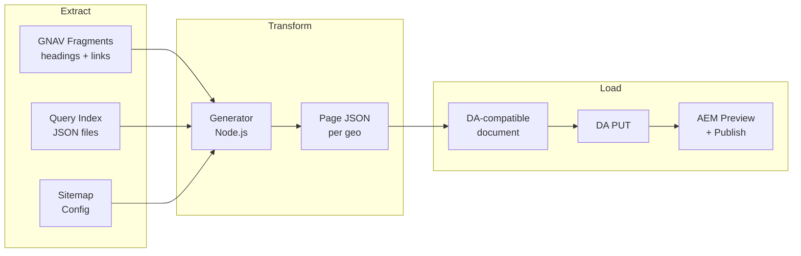

# HTML Sitemap Generator

A GitHub Actions-based system that generates localized HTML sitemap pages for Adobe's international sites and publishes them via DA and the AEM Admin API.

## Why

Crawlers (Googlebot, Bingbot) and LLM agents need a navigable, indexable entry point to discover all pages across Adobe's international sites. Without one, bots rely on XML sitemaps alone, which lack human-readable context and titles.

This work is especially important alongside **Project Lingo**, which is consolidating Adobe's country-first site structure into a language-first model. Google has been dropping ~20% of local pages due to content duplication across geos. Lingo reduces the indexable footprint; these HTML sitemaps ensure the remaining pages are explicitly surfaced for discovery, consolidating SEO value in the pages that matter.

**Who it serves**: Googlebot and search engine crawlers, LLM agents, and humans who navigate to these pages directly.

## Terminology

| Term | Definition |
|------|-----------|
| **Geo** | A region/locale (e.g. `fr`, `be_en`, `ch_fr`) |
| **Base Geo** | Primary region/locale with a dedicated `sitemap.html` page |
| **Extended Geo** | Secondary region/locale whose pages surface inside a base geo's page; no dedicated sitemap page |

## Scope

Each of Adobe's two primary subdomains gets its own set of HTML sitemaps. Each base geo within a subdomain gets a localized sitemap page.

| Subdomain | DA Host | NOT in scope |
|---|---|---|
| business.adobe.com | [da-bacom](https://da.live/sheet#/adobecom/da-bacom/) | |
| www.adobe.com | [da-cc](https://da.live/sheet#/adobecom/da-cc/) | genuine (only in-app), upp (only homepage) |

Output pages: `https://{subdomain}/sitemap.html` and `https://{subdomain}/{baseGeo}/sitemap.html` for each base geo with indexable content.

### Query Index Sources

Each site contributes a query index per geo. The generator fetches `/{geo}/{queryIndexPath}` from each site.

Note: cc is missing `title, robots`.

```tsv
domain	site	queryIndexPath
business	da-bacom	/query-index.json
www	cc	/cc-shared/assets/query-index.json
www	da-cc	/cc-shared/assets/query-index.json
www	da-dc	/dc-shared/assets/query-index.json
www	da-events	/events/query-index.json
www	da-express-milo	/express/query-index.json
www	edu	/edu-shared/assets/query-index.json
```

### Geo Map

Each row defines a base geo and its extended geos. Extended geos share the base geo's language -- their pages appear on the base geo's sitemap. Not every extended geo will have a query index for every site -- the generator warns and continues on 404.

A sitemap page is only generated for a base geo when **at least one query index from any site returns indexable URLs** for that geo. If all indices for a base geo are 404 or contain no indexable URLs (e.g. all pages are noindex/nofollow), the page is skipped. This means new geos automatically get sitemap pages the moment content is published, and empty geos are never produced.

```tsv
domain	baseGeo	language	extendedGeos
business		en
business	au	en
business	de	de
business	fr	fr
business	in	en
business	it	it
business	jp	ja
business	kr	ko
business	pt	pt
business	sp	es	es
business	uk	en
www		en	ae_en, africa, be_en, ca, cis_en, cy_en, eg_en, gr_en, hk_en, id_en, ie, il_en, kw_en, lu_en, mena_en, mt, my_en, ng, nz, ph_en, qa_en, sa_en, sg, th_en, vn_en, za
www	ara	ar	ae_ar, eg_ar, kw_ar, mena_ar, qa_ar, sa_ar
www	au	en
www	az	az
www	bg	bg
www	bn	ms
www	br	pt
www	cn	zh	hk_zh, tw
www	cz	cs
www	de	de	at, ch_de, lu_de
www	dk	da
www	ee	et
www	el	el	gr_el
www	es	es	ar, cl, co, cr, ec, gt, la, mx, pe, pr
www	fi	fi
www	fr	fr	be_fr, ca_fr, ch_fr, lu_fr
www	hr	hr
www	hu	hu
www	hy	hy
www	id_id	id
www	il_he	he
www	in	en
www	in_hi	hi
www	it	it	ch_it
www	jp	ja
www	kr	ko
www	lt	lt
www	lv	lv
www	my_ms	ms
www	nl	nl	be_nl
www	no	no
www	ph_fil	fil
www	pl	pl
www	pt	pt
www	ro	ro
www	ru	ru	cis_ru
www	se	sv
www	si	sl
www	sk	sk
www	sr	sr
www	th_th	th
www	tr	tr
www	ua	uk
www	uk	en
www	vn_vi	vi
www	zh	zh
```

## Page Structure

Each generated sitemap page has three sections. Each section maps to a distinct data source and pipeline stage.

```
┌─────────────────────────────────────────────────────┐
│  Section 1: Base Geo Links (sitemap-base)           │
│  Source: GNAV fragments                             │
│                                                     │
│  H3 section headings with H4 sub-headings and       │
│  link groups from the site's global navigation.     │
│  e.g. "Creativity & Design > Featured products"    │
├─────────────────────────────────────────────────────┤
│  Section 2: Other Sitemap Links (sitemap-list)      │
│  Source: generated from geo map                     │
│                                                     │
│  Links to the sitemap.html of every other base geo  │
│  in the same domain. Excludes the current page.     │
│  e.g. "France", "Germany", "Japan", ...             │
├─────────────────────────────────────────────────────┤
│  Section 3: Extended Geo Links (sitemap-extended)   │
│  Source: query index JSON files                     │
│                                                     │
│  Links unique to each extended geo grouped by       │
│  region. Only URLs not already present in the       │
│  base geo are included (deduplicated by path).      │
│  e.g. "Belgium (fr)" > /be_fr/products/acrobat     │
└─────────────────────────────────────────────────────┘
```

### Section 1: Base Geo Links

Sourced from GNAV fragments. Contains the main navigation links organized by section heading (H3) and sub-heading (H4) with grouped link lists. This is the primary content of the page -- the same product/feature links that appear in the site's global navigation, rendered as a flat sitemap.

See [GNAV Sources](#gnav-sources) and [Content Rendering Rules](#content-rendering-rules) for full details.

### Section 2: Other Sitemap Links

Auto-generated from the geo map. A list of links to the `sitemap.html` page of every other active base geo in the same domain. The current page's own geo is excluded. This allows crawlers and users to navigate between all localized sitemaps.

### Section 3: Extended Geo Links

Sourced from query index JSON files. For each extended geo mapped to the current base geo, fetch the query index from each site and collect the URLs.

**Deduplication**: Extended geos often contain URLs that duplicate the base geo's content (same path, different geo prefix). These are excluded. The deduplication rule: for each extended geo URL, strip the geo prefix to get the path. If that path exists in any of the base geo's query indices, the URL is dropped. Only URLs unique to the extended geo are included. This ensures the extended section surfaces content that is region-specific and not already represented in the base geo's GNAV links or query index.

The remaining unique URLs are grouped by extended geo (e.g. "Belgium (fr)", "Canada (fr)", "Switzerland (fr)" under the `fr` base geo).

## Requirements

- **Performance**: Pages must be fast. Googlebot penalizes slow pages, and slow CrUX scores defeat the purpose. Humans may also visit.
- **Extended geo automation**: Authors cannot manually maintain lists of pages across dozens of geos. Extended geo content must be fully automated.
- **Lingo compatibility**: As Lingo rolls out in phases (French first), sitemap pages will need updating based on which query indices are available at the time.
- **Static production URLs**: Generated pages contain hardcoded production URLs. Client-side JavaScript rewrites URLs in non-production environments.
- **Monitoring**: Both the generation process and the resulting pages will be monitored.

## Architecture

### Data Sources

1. **Sitemap Config** (source of truth for this generator):
   Query index sources and geo maps defined in the [Scope](#scope) section above. Will eventually be backed by a DA spreadsheet.

2. **GNAV Fragments** (section headings and link groupings):
   The global navigation provides localized section headings and categorized product/page links. Each subdomain sources its GNAV differently. See [GNAV Sources](#gnav-sources) for the full mapping.

3. **GNAV Placeholders** (localized UI strings):
   The GNAV fragments use `{{placeholder}}` tokens for certain link labels (e.g. `{{premiere}}` resolves to "Premiere"). These are resolved via the federal globalnav placeholders:
   [`/federal/globalnav/placeholders.json`](https://main--federal--adobecom.aem.live/federal/globalnav/placeholders.json) (English) |
   [`/fr/federal/globalnav/placeholders.json`](https://main--federal--adobecom.aem.live/fr/federal/globalnav/placeholders.json) (French example)
   No additional placeholder keys are needed beyond what the GNAV already uses.

4. **Query Index JSON** (per site, per geo):
   Provides localized URLs and page titles for each region.
   URL pattern: `https://main--{repo}--adobecom.aem.live/{geo}/{query-index-path}`
   - Uses the standard `query-index.json` (not the lingo variant)

### GNAV Sources

The two subdomains use different GNAV structures and origins.

#### business.adobe.com (da-bacom)

**Source**: Local GNAV in the [da-bacom](https://github.com/adobecom/da-bacom) repo.

| Fragment | Path | Content |
|---|---|---|
| Top-level GNAV | [`/gnav`](https://main--da-bacom--adobecom.aem.live/gnav.plain.html) | Flat list of `<a>` links to section fragments |
| Products | [`/fragments/gnav/products`](https://main--da-bacom--adobecom.aem.live/fragments/gnav/products.plain.html) | 28 links: product pages |
| AI | [`/fragments/gnav/ai`](https://main--da-bacom--adobecom.aem.live/fragments/gnav/ai.plain.html) | 19 links: AI features and solutions |
| Industries | [`/fragments/gnav/industries`](https://main--da-bacom--adobecom.aem.live/fragments/gnav/industries.plain.html) | 17 links: industry verticals |
| Roles | [`/fragments/gnav/roles`](https://main--da-bacom--adobecom.aem.live/fragments/gnav/roles.plain.html) | 19 links: persona/role pages |
| Resources | [`/fragments/gnav/resources`](https://main--da-bacom--adobecom.aem.live/fragments/gnav/resources.plain.html) | 15 links: blog, reports, events |
| Support | [`/fragments/gnav/support`](https://main--da-bacom--adobecom.aem.live/fragments/gnav/support.plain.html) | 14 links: help, services, docs |

All fragment paths are relative to the da-bacom repo origin (`https://main--da-bacom--adobecom.aem.live`).
Links resolve to `business.adobe.com` in production.

#### www.adobe.com (da-cc)

**Source**: [Federal](https://github.com/adobecom/federal) repo (da-cc has no local `/gnav`).

| Fragment | Path | Content |
|---|---|---|
| Top-level GNAV | [`/federal/globalnav/acom/acom-gnav`](https://main--federal--adobecom.aem.live/federal/globalnav/acom/acom-gnav.plain.html) | Headings with `<a>` links to section sub-fragments |
| Creativity & Design | [`/federal/globalnav/acom/sections/section-menu-cc`](https://main--federal--adobecom.aem.live/federal/globalnav/acom/sections/section-menu-cc.plain.html) | References 3 column fragments |
| -- CC Column 1 | [`/federal/globalnav/acom/fragments/cc/cc-column-1`](https://main--federal--adobecom.aem.live/federal/globalnav/acom/fragments/cc/cc-column-1.plain.html) | Plans and pricing links |
| -- CC Column 2 | [`/federal/globalnav/acom/fragments/cc/cc-column-2`](https://main--federal--adobecom.aem.live/federal/globalnav/acom/fragments/cc/cc-column-2.plain.html) | Product links (Photoshop, Illustrator, etc.) |
| -- CC Column 3 | [`/federal/globalnav/acom/fragments/cc/cc-column-3`](https://main--federal--adobecom.aem.live/federal/globalnav/acom/fragments/cc/cc-column-3.plain.html) | AI feature links |
| PDF & E-signatures | [`/federal/globalnav/acom/sections/section-menu-dc`](https://main--federal--adobecom.aem.live/federal/globalnav/acom/sections/section-menu-dc.plain.html) | References 3 column fragments |
| -- DC Column 1 | [`/federal/globalnav/acom/fragments/dc/dc-column-1`](https://main--federal--adobecom.aem.live/federal/globalnav/acom/fragments/dc/dc-column-1.plain.html) | Acrobat product links |
| -- DC Column 2 | [`/federal/globalnav/acom/fragments/dc/dc-column-2`](https://main--federal--adobecom.aem.live/federal/globalnav/acom/fragments/dc/dc-column-2.plain.html) | Use-case links |
| -- DC Column 3 | [`/federal/globalnav/acom/fragments/dc/dc-column-3`](https://main--federal--adobecom.aem.live/federal/globalnav/acom/fragments/dc/dc-column-3.plain.html) | Business/enterprise links |
| ~~Marketing & Commerce~~ | [`/federal/globalnav/acom/sections/section-menu-dx`](https://main--federal--adobecom.aem.live/federal/globalnav/acom/sections/section-menu-dx.plain.html) | **Excluded** -- all links point to business.adobe.com |
| Learn & Support | [`/federal/globalnav/acom/sections/section-menu-help`](https://main--federal--adobecom.aem.live/federal/globalnav/acom/sections/section-menu-help.plain.html) | Inline links (no column fragments) |

All fragment paths are relative to the federal repo origin (`https://main--federal--adobecom.aem.live`).
Links resolve to `www.adobe.com` or `business.adobe.com` in production.

**Note**: Marketing & Commerce (`section-menu-dx`) is excluded from www sitemaps because its links all point to business.adobe.com. This is hardcoded in the generator.

**Localization**: Localized GNAV fragments are fetched by prepending the geo prefix, e.g.:
[`/fr/federal/globalnav/acom/acom-gnav`](https://main--federal--adobecom.aem.live/fr/federal/globalnav/acom/acom-gnav.plain.html) (French)

#### GNAV Resolution Fallback Chain

The generator resolves the GNAV source using this chain:
1. `gnav-source` page metadata (if present)
2. Local `/{geo}/gnav` on the site's own repo
3. Federal `/{geo}/federal/globalnav/acom/acom-gnav` (fallback)

#### Link Domain Mapping

All rendered links use production URLs. The domain mapping:

| Repo Pattern | Production Domain |
|---|---|
| da-bacom and da-bacom-* repos | `https://business.adobe.com` |
| All other repos | `https://www.adobe.com` |

Links to external domains (helpx.adobe.com, experienceleague.adobe.com, etc.) are preserved as-is.

#### Content Rendering Rules

Each GNAV section fragment produces a block of content within the sitemap page. The rendering follows these rules:

**Heading hierarchy**:
- **H3**: Section heading (from the top-level GNAV, e.g. "Creativity & Design", "Products")
- **H4**: Sub-heading (from heading tags within section fragments, e.g. "Shop for", "Featured products", "Online tools")
- Sub-headings break the content into multiple `<ul>` groups within a section. Each sub-heading is followed by its own `<ul>` of links.

**Fragment parsing**:
- Section fragments use two structures: `.link-group` divs (federal pattern) or `<ul><li>` lists. Both are supported.
- Federal CC and DC sections use nested `#_inline` column fragment references. These are followed and their content is merged in document order.
- Heading tags (`<h5>`, `<h6>`, etc.) within fragments become H4 sub-headings.
- `<a>` tags within `.link-group`, `<li>`, `<p>`, or `<strong>` elements become links.
- Description text in `<p>` tags after links (e.g. "Image editing and design", "AI-powered content creation") is **discarded** -- these are GNAV mega-menu descriptions, not sitemap content.

**Placeholders**: `{{placeholder}}` tokens in link text (e.g. `{{premiere}}`) are resolved via [`/federal/globalnav/placeholders.json`](https://main--federal--adobecom.aem.live/federal/globalnav/placeholders.json). Only placeholders already used by the GNAV are needed.

**Excluded content**:
- `bookmark://` links (internal GNAV anchor plumbing, not navigable URLs)
- `#_inline` fragment references (internal GNAV plumbing -- followed for content, but the reference itself is not rendered)
- Image-only content (SVG icons, product logos) -- stripped after link decoration
- Promo fragments (promotional aside content within column references)
- Marketing & Commerce section (`section-menu-dx`) on www (all links point to business.adobe.com -- hardcoded exclusion)

**Page generation rule**: A sitemap page is only produced for a base geo when at least one query index from any site returns indexable URLs. Empty or all-noindex geos are skipped.

### Pipeline



### Generator Logic

For each domain (business, www) and for each base geo in the geo map:

1. **Resolve GNAV source** for the base geo using the fallback chain:
   1. `gnav-source` page metadata (if present)
   2. Local `/{geo}/gnav` on the host repo (e.g. da-bacom)
   3. Federal `/{geo}/federal/globalnav/acom/acom-gnav` (fallback)
2. **Parse top-level sections** from the GNAV document:
   - Federal pattern: heading tags containing `<a>` links to section sub-fragment paths
   - Local pattern: flat `<a>` links with paths containing `/fragments/`
   - Exclude sections in the hardcoded exclusion list (e.g. `section-menu-dx` for www)
3. **Fetch each section fragment** and extract content in document order:
   - If the fragment contains `#_inline` column references, follow each (skip promos), fetch, and merge content
   - Heading tags (`h5`, `h6`, etc.) become sub-headings
   - Links inside `.link-group`, `<li>`, `<p>`, or `<strong>` become links
   - Description `<p>` text after links is discarded
   - `bookmark://` links are discarded
4. **Resolve placeholders** (`{{key}}` tokens) via federal globalnav placeholders for the geo
5. **Fetch query index JSON** for the base geo (and its extended geos) from each site in the query index map. Warn and skip on 404 or empty results.
6. **Check page generation rule**: if no site returned indexable URLs for this base geo, skip -- do not produce a page.
7. **Build page structure** (H3 section heading > H4 sub-headings > UL link groups):
   - GNAV sections with localized headings and sub-headings
   - Links to HTML sitemaps of every other base geo in the same domain
   - Links from each extended geo related to this base geo
   - All links use hardcoded production URLs (`business.adobe.com` for da-bacom repos, `www.adobe.com` for all others)
   - Strip images/SVGs that may have been generated from URL decoration
8. **Transform** the page structure into a DA-compatible document
9. **Push** the document to DA via the DA Admin API (IMS-authenticated)
10. **Trigger** AEM preview and publish via the Helix Admin API

### Output

Each generated sitemap page contains three sections:

1. **GNAV-sourced links in the base geo** grouped by localized section heading
2. **Links to the HTML sitemap of every other base geo** in the same subdomain
3. **Links from each extended/regional geo** related to the base geo

### Page Hosting

| Subdomain | Host Repo | DA Authoring |
|---|---|---|
| business.adobe.com | da-bacom | da-bacom |
| www.adobe.com | da-cc | da-cc |

### Scheduling

The generator runs on a recurring schedule. Options:
- GitHub Actions `schedule` trigger (cron)
- External cron (e.g. Adobe I/O Runtime / OpenWhisk action) triggering via `repository_dispatch`

Full rebuild on each run (no incremental state management needed). The entire dataset is processed from scratch each time.

## Prototype

A client-side prototype of the GNAV extraction is implemented in the `sitemap-base` block on the `sitemap-gnav-proto` branch. It demonstrates the GNAV-sourced rendering using the same CSS and layout as the authored sitemap pages.

**Test URLs** (append `&cache=bust` if seeing stale content):
- business: `https://main--da-bacom--adobecom.aem.live/drafts/hgpa/sitemap?milolibs=sitemap-gnav-proto--milo--adobecom&sitemap-source=gnav`
- www: `https://main--da-cc--adobecom.aem.live/drafts/hgpa/sitemap?milolibs=sitemap-gnav-proto--milo--adobecom&sitemap-source=gnav`

The prototype activates via `?sitemap-source=gnav` and implements the same GNAV resolution fallback chain, placeholder resolution, and content filtering described above. The production pipeline will replicate this logic server-side in Node.js, generating static HTML with hardcoded production links instead of client-side rendering.

## Configuration

### Environment Variables

#### Authentication (DA Access)

| Variable | Description |
|---|---|
| `ROLLING_IMPORT_IMS_URL` | Adobe IMS authentication URL |
| `ROLLING_IMPORT_CLIENT_ID` | IMS OAuth client ID |
| `ROLLING_IMPORT_CLIENT_SECRET` | IMS OAuth client secret |
| `ROLLING_IMPORT_CODE` | IMS OAuth authorization code |
| `ROLLING_IMPORT_GRANT_TYPE` | IMS OAuth grant type |

#### AEM Admin API

| Variable | Description |
|---|---|
| `AEM_ADMIN_TOKEN_ADOBECOM_DA_BACOM` | Helix admin API token for da-bacom preview/publish |
| `AEM_ADMIN_TOKEN_ADOBECOM_DA_CC` | Helix admin API token for da-cc preview/publish |

#### Other

| Variable | Description |
|---|---|
| `GITHUB_TOKEN` | GitHub API token (automatically provided) |

The sitemap config (query index sources and geo map) is hardcoded in the generator for now. When promoted to a spreadsheet, it will live in the [federal](https://github.com/adobecom/federal) repo alongside the [lingo site mapping](https://main--federal--adobecom.aem.live/federal/assets/data/lingo-site-mapping.json) -- not in milo, which is reserved for test files.

## Local Development

### Prerequisites

- Node.js 21 or higher
- Access to required secrets and environment variables

### Setup

```bash
cd .github/workflows/html-sitemap
npm install
```

### Running Locally

Create a `.env` file with required environment variables:

```bash
# Authentication
ROLLING_IMPORT_IMS_URL=https://...
ROLLING_IMPORT_CLIENT_ID=...
ROLLING_IMPORT_CLIENT_SECRET=...
ROLLING_IMPORT_CODE=...
ROLLING_IMPORT_GRANT_TYPE=authorization_code

# AEM Admin
AEM_ADMIN_TOKEN_ADOBECOM_DA_BACOM=...
AEM_ADMIN_TOKEN_ADOBECOM_DA_CC=...

# Optional
LOCAL_RUN=true
```

```bash
cd .github/workflows/html-sitemap
node --env-file=../../../.env generate.js
```

## Open Questions

- [ ] Scheduling frequency: hourly? daily?
- [ ] Should this live in milo or a separate repo?
- [ ] Reuse preview-indexer's DA client and IMS auth modules, or fresh implementation?
- [ ] OpenWhisk cron vs. GitHub Actions scheduled trigger?

## Dependencies

TBD -- expected to be similar to preview-indexer:
- **axios** / **axios-retry**: HTTP client with retry logic
- **form-data**: Multipart form data for DA uploads

## Related

- [Preview Indexer](../preview-indexer/README.md): Similar GitHub Actions-based system for maintaining preview indexes. Shares authentication patterns and DA/AEM API integration.
- [Sitemap Base Block](../../../libs/blocks/sitemap-base/): Client-side block that renders sitemap content. The [`sitemap-gnav-proto`](https://github.com/adobecom/milo/tree/sitemap-gnav-proto) branch contains the GNAV prototype.
- [Federal repo](https://github.com/adobecom/federal): Hosts shared GNAV fragments and placeholders used by www.adobe.com.

## License

See the repository root LICENSE file.
