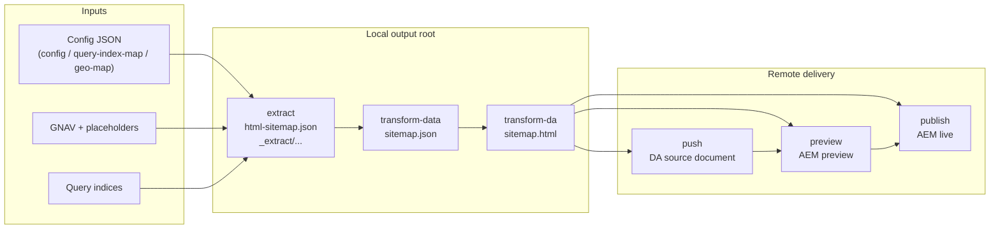

# HTML Sitemap Generator — Spec

This document owns the behavioral and architectural contract behind the HTML sitemap generator.

`SPEC.md` is written primarily for stakeholders, PMs, architects, and implementers who need to understand:

- the product problem
- the intended page behavior
- the system architecture
- the source-of-truth inventories
- the operational rules behind each stage

`README.md` owns the external interface:

- CLI usage
- canonical stage ids
- flags and env vars
- input/output file contracts

This spec defines the intended generator and page contract. The implementation should converge to this document; only explicitly marked future work should remain out of sync.

## Why

Crawlers and LLM agents need a navigable, indexable HTML entry point for Adobe’s localized pages. XML sitemaps alone do not provide human-readable titles, regional grouping, or easy movement between localized surfaces.

This matters even more during Project Lingo, where Adobe is consolidating country-first structures into language-first structures. The sitemap pages are intended to surface the smaller set of indexable pages clearly and consistently so discovery remains strong while redundant regional content shrinks.

Primary audiences:

- Googlebot and other search crawlers
- LLM agents that benefit from explicit regional navigation
- humans who land on these pages directly

## Product Model

Each supported subdomain gets a family of sitemap pages:

- one page for the default/root base geo
- one page for each additional base geo that qualifies for output

Each sitemap page has three sections:

1. Base-geo links from GNAV
2. Links to sibling sitemap pages in the same subdomain
3. Extended-geo links that are unique after deduplication

### Terminology

| Term | Definition |
|------|-----------|
| **Geo** | A locale or region code such as `fr`, `be_en`, `ch_fr` |
| **Base Geo** | A geo with its own dedicated `sitemap.html` |
| **Extended Geo** | A geo whose unique pages are surfaced within a base geo’s sitemap instead of getting its own page |

### Page Emission Rule

A base geo emits sitemap output only when at least one base-geo query index from any configured site returns indexable URLs.

If all query indices for a base geo:

- 404
- fail in a skippable way
- or return no indexable rows

then that base geo does not emit a sitemap page.

This rule affects both:

- whether a base-geo local output folder exists after `extract`
- whether downstream stages have anything to transform or promote

## Page Semantics

### Section 1: Base Geo Links

This section is derived from GNAV structure.

- H3 groups top-level categories
- H4 groups subcategories
- links preserve navigational grouping as closely as possible

### Section 2: Other Sitemap Links

This section links to sibling base-geo sitemap pages in the same subdomain.

Rule:

- include only sibling base geos that currently have sitemap output
- geo labels should prefer the authored region-nav fragment label for that geo when available
- any trailing ` - <language>` suffix should be removed from the displayed geo label

### Section 3: Extended Geo Links

This section contains extended-geo pages grouped by geo label.

Deduplication rule:

- compare canonical paths after removing the geo prefix from both the base-geo path and the extended-geo path
- if the canonical path already exists in the base geo, drop the extended-geo entry
- dedupe is based on exact canonical path equivalence, not broader content equivalence or future consolidation rules
- geo labels should follow the same region-nav-derived labeling rule as section 2

## Architecture

The pipeline is described in terms of `stages`. In GitHub Actions, those stages may later be mapped to one or more workflow `steps` or jobs, but the generator’s contract remains stage-oriented.

### Stage Model

The canonical atomic stage ids are:

- `clean`
- `extract`
- `transform-data`
- `transform-da`
- `push`
- `preview`
- `publish`

The CLI may expose shortcuts, but behavior is defined in terms of those atomic stages.

### Dependency Model

Dependencies are enforced by the generator, not by a separate metadata schema.

Examples:

- `transform-data` depends on eligible extracted input
- `transform-da` depends on `sitemap.json`
- `push`, `preview`, and `publish` depend on local `sitemap.html`
- `push`, `preview`, and `publish` also depend on `--da-root`

### Pipeline Overview



Interpretation:

- `extract` persists deterministic local inputs
- `transform-data` converts those inputs into normalized sitemap page data
- `transform-da` converts normalized data into a DA-compatible HTML source document
- `push` uploads that HTML to DA
- `preview` and `publish` promote the corresponding remote document path in AEM

## Scope

Each supported subdomain gets a set of base-geo sitemap pages.

Output pages:

- `https://{domain}/sitemap.html`
- `https://{domain}/{baseGeo}/sitemap.html`

but only for base geos that satisfy the page-emission rule above.

## Config Semantics

### `config`

Maps each subdomain to:

- production domain
- host site / repo
- extended sitemap mode

```tsv
subdomain	domain	site	extendedSitemap
business	business.adobe.com	da-bacom	all
www	www.adobe.com	da-cc	language
```

`extendedSitemap` semantics:

- `language`: include only the base geo’s mapped extended geos
- `all`: include every extended geo in the subdomain

### `query-index-map`

Maps each site to its query-index path.

- `enabled` is optional and defaults to enabled
- disabled rows are ignored by planning and extraction

### `geo-map`

Maps each base geo to:

- language
- extended geos assigned to that base geo

### `page-copy`

Maps each base geo to render-time page strings:

- page title
- page description
- sibling sitemap section heading
- extended-geo section heading

This sheet is the source of truth for page copy.

## Source Inventory

The live config JSON is the source of truth for query-index paths, geo mappings, and page copy:

- [`html-sitemap.json`](https://main--federal--adobecom.aem.live/federal/assets/data/html-sitemap.json)

The snapshots below are for architectural context only. Refer to the live config for current data.

There are two different source models in play:

- `business` is comparatively direct: the sitemap is derived from a local GNAV plus a single site family centered on `da-bacom`
- `www` is federated: sitemap coverage spans several site repos and uses the federal GNAV structure rather than a local `da-cc` GNAV

That difference is important architecturally:

- `business` behaves more like a single-site extraction problem
- `www` behaves more like a multi-source aggregation problem

The pipeline keeps one interface across both, but the source inventory below explains why the underlying extraction behavior is not identical.

### Query index and geo map (snapshot)

These paths and locale rows are live data. Re-verify them when behavior drifts.

**Catalog snapshot: 2026-03-30**

#### Query index sources

The query-index model differs by subdomain:

- `business` currently reads from one site family, so query-index coverage is simpler and more centralized
- `www` pulls from several site families (`cc`, `da-cc`, `da-dc`, `da-events`, `da-express-milo`, `edu`), which means base-geo eligibility and final page coverage are decided from a broader aggregate of site sources

That is why the page-emission rule is phrased in terms of “at least one query index from any configured site” rather than assuming a single origin.

```tsv
subdomain	site	queryIndexPath
business	da-bacom	/query-index.json
www	cc	/cc-shared/assets/query-index.json
www	da-cc	/cc-shared/assets/query-index.json
www	da-dc	/dc-shared/assets/query-index.json
www	da-events	/events/query-index.json
www	da-express-milo	/express/query-index.json
www	edu	/edu-shared/assets/query-index.json
```

#### Geo map

The geo map is shared conceptually across both subdomains, but its operational effect differs:

- for `business`, the geo map mostly defines which localized sitemap pages exist and which extended geos roll up beneath them
- for `www`, the same geo map sits on top of a broader multi-site query-index estate, so it acts more like a routing and grouping layer across several content systems

This is why the geo map belongs in the common config model even though the density and complexity of the underlying source data differs by subdomain.

```tsv
subdomain	baseGeo	language	extendedGeos
business		en
business	au	en
business	de	de
business	fr	fr
business	in	en
business	it	it
business	jp	ja
business	kr	ko
business	pt	pt
business	sp	es	es
business	uk	en
www		en	ae_en, africa, be_en, ca, cis_en, cy_en, eg_en, gr_en, hk_en, id_en, ie, il_en, kw_en, lu_en, mena_en, mt, my_en, ng, nz, ph_en, qa_en, sa_en, sg, th_en, vn_en, za
www	ara	ar	ae_ar, eg_ar, kw_ar, mena_ar, qa_ar, sa_ar
www	au	en
www	az	az
www	bg	bg
www	bn	ms
www	br	pt
www	cn	zh	hk_zh, tw
www	cz	cs
www	de	de	at, ch_de, lu_de
www	dk	da
www	ee	et
www	el	el	gr_el
www	es	es	ar, cl, co, cr, ec, gt, la, mx, pe, pr
www	fi	fi
www	fr	fr	be_fr, ca_fr, ch_fr, lu_fr
www	hr	hr
www	hu	hu
www	hy	hy
www	id_id	id
www	il_he	he
www	in	en
www	in_hi	hi
www	it	it	ch_it
www	jp	ja
www	kr	ko
www	lt	lt
www	lv	lv
www	my_ms	ms
www	nl	nl	be_nl
www	no	no
www	ph_fil	fil
www	pl	pl
www	pt	pt
www	ro	ro
www	ru	ru	cis_ru
www	se	sv
www	si	sl
www	sk	sk
www	sr	sr
www	th_th	th
www	tr	tr
www	ua	uk
www	uk	en
www	vn_vi	vi
www	zh	zh
```

### GNAV (snapshot)

**Catalog snapshot: 2026-03-30**

The GNAV model differs even more sharply than the query-index model:

- `business` has a local GNAV in `da-bacom`
- `www` does not rely on a local `da-cc` GNAV and instead follows the shared federal GNAV structure

This difference is the main reason `extract` has GNAV-specific fallback and discovery logic rather than a single fixed path per subdomain.

#### GNAV placeholders

GNAV placeholders are fetched during `extract` and resolved during `transform-data`.

| | URL |
|---|---|
| English | [`/federal/globalnav/placeholders.json`](https://main--federal--adobecom.aem.live/federal/globalnav/placeholders.json) |
| Example localized | [`/fr/federal/globalnav/placeholders.json`](https://main--federal--adobecom.aem.live/fr/federal/globalnav/placeholders.json) |

#### business.adobe.com (da-bacom)

`business` is structurally simpler:

- one local GNAV
- local fragment paths
- fewer moving parts between navigation discovery and final page assembly

That simplicity is why `business` is often the easier subdomain to validate end to end when pipeline changes are introduced.

```tsv
fragment	path
Top-level GNAV	/gnav
Products	/fragments/gnav/products
AI	/fragments/gnav/ai
Industries	/fragments/gnav/industries
Roles	/fragments/gnav/roles
Resources	/fragments/gnav/resources
Support	/fragments/gnav/support
```

#### www.adobe.com (da-cc via federal)

`www` is structurally broader:

- the GNAV comes from federal rather than the page-hosting site repo
- the navigation is discovered from a top-level federal structure and then expanded into section fragments
- query-index coverage spans multiple site families

So while `www` uses the same stage interface as `business`, it is effectively the more complex integration surface and should be treated as the more demanding validation target.

```tsv
fragment	path
Top-level GNAV	/federal/globalnav/acom/acom-gnav
Creativity & Design	/federal/globalnav/acom/sections/section-menu-cc
PDF & E-signatures	/federal/globalnav/acom/sections/section-menu-dc
Marketing & Commerce	/federal/globalnav/acom/sections/section-menu-dx
Learn & Support	/federal/globalnav/acom/sections/section-menu-help
```

`section-menu-dx` is excluded from www sitemap output because it points to `business.adobe.com`.

## Stage Semantics

This section moves from architecture into operational detail. These rules explain why outputs appear or do not appear.

### Extract

`extract` fetches raw inputs and persists them for deterministic downstream transforms.

What `extract` persists:

- resolved config snapshot
- raw GNAV fragments
- GNAV manifest
- region-nav fragment HTML
- placeholders payload
- base-geo query indices
- extended-geo query indices

GNAV resolution behavior:

1. local `/{geo}/gnav` on the subdomain’s host site
2. federal fallback GNAV when local GNAV is unavailable

For localized geos, discovered GNAV fragment paths inherit the geo prefix.

Warning behavior:

- missing GNAV for a base geo warns and continues
- missing placeholders warn and continue
- missing region-nav fragment HTML warns and continues
- missing query-index files warn and continue
- paginated query-index responses must be fetched to completion using `total`, `offset`, and `limit`; extraction should not stop at the first response page

#### Fetch retry policy

All HTTP fetches during extraction use a shared retry strategy:

- Up to 2 retries (3 total attempts)
- Retryable status codes: 429, 500, 502, 503, 504
- Non-retryable failures (4xx other than 429) are returned immediately
- Backoff delay: 250ms * 2^attempt (250ms, 500ms)
- Network errors (fetch throws) are retried with the same policy

#### Query-index pagination

The merge algorithm for paginated query-index responses:

1. First page is fetched at `https://main--{site}--adobecom.aem.live/{geo}{queryIndexPath}`
2. If the response lacks a `data` array, it is treated as success with zero indexable rows
3. `total` defaults to the first-page data length when absent
4. `limit` (page size) defaults to the first-page data length when absent or zero
5. Next-page offset = current offset + rows received; falls back to page size when zero rows are returned
6. Loop continues while merged row count < total
7. Loop breaks on: HTTP error (returns error, not partial data), non-paged response body, or empty data array
8. The merged result preserves first-page metadata with `data` replaced by the full merged array

### Transform-Data

`transform-data` converts extracted raw inputs into normalized page data.

Output semantics:

- writes `sitemap.json`
- resolves placeholder tokens using extracted placeholders
- resolves section 2 and section 3 geo labels from extracted region-nav fragment links when available
- normalizes query-index titles
- strips trailing Adobe branding such as `- Adobe` or `| Adobe`
- derives fallback titles from URL slugs without file extensions
- includes only sibling sitemap links that currently exist
- dedupes extended-geo entries against base-geo canonical paths
- strips any trailing ` - <language>` suffix from region-nav-derived geo labels

#### Query-index row selection

- Each row is read from the `path` field; falls back to `url` when `path` is absent
- Rows where `robots` contains `noindex` or `nofollow` are excluded (either value triggers exclusion)

#### Extended-geo deduplication

1. Build the base-geo canonical path set: for each base-geo query-index row, strip the geo prefix to produce a canonical path
2. For each extended geo, normalize its query-index rows the same way
3. Drop any extended-geo entry whose canonical path already exists in the base-geo set
4. Within a single extended geo, also drop entries whose canonical path was already seen in that geo

The resulting `sitemap.json` contains:

- `sections.baseGeoLinks`
- `sections.otherSitemapLinks`
- `sections.extendedGeoLinks`

This `sitemap.json` document is the normalized render contract for a sitemap page. Downstream rendering should consume this document rather than re-reading raw extracted GNAV or query-index inputs.

### Transform-DA

`transform-da` converts `sitemap.json` into DA-compatible HTML source.

Output format:

- plain HTML source
- not a DA-specific JSON representation

Expected shell:

```html
<body>
  <header></header>
  <main>...</main>
  <footer></footer>
</body>
```

Section rendering contract:

- Section 1: grouped navigation links rendered as a generic multi-column or grid-like layout
- Section 2: a simple authored list of sibling sitemap links; a dedicated block is not required
- Section 3: grouped extended-geo links rendered as an expandable or otherwise compact grouped layout

Rendering notes:

- block choice is an implementation detail and may change without changing page semantics
- the old browser-specific sitemap blocks are not the normative contract for this generator
- the normalized `sitemap.json` contract and the DA/AEM page structure emitted by `transform-da` are the source of truth for page composition
- `transform-da` should behave like a render step over normalized page data, not like a second extraction step
- the editable DA template should be able to express most page structure directly, including simple conditional and repeated sections over normalized data
- `templates/da-sitemap.html` is the reference DA page artifact for structure and section layout
- template choice may vary by subdomain through config, but `da-sitemap.html` is the default contract when no override is provided
- generated links should use canonical production URLs
- non-production URL rewriting may be added by page-level client JS later, but it is optional and not required for the base generator contract

Page-copy contract:

- H1 defaults to `Sitemap`
- metadata `title` and `description` are rendered directly in the editable DA template from `pageTitle` and `pageDescription`
- metadata `locale` is rendered directly in the editable DA template from the current base geo, with root rendered as `global`
- metadata rows may be authored literally in the DA template; they are not required to come from a preassembled metadata array in code
- page-copy strings may contain `{{variable}}` placeholders, resolved using the extracted placeholder map for that base geo
- the DA document shell should remain editable as template HTML rather than being buried entirely in string assembly code

### Push / Preview / Publish

Push uploads local `sitemap.html` to DA under the remote document root specified by `--da-root`.

Push output should include the corresponding DA edit URLs for uploaded documents.

Auth contract:

- local or manual runs may authenticate with a direct DA bearer token such as `DA_SOURCE_TOKEN` or `DA_TOKEN`
- production workflow automation may exchange the `ROLLING_IMPORT_*` IMS credentials for a DA bearer token before upload

#### DA upload contract

Push uses the DA admin source API:

- Origin: `https://admin.da.live/source`
- Org: `adobecom`
- Folder creation: `POST /source/{org}/{repo}/{path}` with auth header; 409 Conflict is treated as success (folder already exists)
- Hierarchical folder creation: parent folders are created top-down; paths under `drafts/` skip the first two segments (assumed to exist)
- File upload: `POST /source/{org}/{repo}/{path}` with `FormData` body containing a `data` field with the HTML content as a `Blob` (`type: text/html`)
- Edit URLs follow the pattern `https://da.live/edit#/{org}/{repo}/{path}`

#### AEM promotion contract

Preview and publish use the AEM admin API:

- Origin: `https://admin.hlx.page`
- Org: `adobecom`, ref: `main`
- Preview endpoint: `POST /{preview|live}/{org}/{repo}/{ref}/*` with JSON body `{ paths, forceUpdate: true }`
- Auth header format: `token {value}` (not `Bearer`)
- Job status: poll the `links.self` URL from the start response (append `/details` if needed)
- Poll interval: 2 seconds, up to 30 attempts (60 seconds max)
- Job is complete when `stopTime` is present in the status response
- Per-resource status is extracted from `data.resources[].status`; 200 and 204 are treated as success
- Preview output URLs: `https://main--{repo}--adobecom.aem.page/{path}`
- Publish output URLs: `https://main--{repo}--adobecom.aem.live/{path}`

## Summary Semantics

Each stage prints a summary for the geos it actually acted on.

Expected summary intent:

- `extract`: which base geos produced sitemap-eligible extracted state
- `transform-data`: which base geos produced normalized data
- `transform-da`: which base geos produced HTML
- `push`: which base geos were uploaded
- `preview`: which base geos were previewed
- `publish`: which base geos were published

## Transform Rules

These rules are shared across GNAV transform and query-index normalization.

### URL normalization

All URLs in sitemap output should be canonical production URLs:

- Relative paths (`/foo`) resolve to `https://{domain}/foo` using the subdomain's production domain
- AEM repo hosts (`main--{site}--adobecom.aem.live`) remap to the production domain for that site using the `siteDomains` mapping derived from config
- Other absolute URLs pass through unchanged

### Title normalization

- Strip trailing Adobe branding: case-insensitive match on `- Adobe` or `| Adobe` at end of string (regex: `\s*[-|]\s*Adobe\s*$`)
- Collapse internal whitespace to a single space
- Fallback when title is empty: take the last path segment, strip any file extension, split on `-`, and capitalize each word

### Placeholder resolution

Placeholders use the pattern `{{key}}`:

- Regex: `\{\{([^}]+)\}\}` with the key trimmed before lookup
- Unresolved placeholders (no matching key) pass through verbatim
- Applied to: GNAV headings, GNAV link text and hrefs, page-copy strings

### Geo label resolution

Sections 2 and 3 need display labels for each geo. Resolution order:

1. **Region-nav label**: if the extracted `regions.html` contains a link whose href maps to the geo, use that link text after stripping any trailing ` - <language>` suffix (regex: `\s+-\s+.+$`)
2. **Intl.DisplayNames fallback**: if no region-nav label is available, generate one using `Intl.DisplayNames` with locale `en`:
   - Split the geo on `_` to get region and optional language codes
   - Format the region code as a display name (e.g., `fr` → `France`, `be` → `Belgium`)
   - Append the language only when the same region appears in multiple geo variants within the subdomain (e.g., `be_en` and `be_fr` both exist, so `Belgium (english)` and `Belgium (français)`)
   - If the region has only one variant, omit the language suffix
3. **Empty/root geo**: always renders as `Global`

## GNAV Transform Rules

The GNAV extraction behavior documented earlier in this spec describes how raw GNAV HTML is discovered and persisted. This section describes how that raw HTML is transformed into the section 1 links in `sitemap.json`.

### Structural link filter

Not every `<a>` element in GNAV section HTML becomes a sitemap link. A link is included only when it appears inside one of these structural contexts:

- an ancestor element with class `.link-group`
- an `<li>` ancestor
- a direct child of `<p>` or `<strong>`

Links outside these contexts (decorative card images, standalone anchors in layout divs) are ignored.

### Exclusion rules

The following hrefs are skipped during GNAV link grouping:

- `#_inline` and `bookmark://` references (navigation plumbing, not user-facing links)
- Decorative asset hrefs matching image extensions: `.svg`, `.png`, `.jpg`, `.jpeg`, `.gif`, `.webp`, `.avif`

### Subheading grouping algorithm

Section HTML is parsed into a flat sequence of items: headings (`h1`–`h6`) and links.

1. Each heading starts a new group with the heading text as `subheading`
2. Links following a heading are collected into that group until the next heading
3. Groups with zero links after exclusion filtering are dropped
4. If a GNAV section has inline-column children (recorded in `manifest.json`), those inline-column files are parsed instead of the parent section file

Placeholders are resolved in both heading text and link text/hrefs before grouping.

## Template Language

The DA template renderer (`lib/render/template.ts`) evaluates a lightweight template language over the normalized render model derived from `sitemap.json`.

### Syntax

| Pattern | Behavior |
|---------|----------|
| `{{key}}` | Value interpolation, HTML-escaped |
| `{{key.nested}}` | Dot-notation property access |
| `{{.}}` or `{{this}}` | Current scope reference |
| `{{#if key}}...{{/if}}` | Conditional block |
| `{{#each key}}...{{/each}}` | Iteration block |

### Scope chain

- The root scope is the render model object
- Each `#each` iteration pushes the current array item as a new scope
- Lookups traverse inner-to-outer: a key in the current `#each` item shadows the same key in the parent scope
- Parent scope values remain accessible from nested blocks

### Truthiness

- Arrays: truthy when non-empty
- All other values: `Boolean(value)`

### Escaping

- All interpolated scalar values are HTML-escaped: `&`, `<`, `>`, `"`, `'`
- Literal HTML in the template (text nodes) is not escaped

### Standalone control lines

Lines containing only a control tag (`#if`, `/if`, `#each`, `/each`) plus optional whitespace are stripped from output to prevent blank lines.

### Error behavior

- Mismatched or missing closing tags throw
- `#each` on a non-array value warns and produces empty output
- Rendering an object as a scalar throws
