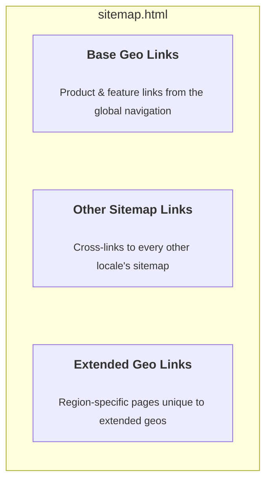
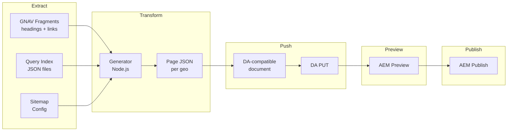

# HTML Sitemap Generator — Spec

Design, architecture, and source-of-truth data for the HTML sitemap generator.

See [README.md](./README.md) for CLI usage, setup, and GitHub Actions workflow inputs.

## Why

Crawlers (Googlebot, Bingbot) and LLM agents need a navigable, indexable entry point to discover all pages across Adobe's international sites. Without one, bots rely on XML sitemaps alone, which lack human-readable context and titles.

This work is especially important alongside **Project Lingo**, which is consolidating Adobe's country-first site structure into a language-first model. Google has been dropping ~20% of local pages due to content duplication across geos. Lingo reduces the indexable footprint; these HTML sitemaps ensure the remaining pages are explicitly surfaced for discovery, consolidating SEO value in the pages that matter.

**Who it serves**: Googlebot and search engine crawlers, LLM agents, and humans who navigate to these pages directly.

## Terminology

| Term | Definition |
|------|-----------|
| **Geo** | A region/locale (e.g. `fr`, `be_en`, `ch_fr`) |
| **Base Geo** | Primary region/locale with a dedicated `sitemap.html` page |
| **Extended Geo** | Secondary region/locale whose pages surface inside a base geo's page; no dedicated sitemap page |

## Requirements

- **Performance**: Pages must be fast. Googlebot penalizes slow pages, and slow CrUX scores defeat the purpose. Humans may also visit.
- **Static production URLs**: Generated pages contain hardcoded production URLs. We need bots to see this in HTML on first pass. Client-side JavaScript rewrites URLs in non-production environments to support development.
- **Full automation**: Authors must not be required to author or maintain anything that can be automated. Pages are generated entirely from live data sources -- no manual curation, no spreadsheets to maintain, no per-geo authoring.
- **Lingo compatibility**: As Lingo rolls out in phases (French first), sitemap pages will need updating based on which query indices are available at the time.
- **Monitoring**: Both the generation process and the resulting pages will be monitored.

## Page Structure

Each generated sitemap page has three stacked sections:



### Section 1: Base Geo Links

The main event. Product and feature links organized by category -- the same structure visitors see in the site's global navigation, flattened into a browsable list. Section headings (H3) group top-level categories like "Creativity & Design" or "Products"; sub-headings (H4) break them into groups like "Featured products" or "Online tools".

Sourced from GNAV fragments — see [GNAV (snapshot)](#gnav-snapshot) and [Content rendering rules](#content-rendering-rules).

### Section 2: Other Sitemap Links

A flat list of links to every other base geo's `sitemap.html` in the same domain (the current page is excluded). This is how crawlers and humans hop between localized sitemaps.

Auto-generated from the [geo map](#geo-map) -- no authoring required.

### Section 3: Extended Geo Links

Pages that only exist in extended geos, grouped by region (e.g. "Belgium (fr)", "Canada (fr)"). **Deduplication** is applied in **`transform`**, not in **`extract`**. The comparison is done on canonical paths with the geo prefix removed from both the base-geo path and the extended-geo path. If an extended-geo URL canonicalizes to a path that already exists in the base geo, the extended-geo entry is dropped. **Extract** only downloads raw `query-index.json` per site and geo.

Sourced from query index JSON files — see [Query index and geo map (snapshot)](#query-index-and-geo-map-snapshot).

## Scope

Each of Adobe's two primary subdomains gets its own set of HTML sitemaps. Each base geo within a subdomain gets a localized sitemap page.

Output pages: `https://{domain}/sitemap.html` and `https://{domain}/{baseGeo}/sitemap.html` for each base geo with indexable content.

### Config

Maps each subdomain to the AEM site that hosts its generated pages, the production domain for hardcoded links, and the extended geo display mode.

```tsv
subdomain	domain	site	extendedSitemap
business	business.adobe.com	da-bacom	all
www	www.adobe.com	da-cc	language
```

- `subdomain` — Logical subdomain name. Matches the `subdomain` column in `geo-map` and `query-index-map`.
- `domain` — Production domain for all rendered links. Replaces AEM `.aem.live` origins in output.
- `site` — AEM repo used for local GNAV fallback (step 2 of the [fallback chain](#gnav-resolution-fallback-chain)), DA push target, and AEM preview/publish.
- `extendedSitemap` — How extended geos are included on each base geo's page: `all` (every extended geo in the subdomain) or `language` (only language-matched extended geos mapped to the base geo).

Per-site query-index paths and the full geo map live in [Query index and geo map (snapshot)](#query-index-and-geo-map-snapshot).

## Query index and geo map (snapshot)

These paths and locale rows are **live** data: they change on AEM/repo schedules, not with this pipeline. A renamed path or missing index can break **extract** or **transform** without a coordinated release—re-verify when behavior drifts.

**Catalog snapshot: 2026-03-30** — The query-index path list and geo map below were checked against live `main--{site}--adobecom.aem.live` endpoints at that time. **Bump the date and revise the TSVs** when you re-audit after index or routing changes. GNAV-specific inventory lives in [GNAV (snapshot)](#gnav-snapshot).

### Query index sources

Each site contributes a query index per geo. **Extract** fetches `https://main--{site}--adobecom.aem.live/{geo}/{queryIndexPath}` for each row (and for each geo in scope — base + extended — per `geo-map`).

Out of scope for www: `genuine` (only in-app) and `upp` (only homepage).

Note: cc is missing `title, robots` (see [Generator logic](#generator-logic) for title fallback).

```tsv
subdomain	site	queryIndexPath
business	da-bacom	/query-index.json
www	cc	/cc-shared/assets/query-index.json
www	da-cc	/cc-shared/assets/query-index.json
www	da-dc	/dc-shared/assets/query-index.json
www	da-events	/events/query-index.json
www	da-express-milo	/express/query-index.json
www	edu	/edu-shared/assets/query-index.json
```

### Geo map

Each row defines a base geo and its extended geos. Not every extended geo will have a query index for every site — the generator warns and continues on 404.

Extended geos are mapped to the base geo that shares their language. **Extract** downloads query indices for all extended geos listed in the geo map for the subdomain (so **transform** has complete data). The `extendedSitemap` column in [Config](#config) controls how **transform** assembles Section 3 into pages:

- `language` (default): Each base geo page includes only its own mapped extended geos (language-matched).
- `all`: Each base geo page includes all extended geos from every base geo row in the subdomain.

**Page generation rule** (evaluated in **transform**): A sitemap page is only produced for a base geo when **at least one query index from any site returns indexable URLs** for that geo. If all indices for a base geo are 404 or contain no indexable URLs (e.g. all pages are noindex/nofollow), the page is skipped.

```tsv
subdomain	baseGeo	language	extendedGeos
business		en
business	au	en
business	de	de
business	fr	fr
business	in	en
business	it	it
business	jp	ja
business	kr	ko
business	pt	pt
business	sp	es	es
business	uk	en
www		en	ae_en, africa, be_en, ca, cis_en, cy_en, eg_en, gr_en, hk_en, id_en, ie, il_en, kw_en, lu_en, mena_en, mt, my_en, ng, nz, ph_en, qa_en, sa_en, sg, th_en, vn_en, za
www	ara	ar	ae_ar, eg_ar, kw_ar, mena_ar, qa_ar, sa_ar
www	au	en
www	az	az
www	bg	bg
www	bn	ms
www	br	pt
www	cn	zh	hk_zh, tw
www	cz	cs
www	de	de	at, ch_de, lu_de
www	dk	da
www	ee	et
www	el	el	gr_el
www	es	es	ar, cl, co, cr, ec, gt, la, mx, pe, pr
www	fi	fi
www	fr	fr	be_fr, ca_fr, ch_fr, lu_fr
www	hr	hr
www	hu	hu
www	hy	hy
www	id_id	id
www	il_he	he
www	in	en
www	in_hi	hi
www	it	it	ch_it
www	jp	ja
www	kr	ko
www	lt	lt
www	lv	lv
www	my_ms	ms
www	nl	nl	be_nl
www	no	no
www	ph_fil	fil
www	pl	pl
www	pt	pt
www	ro	ro
www	ru	ru	cis_ru
www	se	sv
www	si	sl
www	sk	sk
www	sr	sr
www	th_th	th
www	tr	tr
www	ua	uk
www	uk	en
www	vn_vi	vi
www	zh	zh
```


## GNAV (snapshot)

**Catalog snapshot: 2026-03-30** — Fragment paths and link counts below were verified against live `.aem.live` and [`libs/blocks/sitemap-base/sitemap-base.js`](../../../libs/blocks/sitemap-base/sitemap-base.js) at that time (same review window as [Query index and geo map (snapshot)](#query-index-and-geo-map-snapshot)). Federal and da-bacom navigation changes independently of this repo—**edit this section first** when GNAV shape or URLs drift, then align the reference block if behavior changes.

The two subdomains use different GNAV structures and origins.

### GNAV placeholders

GNAV fragments use `{{placeholder}}` tokens for some link labels (e.g. `{{premiere}}` → "Premiere"). **Extract** should fetch and store `placeholders.json` per geo; **transform** resolves tokens the same way as the browser block.

| | URL (append for each base geo via `/{geo}/…` when not English) |
|---|---|
| English | [`/federal/globalnav/placeholders.json`](https://main--federal--adobecom.aem.live/federal/globalnav/placeholders.json) |
| Example (localized) | [`/fr/federal/globalnav/placeholders.json`](https://main--federal--adobecom.aem.live/fr/federal/globalnav/placeholders.json) |

No keys beyond those already used by GNAV are required.

### business.adobe.com (da-bacom)

**Source**: Local GNAV in the [da-bacom](https://github.com/adobecom/da-bacom) repo.

| Fragment | Path | Content |
|---|---|---|
| Top-level GNAV | [`/gnav`](https://main--da-bacom--adobecom.aem.live/gnav.plain.html) | Flat list of `<a>` links to section fragments |
| Products | [`/fragments/gnav/products`](https://main--da-bacom--adobecom.aem.live/fragments/gnav/products.plain.html) | 28 links: product pages |
| AI | [`/fragments/gnav/ai`](https://main--da-bacom--adobecom.aem.live/fragments/gnav/ai.plain.html) | 19 links: AI features and solutions |
| Industries | [`/fragments/gnav/industries`](https://main--da-bacom--adobecom.aem.live/fragments/gnav/industries.plain.html) | 17 links: industry verticals |
| Roles | [`/fragments/gnav/roles`](https://main--da-bacom--adobecom.aem.live/fragments/gnav/roles.plain.html) | 19 links: persona/role pages |
| Resources | [`/fragments/gnav/resources`](https://main--da-bacom--adobecom.aem.live/fragments/gnav/resources.plain.html) | 15 links: blog, reports, events |
| Support | [`/fragments/gnav/support`](https://main--da-bacom--adobecom.aem.live/fragments/gnav/support.plain.html) | 14 links: help, services, docs |

All fragment paths are relative to the da-bacom repo origin (`https://main--da-bacom--adobecom.aem.live`).
Links resolve to `business.adobe.com` in production.

### www.adobe.com (da-cc)

**Source**: [Federal](https://github.com/adobecom/federal) repo (da-cc has no local `/gnav`).

| Fragment | Path | Content |
|---|---|---|
| Top-level GNAV | [`/federal/globalnav/acom/acom-gnav`](https://main--federal--adobecom.aem.live/federal/globalnav/acom/acom-gnav.plain.html) | Headings with `<a>` links to section sub-fragments |
| Creativity & Design | [`/federal/globalnav/acom/sections/section-menu-cc`](https://main--federal--adobecom.aem.live/federal/globalnav/acom/sections/section-menu-cc.plain.html) | References 3 column fragments |
| -- CC Column 1 | [`/federal/globalnav/acom/fragments/cc/cc-column-1`](https://main--federal--adobecom.aem.live/federal/globalnav/acom/fragments/cc/cc-column-1.plain.html) | Plans and pricing links |
| -- CC Column 2 | [`/federal/globalnav/acom/fragments/cc/cc-column-2`](https://main--federal--adobecom.aem.live/federal/globalnav/acom/fragments/cc/cc-column-2.plain.html) | Product links (Photoshop, Illustrator, etc.) |
| -- CC Column 3 | [`/federal/globalnav/acom/fragments/cc/cc-column-3`](https://main--federal--adobecom.aem.live/federal/globalnav/acom/fragments/cc/cc-column-3.plain.html) | AI feature links |
| PDF & E-signatures | [`/federal/globalnav/acom/sections/section-menu-dc`](https://main--federal--adobecom.aem.live/federal/globalnav/acom/sections/section-menu-dc.plain.html) | References 3 column fragments |
| -- DC Column 1 | [`/federal/globalnav/acom/fragments/dc/dc-column-1`](https://main--federal--adobecom.aem.live/federal/globalnav/acom/fragments/dc/dc-column-1.plain.html) | Acrobat product links |
| -- DC Column 2 | [`/federal/globalnav/acom/fragments/dc/dc-column-2`](https://main--federal--adobecom.aem.live/federal/globalnav/acom/fragments/dc/dc-column-2.plain.html) | Use-case links |
| -- DC Column 3 | [`/federal/globalnav/acom/fragments/dc/dc-column-3`](https://main--federal--adobecom.aem.live/federal/globalnav/acom/fragments/dc/dc-column-3.plain.html) | Business/enterprise links |
| ~~Marketing & Commerce~~ | [`/federal/globalnav/acom/sections/section-menu-dx`](https://main--federal--adobecom.aem.live/federal/globalnav/acom/sections/section-menu-dx.plain.html) | **Excluded** -- all links point to business.adobe.com |
| Learn & Support | [`/federal/globalnav/acom/sections/section-menu-help`](https://main--federal--adobecom.aem.live/federal/globalnav/acom/sections/section-menu-help.plain.html) | Inline links (no column fragments) |

All fragment paths are relative to the federal repo origin (`https://main--federal--adobecom.aem.live`).
Links resolve to `www.adobe.com` or `business.adobe.com` in production.

**Note**: Marketing & Commerce (`section-menu-dx`) is excluded from www sitemaps because its links all point to business.adobe.com. This is hardcoded in the generator.

**Localization**: Localized GNAV fragments are fetched by prepending the geo prefix, e.g.:
[`/fr/federal/globalnav/acom/acom-gnav`](https://main--federal--adobecom.aem.live/fr/federal/globalnav/acom/acom-gnav.plain.html) (French)

**Catalog vs runtime discovery (www)**:

- The table above is a **human-readable catalog** of the federal GNAV shape (top-level → section → optional `#_inline` column fragments). It is **not** a fixed list hardcoded in the browser reference implementation.
- [Reference implementation](#reference-implementation-browser) (`milo` `libs/blocks/sitemap-base/sitemap-base.js`): loads **one** top-level GNAV (`acom-gnav`), parses section headings and links, then **fetches each section** `.plain.html` and, when present, follows each `#_inline` link (excluding promos) to fetch column fragments. **Additional URLs** are discovered from the live DOM; if federal adds or renames sections, the prototype picks them up without a code change.
- **`extract` can ship** by mirroring that same strategy: fetch top-level → discover section paths → fetch each section → fetch column targets from `#_inline` links (same URL set as the browser, modulo caching). Alternatively, a **prefetch list** derived from this table can be used for validation or offline tooling; it may drift if federal changes before this spec is updated.
- **Transform / HTML rendering** (server-side) reuses the **same parsing rules** as the prototype: walk headings and links in order, merge column content, apply exclusions and placeholders. That logic belongs in `transform`, not in `extract`; `extract` only needs to persist enough raw `.plain.html` (and placeholders) so `transform` is deterministic.

See [Reference implementation](#reference-implementation-browser) for file paths and draft test URLs.

### GNAV Resolution Fallback Chain

The generator resolves the GNAV source using this chain:
1. `gnav-source` page metadata (if present) — client-side prototype only; skipped in the server-side pipeline (no page context to read metadata from)
2. Local `/{geo}/gnav` on the subdomain's host site (see [Config](#config))
3. Federal `/{geo}/federal/globalnav/acom/acom-gnav` (fallback)

### Link Domain Mapping

All rendered links use production URLs. The domain mapping:

| Repo Pattern | Production Domain |
|---|---|
| da-bacom and da-bacom-* repos | `https://business.adobe.com` |
| All other repos | `https://www.adobe.com` |

Links to external domains (helpx.adobe.com, experienceleague.adobe.com, etc.) are preserved as-is.

### Content Rendering Rules

Each GNAV section fragment produces a block of content within the sitemap page. The rendering follows these rules:

**Heading hierarchy**:
- **H3**: Section heading (from the top-level GNAV, e.g. "Creativity & Design", "Products")
- **H4**: Sub-heading (from heading tags within section fragments, e.g. "Shop for", "Featured products", "Online tools")
- Sub-headings break the content into multiple `<ul>` groups within a section. Each sub-heading is followed by its own `<ul>` of links.

**Fragment parsing**:
- Section fragments use two structures: `.link-group` divs (federal pattern) or `<ul><li>` lists. Both are supported.
- Federal CC and DC sections use nested `#_inline` column fragment references. These are followed and their content is merged in document order.
- Heading tags (`<h5>`, `<h6>`, etc.) within fragments become H4 sub-headings.
- `<a>` tags within `.link-group`, `<li>`, `<p>`, or `<strong>` elements become links.
- Description text in `<p>` tags after links (e.g. "Image editing and design", "AI-powered content creation") is **discarded** -- these are GNAV mega-menu descriptions, not sitemap content.

**Placeholders**: Resolve `{{placeholder}}` tokens using the JSON from [GNAV placeholders](#gnav-placeholders).

**Excluded content**:
- `bookmark://` links (internal GNAV anchor plumbing, not navigable URLs)
- `#_inline` fragment references (internal GNAV plumbing -- followed for content, but the reference itself is not rendered)
- Image-only content (SVG icons, product logos) -- stripped after link decoration
- Promo fragments (promotional aside content within column references)
- Marketing & Commerce section (`section-menu-dx`) on www (all links point to business.adobe.com -- hardcoded exclusion)

Whether a page is emitted at all also depends on query-index data — see **Page generation rule** under [Geo map](#geo-map).

## Architecture

### Data Sources

1. **Sitemap [Config](#config)** — Subdomain → site mapping, production domains, `extendedSitemap` mode. Will eventually be backed by a DA spreadsheet.
2. **[Query index and geo map (snapshot)](#query-index-and-geo-map-snapshot)** — Per-site query-index paths and base/extended geo rows; **extract** downloads JSON; **transform** applies scope and deduplication.
3. **[GNAV (snapshot)](#gnav-snapshot)** — Fragment paths, placeholders, fallback chain, rendering rules; **extract** stores raw `.plain.html` under a per-geo `_extract` tree plus a per-geo manifest that maps saved files back to source URLs and fragment roles; **transform** parses into Section 1.

### Extract Output Conventions

- `_extract` is internal pipeline state only. It is not a publishable content path and does not correspond to a final sitemap document.
- A base-geo folder is created only when that geo qualifies for sitemap output based on its base-geo query-index data.
- Extended-geo query indices are stored under the owning base geo's `_extract/extended/` subtree so each base geo's transform inputs remain self-contained.
- For non-root geos, localized GNAV extraction follows geo-prefixed fragment paths so section and inline fragment content matches the base geo being processed.

### Pipeline



### Generator Logic

For each domain (business, www) and for each base geo in the geo map:

1. **Resolve GNAV source** for the base geo using the [fallback chain](#gnav-resolution-fallback-chain):
   1. Local `/{geo}/gnav` on the subdomain's host site (see [Config](#config))
   2. Federal `/{geo}/federal/globalnav/acom/acom-gnav` (fallback)
   - If no GNAV source resolves for the base geo, log a warning, skip GNAV extraction for that base geo, and continue the run.
2. **Parse top-level sections** from the GNAV document:
   - Federal pattern: heading tags containing `<a>` links to section sub-fragment paths
   - Local pattern: flat `<a>` links with paths containing `/fragments/`
   - Exclude sections in the hardcoded exclusion list (e.g. `section-menu-dx` for www)
3. **Fetch each section fragment** and extract content in document order:
   - If the fragment contains `#_inline` column references, follow each (skip promos), fetch, and merge content
   - Heading tags (`h5`, `h6`, etc.) become sub-headings
   - Links inside `.link-group`, `<li>`, `<p>`, or `<strong>` become links
   - Description `<p>` text after links is discarded
   - `bookmark://` links are discarded
   - Persist a manifest alongside raw GNAV files so local filenames can remain implementation-defined while retaining exact source provenance (`sourceUrl`, `sourcePath`, fragment role, and parent relationship when applicable).
4. **Resolve placeholders** (`{{key}}` tokens) via federal globalnav placeholders for the geo
5. **Fetch query index JSON** for the base geo (and its extended geos) from each site in the query index map. Warn and skip on 404 or empty results.
6. **Check page generation rule**: if no site returned indexable URLs for this base geo, skip -- do not produce a page.
   - In the current implementation, `extract` treats a base geo as eligible for sitemap output when at least one base-geo query index succeeds and returns rows.
   - If that rule is not met, `extract` leaves no per-geo output subtree behind for that base geo.
7. **Build page structure** (H3 section heading > H4 sub-headings > UL link groups):
   - GNAV sections with localized headings and sub-headings
   - Links to HTML sitemaps of every other base geo in the same domain
   - Extended geo links: scoped by `extendedSitemap` config (`language` = this base geo's mapped extended geos; `all` = every extended geo in the subdomain); **deduplicate** against the base geo's query-index paths using canonical paths with the geo prefix removed, per [Section 3](#section-3-extended-geo-links) / [Geo map](#geo-map)
   - All links use hardcoded production URLs (`business.adobe.com` for da-bacom repos, `www.adobe.com` for all others)
   - Strip images/SVGs that may have been generated from URL decoration
8. **Transform** the page structure into a DA-compatible document (see [DA Document Format](#da-document-format))
9. **Push** the document to DA via the DA Admin API (IMS-authenticated)
10. **Trigger** AEM preview and publish via the Helix Admin API

**Query index title fallback**: When a query index entry is missing a `title` field (e.g. the cc site), generate a title from the URL slug: remove any file extension, split on hyphens, and capitalize each word. Naive but better than a blank entry.

**Query index title cleanup**: During `transform data`, strip trailing Adobe branding suffixes such as `- Adobe` or `| Adobe` from normalized titles.

### Transform Data Contract

`transform data` is a local-only stage. It reads previously extracted `_extract` artifacts for each eligible base geo and writes a normalized `sitemap.data.json` file for that geo.

The current normalized data contract contains:

- `sections.baseGeoLinks`
- `sections.otherSitemapLinks`
- `sections.extendedGeoLinks`

Placeholder resolution occurs in `transform data`, using the extracted `placeholders.json` file. That resolution applies to GNAV-derived labels and GNAV-derived links before the normalized output is written.

### Extract Summary

At the end of an `extract` run, the generator prints a rollup of:

- base geos processed
- base geos with sitemap output
- base geos without sitemap output
- warning-derived gaps such as missing base query indices

This summary is intended to reflect the effective output set for downstream `transform`, not just raw fetch attempts.

### Transform Summary

At the end of a `transform data` run, the generator prints a rollup of:

- base geos transformed
- base geos skipped because no eligible extracted subtree was present

This summary is intended to reflect which geos produced normalized data files in the current run.

### DA Document Format

> **TODO**: Document the DA page format -- how to represent an HTML page as a DA-compatible document for upload via the DA Admin API. This will be informed by DA documentation and iteration on the pipeline's push stage.

### Scheduling

The generator runs on a recurring schedule. Options:
- GitHub Actions `schedule` trigger (cron)
- External cron (e.g. Adobe I/O Runtime / OpenWhisk action) triggering via `repository_dispatch`

Full rebuild on each run (no incremental state management needed). The entire dataset is processed from scratch each time.

Local cleanup of generated artifacts is handled by a separate `clean` CLI stage that deletes the configured output directory. It only affects local disk output, not DA or AEM state.

Current operational scope is additive only: the pipeline creates or updates generated sitemap pages, but does not automatically remove or unpublish pages that become ineligible. Cleanup is manual until explicit removal behavior is specified.

## Reference implementation (browser)

Canonical **behavior** for GNAV resolution, discovery, `#_inline` columns, exclusions, and placeholders is described in [GNAV (snapshot)](#gnav-snapshot) and implemented in:

| | |
|---|---|
| Block | [`libs/blocks/sitemap-base/sitemap-base.js`](../../../libs/blocks/sitemap-base/sitemap-base.js) |
| Tests | [`test/blocks/sitemap-base/sitemap-base.test.js`](../../../test/blocks/sitemap-base/sitemap-base.test.js) |

The [`sitemap-gnav-proto`](https://github.com/adobecom/milo/tree/sitemap-gnav-proto) branch is only for **draft preview** (`milolibs=…`); source of truth is `libs/blocks/sitemap-base/` on your branch.

**Activation**: `?sitemap-source=gnav` on a page that uses the sitemap block.

**Draft URLs** (append `&cache=bust` if stale):

- business: `https://main--da-bacom--adobecom.aem.live/drafts/hgpa/sitemap?milolibs=sitemap-gnav-proto--milo--adobecom&sitemap-source=gnav`
- www: `https://main--da-cc--adobecom.aem.live/drafts/hgpa/sitemap?milolibs=sitemap-gnav-proto--milo--adobecom&sitemap-source=gnav`

The Node pipeline should stay aligned with this block; **bump the Catalog snapshot dates** in [GNAV (snapshot)](#gnav-snapshot) and [Query index and geo map (snapshot)](#query-index-and-geo-map-snapshot) when re-verifying against live endpoints or when the block changes.

## Open Questions

- [ ] Scheduling frequency: hourly? daily?
- [ ] Should this live in milo or a separate repo?
- [ ] Reuse preview-indexer's DA/IMS/Helix client modules (`internal/da-client.js`, `internal/helix-client.js`) or rewrite in TypeScript?
- [ ] OpenWhisk cron vs. GitHub Actions scheduled trigger?
