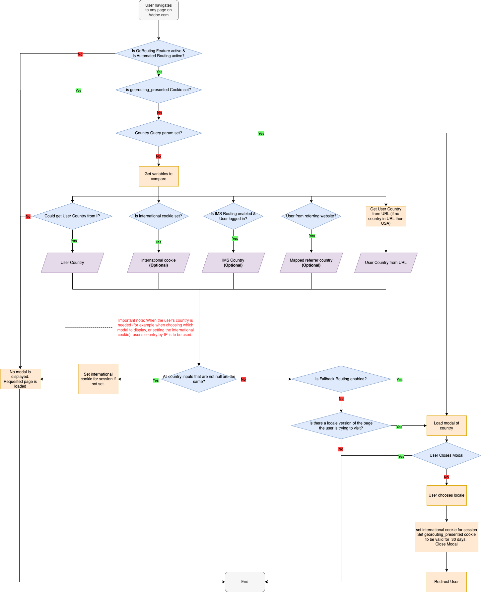

# Georouting in Milo
The image belows describes how the Georouting has been implemented in Milo.
If you want to make any changes to it, you can edit it here: https://wiki.corp.adobe.com/display/WP4/GeoRouting

