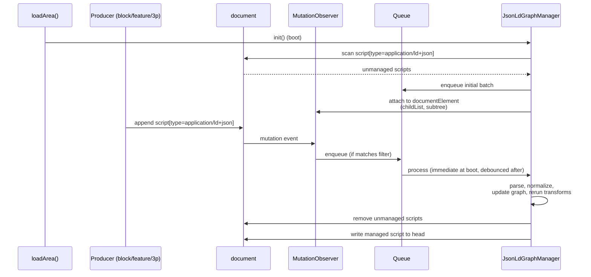
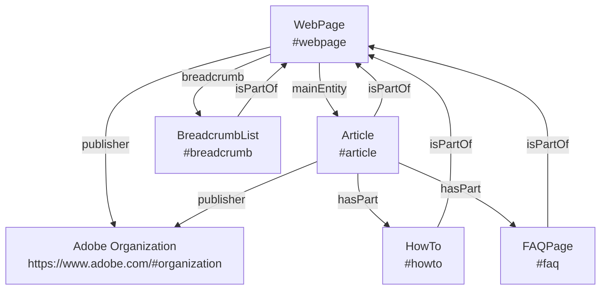
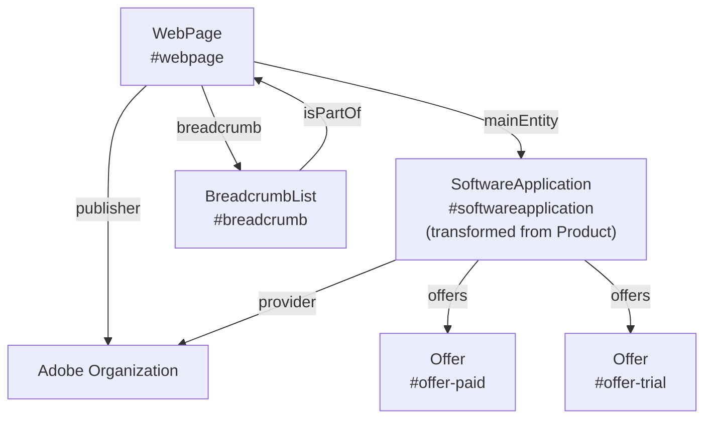

# Milo JSON-LD Graph Manager

> **Status:** DRAFT  

## Summary 

The JSON-LD Graph Manager is a Milo feature that collects all the JSON-LD on a page and rewrites it as **one canonical, linked `@graph`**. This centralization enables the manager to automatically apply JSON-LD graph features that may improve search engine and LLM visibility, such as cross-entity `@id` linking and singleton enforcement for certain types.

The feature is **disabled by default**. To enable, set the `jsonld-graph-manager` page metadata or URL query parameter to the string `true` (case-insensitive). The string `false` explicitly disables it. Presence without a value does not enable the feature. To enable debug logging of queue lifecycle events, add `jsonld-graph-manager-debug=true` as a URL query parameter.

## 1. Introduction

One strategy which may improve Adobe.com visibility across search engines and LLMs is to improve the consistency of JSON-LD across pages. We can define default nodes and relate individual nodes to one another to eliminate duplicated and contradictory nested nodes. This relationship may also improve understanding. Methods include using `@id` references, `mainEntity`, `sameAs`, `isPartOf`, etc.

Many Milo blocks and features produce JSON-LD. The problem is these producers write their JSON-LD to the page independently without any coordination or knowledge of each other. As of April 17, 2026 there were **33 integrations spread across 7 active sites**. Only 17 of those integrations are in `milo` itself. This makes these techniques difficult to coordinate manually.

The `JsonLdGraphManager` exists to convert these entities into a single graph. Consider a product page that today emits JSON-LD from `richresults` (Article, Organization), `gnav` (BreadcrumbList), `seotech` (VideoObject). The `<head>` ends up with four independent scripts, with overlapping entity definitions and inconsistent identifiers:

**Before** — `jsonld-graph-manager: false` — four isolated scripts, no links between them:

```html
<head>
  <!-- richresults -->
  <script type="application/ld+json">
  {
    "@type": "Organization",
    "name": "Adobe",
    "url": "https://www.adobe.com/"
  }
  </script>
  <!-- richresults -->
  <script type="application/ld+json">
  {
    "@type": "Article",
    "headline": "Photoshop",
    "author": { 
      "@type": "Organization",
      "name": "Adobe"
    }
  }
  </script>
  <!-- gnav -->
  <script type="application/ld+json">
  {
    "@type": "BreadcrumbList",
    "itemListElement": [ … ]
  }
  </script>
  <!-- seotech -->
  <script type="application/ld+json">
  {
    "@type": "VideoObject",
    "name": "Photoshop overview"
  }
  </script>
</head>
```

`Organization` is emitted twice (once standalone, once anonymous inside `Article`). Nothing links `Article` to `WebPage`.

**After** — `jsonld-graph-manager: true` — one script, entities linked by `@id`:

```html
<head>
  <script type="application/ld+json" data-milo-jsonld="graph">
  {
    "@context": "https://schema.org",
    "@graph": [
      {
        "@type": "Organization",
        "@id": "https://www.adobe.com/#organization",
        "name": "Adobe"
      },
      {
        "@type": "WebPage",
        "@id": "…#webpage",
        "publisher": { "@id": "https://www.adobe.com/#organization" },
        "breadcrumb": { "@id": "…#breadcrumb" },
        "mainEntity": { "@id": "…#article" }
      },
      {
        "@type": "Article",
        "@id": "…#article",
        "headline": "Photoshop",
        "isPartOf": { "@id": "…#webpage" },
        "mainEntityOfPage": { "@id": "…#webpage" },
        "publisher": { "@id": "https://www.adobe.com/#organization" }
      },
      {
        "@type": "BreadcrumbList",
        "@id": "…#breadcrumb",
        "isPartOf": { "@id": "…#webpage" },
        "itemListElement": [ … ]
      },
      {
        "@type": "VideoObject",
        "@id": "…#videoobject",
        "name": "Photoshop overview"
      }
    ]
  }
  </script>
</head>
```

`Organization` appears once and is referenced by `@id` from both `WebPage.publisher` and `Article.publisher`. `WebPage` is the graph root — it declares its `breadcrumb` and `mainEntity` by reference. `Article` links back via `isPartOf` and `mainEntityOfPage`. `BreadcrumbList` also declares `isPartOf` the `WebPage`. Every relationship is bidirectional and traversable.

§3 Requirements specifies the normative rules for the managed graph. §4 Per-Type Strategy maps each supported schema.org type to its Google rich-result requirements, manager handling, and known producers in the Milo repository.

## 2. Design

### 2.1 Architecture Overview

The `JsonLdGraphManager` is a document-level runtime object initialized from the document branch of `loadArea()` in `libs/utils/utils.js`.

There are three main stages:

1. **Observe** — scan the DOM at boot, and watch for later appends via `MutationObserver`. Ingest and remove unmanaged JSON-LD scripts.
1. **Normalize** — apply canonical page-scoped identity to known entity types; merge conflicts by producer priority; dedupe singletons.
1. **Rewrite** — serialize one `@graph` into a single managed `<script>` in `<head>`.

### 2.2 Runtime Lifecycle

#### Ingestion and rebuild

Unmanaged JSON-LD reaches the manager through two entry points — a one-time boot scan and an ongoing `MutationObserver` — that both feed the same rebuild pipeline.

**At boot**, during document-level `loadArea()`, the manager initializes a singleton instance, scans the full document for `script[type="application/ld+json"]`, ignoring its own managed graph if one already exists, and attaches a `MutationObserver` for future additions.

**At runtime**, when a block, feature, experiment, or third-party script appends JSON-LD anywhere in the document subtree, the observer detects it and enqueues the event for sequential processing.

Both entry points converge on the same pipeline: for each unmanaged payload, the manager parses it, normalizes discovered entities, removes the unmanaged script from the DOM, updates the in-memory graph, reruns graph transforms, and rewrites the managed script in `document.head`.



The observer target is `document.documentElement` with `childList` and `subtree` enabled. Only added nodes that are, or contain, `script[type="application/ld+json"]` are enqueued. Managed output is excluded by filtering on the manager-owned selector `script[type="application/ld+json"][data-milo-jsonld="graph"]`.

#### Queueing and rebuild policy

Although JavaScript execution is single-threaded, the manager still uses an explicit queue. The queue provides:

- deterministic processing order
- protection from re-entrant writes
- one rebuild path for all producer types
- batching during high DOM churn

The manager performs an immediate boot write, then batches later rewrites on a debounce interval. The target behavior is that rebuilds do not occur faster than roughly once per second during steady-state mutation bursts.

### 2.3 Output Contract

The shape of the managed `<script>` and `@graph`, including required and optional attributes, identity rules, singletons, and entity linkage, is defined in §3 Requirements. The manager's job is to produce output that satisfies every `error`-severity rule there.

Accepted input forms include a single JSON-LD object, an array of JSON-LD objects, or an object containing `@graph`. All accepted forms are recursively flattened into one internal graph representation before transforms run: an array element that is itself a `@graph` wrapper is spliced in as siblings rather than retained as a node; a wrapper that carries both `@type` and `@graph` (e.g., `{ "@type": "WebPage", "name": "X", "@graph": [...] }`) is split into the typed-node-without-`@graph` plus the inner nodes; nested wrappers are flattened to any depth. This ensures the managed `@graph` never contains a node whose own property is `@graph`.

Non-managed JSON-LD scripts are candidates for ingestion and removal regardless of where they appear in the document; the manager ignores its own managed graph (identified by the `data-milo-jsonld="graph"` attribute) during scan and observation.

### 2.4 Normalization And Merge Policy

The canonical `@id` values the manager assigns to each recognized entity type are defined in §3 Requirements (`page-scoped-id-format`, `organization-site-wide-id`). Incoming producer `@id` values are treated as merge hints — for recognized entities, the manager rewrites `@id` to the canonical value. Unknown nodes that lack stable identity are retained provisionally until they can be normalized or deduplicated.

#### Merge priority

When multiple sources describe the same entity, the default source priority is:

1. graph-manager-generated transforms
1. Milo feature or block sources
1. third-party runtime sources
1. initial page DOM

#### Default merge rules

Unless a type-specific rule overrides them, the manager applies the following defaults:

- scalar field conflicts are resolved by source priority
- object fields are merged by key, with conflicting child fields resolved by source priority
- relationship arrays are unioned by canonical `@id`
- anonymous array members are deduplicated by normalized content hash when no stable `@id` exists
- unknown anonymous top-level nodes are retained provisionally until they can be normalized or deduplicated

Singleton, supplemental, and repeatable type policies are defined in §3.4 Graph composition (`webpage-canonical-singleton`, `organization-singleton`, `breadcrumblist-singleton`, `required-primary-type`, `supplemental-singletons`, `repeatable-types`). Relationship arrays such as `hasPart` are unioned by canonical `@id`.

#### Type-specific transforms

In addition to identity rewrite and merge, the manager applies a small set of type-specific transforms.

**Product → SoftwareApplication.** Adobe.com pages do not market physical products. The merch card system, however, emits `Product` nodes (see the `merch-card` golden fixture under `test/features/jsonld-graph-manager/`). Because the canonical primary type for product-oriented pages is `SoftwareApplication`, the manager normalizes any incoming `Product` node into a `SoftwareApplication`:

- rewrites `@type` from `Product` to `SoftwareApplication`
- re-derives `@id` to `{canonicalPageURL}#softwareapplication`
- preserves `name`, `brand`, `image`, `offers`, and other shared properties
- hoists nested `Brand` and `Offer` entities to the top-level `@graph` and replaces inline values with `@id` references

This transform is governed by the `product-to-softwareapplication` requirement.

**SoftwareApplication subtype preservation.** Schema.org defines `WebApplication`, `MobileApplication`, and `VideoGame` as subtypes of `SoftwareApplication`, and Google's Software App rich result explicitly supports them. When a producer supplies one of these subtypes (e.g., team-hardcoded `WebApplication` markup), the manager preserves the more specific `@type`, lands the node at the canonical `#softwareapplication` `@id`, and merges contributions from other producers (e.g., the review block emitting `Product` → `SoftwareApplication`) at the same id. The baseline `Product → SoftwareApplication` transform does NOT rewrite a producer-supplied subtype down to plain `SoftwareApplication`. Governed by `softwareapplication-subtype-allowed`.

**Cross-page WebPage references.** Producers occasionally assert `isPartOf` or `mainEntityOfPage` against a different page's WebPage (e.g., a sub-app belonging to a parent /online/ index). Schema.org permits this and Google's rich-result spec is silent on it. To keep the page graph coherent on a single-page basis, the manager rewrites such references to the current canonical `#webpage` id and discards the inline cross-page WebPage body. Governed by `webpage-canonical-singleton`. (We may revisit this if a consumer ever surfaces a need for cross-page parent linkage.)

#### Reference shape

References to other graph nodes are encoded as `{ "@id": "…" }` (see `nodes-referenced-by-id`). Because all referenced entities — including the site-wide `Organization` — are present as top-level nodes in the managed `@graph`, consumers can follow any `@id` to find the full node and its properties. Adding `url` to a reference object would be redundant.

### 2.5 Canonical Page Graph Model

The manager treats `WebPage` as the page container and links related entities to it. Canonical `@id` values are defined in the preceding section.

#### Editorial page shape



This model is intended to be stable across separate producer implementations. The relationships shown — `mainEntity`, `breadcrumb`, `publisher`, `isPartOf`, `hasPart` — and their cardinality constraints are encoded as rules in §3 Requirements.

#### Product page shape



For product-oriented pages, `WebPage.mainEntity` points to `SoftwareApplication` rather than `Article`. Producer payloads of `@type: Product` are transformed to `SoftwareApplication` per §2.4. Offers (paid subscription, free trial, etc.) are hoisted to the top-level `@graph` and referenced by `@id`. The page-family-to-primary-entity mapping is owned by the public `tests` dataset.

### 2.6 Alternatives Considered

There are two additional approaches that have been tabled but should be reexamined in future.

**Coordinated producer migration.** Require every producer to adopt a shared interface — a direct-push API, a publish-subscribe bus, a declarative schema — before shipping anything. Rejected: the producer landscape currently spans 33 integrations across 7 repos, including legacy, external, and non-Milo sources, plus inline author-authored JSON-LD. Any such approach requires every producer to opt in on day one, cannot be feature-flagged per page, and strands producers that cannot be refactored at all. The observation-first design lets the ecosystem converge incrementally without blocking on any single producer. In the future we can offer a direct-push function as the preferred method and refactor existing components.

**Build-time aggregation.** Collect and normalize JSON-LD at publish time instead of at runtime. Rejected: much of today's JSON-LD is produced by runtime code (feature fetches, DOM derivations, experimentation) and by author-hand-coded inline scripts. A build-time aggregator would miss both categories, and the managed graph would not reflect what the browser actually renders. There are still valid use-cases for this approach to perform major portions of node generation.

## 3. Requirements

The normative rules for the managed graph. Every rule has a stable `Name`, a `Severity`, the `Requirement` itself, and optional `Notes`. Severity meanings:

- **error** — the manager MUST satisfy this rule. Output that violates an error-rule is non-conformant.
- **warn** — the manager SHOULD satisfy this rule. Violations should be logged via Lana but do not block emission.
- **info** — informational guidance. Captures defaults, conventions, and rules the manager applies but that consumers and producers MAY also rely on.

Rules are grouped by concern. Cross-type behavior (singletons, defaults, transforms, source priority) lives here; per-type policy and producer inventory lives in §4.

The full, authoritative rule set lives in [`rules.yaml`](./rules.yaml), co-located with the implementation. **That file is the single source of truth.** Each row carries the rule `name`, `severity`, `requirement`, the `implements` symbols in `jsonld-graph-manager.js`, the `tested_by` test blocks, `interacts_with` cross-references, `status`, and rationale `notes`. The Name/Severity/Requirement tables that previously lived in this section duplicated those rows and have been removed to prevent drift.

Query the rules directly, for example:

```sh
# every error-severity rule
yq '.[] | select(.severity == "error") | .name' rules.yaml

# rules not yet fully implemented
yq '.[] | select(.status != "active") | .name' rules.yaml
```

Each rule's `section` field groups it: Output shape, Identity, References, Graph composition, Linking, Type transforms, Defaults and precedence, and the `Type-specific: <Type>` groups. Two cross-cutting design notes are not captured by any single rule row:

**`webpage-canonical-singleton` — cross-page policy.** Schema.org allows `isPartOf` to point at a cross-page resource and Google's rich-result spec doesn't constrain it, but a managed page-graph that contains two WebPage nodes is internally inconsistent for our consumers (the WebPage of the rendered page is the only one with full link wiring). We therefore rewrite cross-page `isPartOf`/`mainEntityOfPage` to the current canonical `#webpage` id. This is policy choice C from the design review — to be revisited if a consumer ever surfaces a need for cross-page parent linkage.

**Interaction with `ignore-types-bypass`.** The rules apply to the *managed graph* — the script the manager emits. When a producer script is bypassed via the ignore-types query parameter, its nodes do not enter the managed graph and the rules are evaluated as if the producer had not contributed:

- `webpage-canonical-singleton` and `organization-singleton` (error): not at risk. The manager always synthesizes baseline WebPage and Organization (`manager-baseline-graph`); ignoring `WebPage` or `Organization` only means a producer-supplied node remains on the page as a sibling — the managed graph still has exactly one of each.
- `breadcrumblist-singleton` (error): satisfied by the "when applicable" semantics. Ignoring `BreadcrumbList` leaves the managed graph with zero BreadcrumbList nodes, which is allowed.
- `webpage-breadcrumb-link` (warn): only evaluated when BreadcrumbList is present in the managed graph, so ignoring it disables the rule for that page.
- `required-primary-type` (warn): **at risk.** Ignoring the sole primary type (e.g., the only `Article` / `SoftwareApplication` on the page) leaves the managed graph without a primary entity and breaks the `WebPage.mainEntity` link. Callers opt into this risk explicitly.

## 4. Per-Type Strategy

The manager's per-type behaviour and the surrounding reference data are owned elsewhere; this section keeps only the curated Google rich-result requirements and eligibility status, which are not captured by any other source:

- **Manager handling** (`@id` format, cardinality, transforms, linking, extraction) — defined by the rule rows in [`rules.yaml`](./rules.yaml).
- **Schema.org and Google documentation links** per type — the `types` sheet of [structured-data-json-ld.json](https://milo.adobe.com/docs/authoring/structured-data-json-ld.json).
- **Producer inventory** (which blocks/features emit each type, across all repos) — the `integrations` sheet of the same catalog.

Coverage strategy: Google rich-result eligibility is consumer #1. Other consumers (LLMs, knowledge graphs) benefit indirectly from the same shape. The manager preserves producer fields beyond what Google requires.

| Type | Google rich result — required (recommended) | Status / notes |
|---|---|---|
| `WebPage` | — | Not directly eligible; acts as the page-graph root that other types attach to via `isPartOf` / `mainEntity` / `breadcrumb`. |
| `Organization` | `name` (logo ≥ 112×112) | Drives logo, knowledge panel, and publisher attribution. |
| `BreadcrumbList` | `itemListElement[]` of `ListItem` with `position`, `name`, `item` | |
| `SoftwareApplication` (+ `WebApplication`, `MobileApplication`, `VideoGame`) | `name`, `offers.price`, one of `aggregateRating` / `review` (`applicationCategory`, `operatingSystem`) | Subtypes explicitly supported by Google. The manager's primary product type; `Product` is transformed into this. |
| `Article` / `NewsArticle` | `headline`, `image`, `datePublished`, `author`, `publisher` | `NewsArticle` is the same shape with stricter content guidelines. |
| `HowTo` | `name`, `step[]` of `HowToStep` | Rich result deprecated by Google in 2023; markup still ingested for general understanding. |
| `FAQPage` | `mainEntity[]` of `Question` with `acceptedAnswer.Answer.text` | Rich result restricted to authoritative government/health sites since 2023; otherwise still consumed by Search/LLMs. |
| `VideoObject` | `name`, `thumbnailUrl`, `uploadDate` (`description`, `contentUrl`, `embedUrl`, `duration`) | |
| `Offer` | `price`, `priceCurrency` (when referenced from `SoftwareApplication`) | |
| `AggregateRating` | `ratingValue`, `ratingCount` (or `reviewCount`) | Required by the Software App, Product, Course, and Review-snippet rich results when present on the host entity. |
| `Event` | `name`, `startDate`, `location` (`description`, `endDate`, `image`, `offers`) | Passed through; not a primary page type. |
| `WebSite` | `potentialAction` `SearchAction` with `target` + `query-input` | Sitelinks search box; emitted only when explicitly authored. |

## 5. Conformance

Testing for the `JsonLdGraphManager` is organized at three levels:

1. **Unit tests** cover the manager's internal behavior: parsing the accepted input shapes, identity-rewrite for known types, merge-priority resolution, and dedupe for singletons. These run under the existing Milo unit-test harness and should not depend on the network. Part of Milo.

2. **Integration tests** cover the boot and mutation lifecycle against representative DOM fixtures. Each fixture represents one page family (editorial, product, breadcrumb-only, multi-producer conflict, etc.) and asserts on the managed `@graph` output plus the removal of unmanaged scripts. Part of Milo.

3. **End-to-end tests** cover cohort pages listed in the public `tests` dataset. For each row, the test asserts the JSON-LD on the page meets all `requirements` and matches the row's defined Expected Primary Entity. End-to-end testing depends on a dev or stage deployment: once the branch is pushed, we can load AEM `.live` or `.page` URLs with `milolib=${BRANCH_NAME}` and `jsonld-graph-manager=true` to exercise the feature before merge. This feature could be considered complete once all `requirements` pass for every row in `tests`. Due to its complexity this test may exist outside of Milo.

Evaluating whether this feature actually improves how search engines and LLMs surface content is not in the scope of this document. 

## 6. Operations

### 6.1 Feature Flagging

**Flag:** `jsonld-graph-manager` (page metadata or URL query parameter, `true`/`false`, default `false`)

The manager is feature-gated by AEM page metadata so it can be enabled or disabled on selected pages and page families without affecting the entire site at once. You can also use the query parameter for quick testing.

**Debug flag:** `jsonld-graph-manager-debug` (URL query parameter only, `true` to enable)

**Ignore-types flag:** `jsonld-graph-manager-ignore` (URL query parameter only, comma-separated list of schema.org type names, case-insensitive). Default empty. Producer scripts whose top-level content matches any entry on the list are bypassed entirely — the manager does not parse, normalize, merge, or remove them from the DOM. The pseudo-type `graph` matches any script whose top-level content is a `{ "@graph": [...] }` container, regardless of the types nested inside. Example: `jsonld-graph-manager-ignore=breadcrumblist,faqpage,howto,videoobject,graph`. Governed by `ignore-types-bypass` (§3.7); see the rule-interaction note in §3.4 for caveats when ignoring primary or singleton types.

### 6.2 Observability And Diagnostics

The manager should expose both local debugging output and production-safe warning and error reporting.

#### Debug logging

Add `jsonld-graph-manager-debug=true` to the URL query string to enable lifecycle logging via `console.log`. Events logged in queue order:

- **enqueue** — source (`bootDom` or `runtime`), DOM location, original captured payload
- **ignored** — source, DOM location, payload (truncated); the script matched `jsonld-graph-manager-ignore` and was bypassed
- **rebuild** — batch size, current graph size
- **parsed** — source, node count, `@type` values found
- **removed from DOM** — parent element of the ingested script
- **rewrite** — node count, full expandable `@graph` object

Debug mode is the appropriate place to surface per-source origin when needed; the production manager does not persist a provenance record on the canonical graph.

#### Warning and error reporting

Warnings and errors should be reported through `window.lana?.log(...)` using the existing repo conventions for tags and severity.

Representative cases:

- invalid JSON-LD that fails to parse
- unsupported payload shapes
- rewrite failures
- transform failures
- producer payloads that violate required assumptions

Recommended logging behavior:

- warnings use Lana warning severity
- errors use Lana error severity
- tags should identify the manager and, when useful, the producer (e.g., `jsonld-graph-manager` or `jsonld-graph-manager,seotech`)
- high-volume success-path events should not be sent to Lana by default

## References

[General structured data guidelines](https://developers.google.com/search/docs/appearance/structured-data/sd-policies). developers.google.com.

[Software App rich results](https://developers.google.com/search/docs/appearance/structured-data/software-app). developers.google.com. Defines required and recommended properties for `SoftwareApplication` to be eligible for software-app rich results: `name`, `offers` (with `price`), and either `aggregateRating` or `review`. Explicitly supports `WebApplication`, `MobileApplication`, and `VideoGame` subtypes. Drives the `softwareapplication-name`, `softwareapplication-rating-or-review`, `offer-price`, and `softwareapplication-subtype-allowed` requirements.

[Logo structured data](https://developers.google.com/search/docs/appearance/structured-data/logo). developers.google.com. Defines requirements for organization logos in structured data: 112×112 pixel minimum, accepts URL string or `ImageObject`. Drives the `organization-default-logo` requirement.

[Schema.org `isPartOf`](https://schema.org/isPartOf). schema.org. Defines `isPartOf` as accepting `CreativeWork` or `URL`, with no constraint that the parent be in the same graph. Informs the policy choice in `webpage-canonical-singleton` to rewrite cross-page references to the current canonical page id.

[Schema.org `WebApplication`](https://schema.org/WebApplication). schema.org. Subtype hierarchy: `Thing > CreativeWork > SoftwareApplication > WebApplication`. Adds `browserRequirements`; otherwise inherits all `SoftwareApplication` properties. Informs `softwareapplication-subtype-allowed`.

[Structured data catalog: structured-data-json-ld.json](https://milo.adobe.com/docs/authoring/structured-data-json-ld.json). milo.adobe.com. This AEM spreadsheet is a companion to this document. The normative `requirements` sheet has been moved into [`rules.yaml`](./rules.yaml) (co-located with the implementation) and is no longer maintained as a separate sheet. The remaining sheets are:

- `sites` — `adobecom` AEM sites in scope, with their GitHub URLs.
- `tests` — validation cohort pages with their expected primary entity.
- `types` — reference of supported schema types with Milo, Google, and Schema.org status and documentation links.
- `integrations` — reference of known JSON-LD producer integrations across sites, with location, trigger, configuration source, and last-updated date.

## A. Canonical Examples

Worked input → output examples are maintained as executable **golden fixtures** rather than inline here, so they cannot drift from the implementation:

- **Inputs:** `test/features/jsonld-graph-manager/mocks/*.html` — `editorial.html`, `product.html`, `multi-producer.html`, `merch-card.html`.
- **Expected managed graphs:** `test/features/jsonld-graph-manager/expected/*.graph.json`.
- **Runner:** `graph-golden.test.js` loads each fixture, runs the manager, and asserts the full `@graph` equals the committed expected file. A diff on an `expected/*.graph.json` file is the reviewable record of any behavioural change.

For example, the merch card `Product → SoftwareApplication` transformation (previously Example 3 in this appendix) is `mocks/merch-card.html` → `expected/merch-card.graph.json`.
