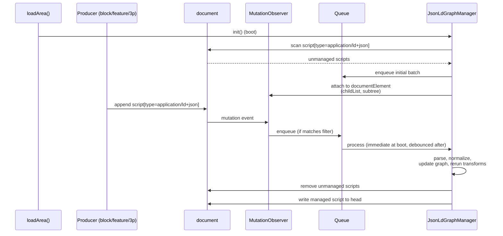
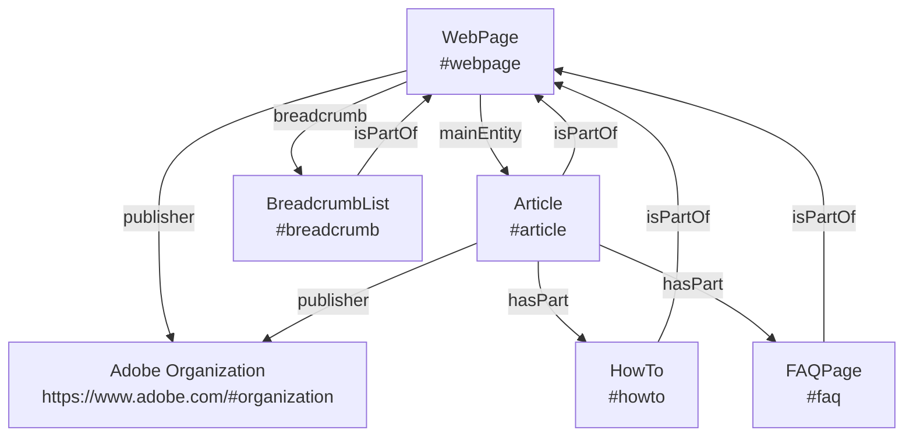
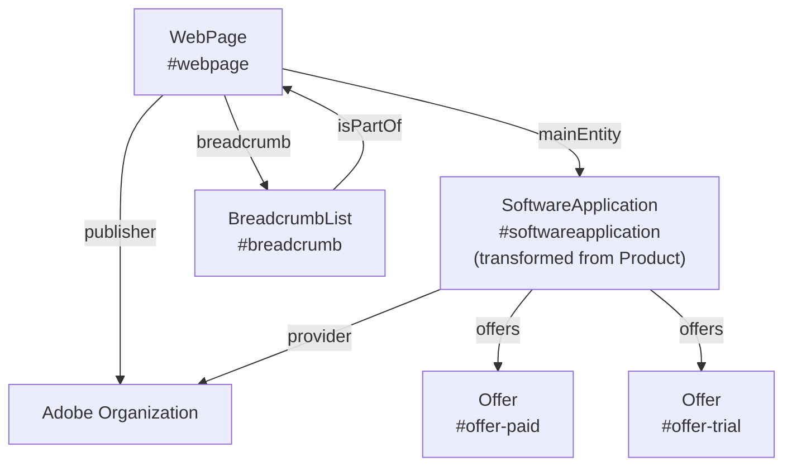

# Milo JSON-LD Graph Manager

> **Status:** DRAFT  

## Summary 

The JSON-LD Graph Manager is a Milo feature that collects all the JSON-LD on a page and rewrites it as **one canonical, linked `@graph`**. This centralization enables the manager to automatically apply JSON-LD graph features that may improve search engine and LLM visibility, such as cross-entity `@id` linking and singleton enforcement for certain types.

The feature is **disabled by default**. To enable, set the `jsonld-graph-manager` page metadata or URL query parameter to the string `true` (case-insensitive). The string `false` explicitly disables it. Presence without a value does not enable the feature. To enable debug logging of queue lifecycle events, add `jsonld-graph-manager-debug=true` as a URL query parameter.

## 1. Introduction

One strategy which may improve Adobe.com visibility across search engines and LLMs is to improve the consistency of JSON-LD across pages. We can define default nodes and relate individual nodes to one another to eliminate duplicated and contradictory nested nodes. This relationship may also improve understanding. Methods include using `@id` references, `mainEntity`, `sameAs`, `isPartOf`, etc.

Many Milo blocks and features produce JSON-LD. The problem is these producers write their JSON-LD to the page independently without any coordination or knowledge of each other. As of April 17, 2026 there were **33 integrations spread across 7 active sites**. Only 17 of those integrations are in `milo` itself. This makes these techniques difficult to coordinate manually.

The `JsonLdGraphManager` exists to convert these entities into a single graph. Consider a product page that today emits JSON-LD from `richresults` (Article, Organization), `gnav` (BreadcrumbList), `seotech` (VideoObject). The `<head>` ends up with four independent scripts, with overlapping entity definitions and inconsistent identifiers:

**Before** — `jsonld-graph-manager: false` — four isolated scripts, no links between them:

```html
<head>
  <!-- richresults -->
  <script type="application/ld+json">
  {
    "@type": "Organization",
    "name": "Adobe",
    "url": "https://www.adobe.com/"
  }
  </script>
  <!-- richresults -->
  <script type="application/ld+json">
  {
    "@type": "Article",
    "headline": "Photoshop",
    "author": { 
      "@type": "Organization",
      "name": "Adobe"
    }
  }
  </script>
  <!-- gnav -->
  <script type="application/ld+json">
  {
    "@type": "BreadcrumbList",
    "itemListElement": [ … ]
  }
  </script>
  <!-- seotech -->
  <script type="application/ld+json">
  {
    "@type": "VideoObject",
    "name": "Photoshop overview"
  }
  </script>
</head>
```

`Organization` is emitted twice (once standalone, once anonymous inside `Article`). Nothing links `Article` to `WebPage`.

**After** — `jsonld-graph-manager: true` — one script, entities linked by `@id`:

```html
<head>
  <script type="application/ld+json" data-milo-jsonld="graph">
  {
    "@context": "https://schema.org",
    "@graph": [
      {
        "@type": "Organization",
        "@id": "https://www.adobe.com/#organization",
        "name": "Adobe"
      },
      {
        "@type": "WebPage",
        "@id": "…#webpage",
        "publisher": { "@id": "https://www.adobe.com/#organization" },
        "breadcrumb": { "@id": "…#breadcrumb" },
        "mainEntity": { "@id": "…#article" }
      },
      {
        "@type": "Article",
        "@id": "…#article",
        "headline": "Photoshop",
        "isPartOf": { "@id": "…#webpage" },
        "mainEntityOfPage": { "@id": "…#webpage" },
        "publisher": { "@id": "https://www.adobe.com/#organization" }
      },
      {
        "@type": "BreadcrumbList",
        "@id": "…#breadcrumb",
        "isPartOf": { "@id": "…#webpage" },
        "itemListElement": [ … ]
      },
      {
        "@type": "VideoObject",
        "@id": "…#videoobject",
        "name": "Photoshop overview"
      }
    ]
  }
  </script>
</head>
```

`Organization` appears once and is referenced by `@id` from both `WebPage.publisher` and `Article.publisher`. `WebPage` is the graph root — it declares its `breadcrumb` and `mainEntity` by reference. `Article` links back via `isPartOf` and `mainEntityOfPage`. `BreadcrumbList` also declares `isPartOf` the `WebPage`. Every relationship is bidirectional and traversable.

§3 Requirements specifies the normative rules for the managed graph. §4 Per-Type Strategy maps each supported schema.org type to its Google rich-result requirements, manager handling, and known producers in the Milo repository.

## 2. Design

### 2.1 Architecture Overview

The `JsonLdGraphManager` is a document-level runtime object initialized from the document branch of `loadArea()` in `libs/utils/utils.js`.

There are three main stages:

1. **Observe** — scan the DOM at boot, and watch for later appends via `MutationObserver`. Ingest and remove unmanaged JSON-LD scripts.
1. **Normalize** — apply canonical page-scoped identity to known entity types; merge conflicts by producer priority; dedupe singletons.
1. **Rewrite** — serialize one `@graph` into a single managed `<script>` in `<head>`.

### 2.2 Runtime Lifecycle

#### Ingestion and rebuild

Unmanaged JSON-LD reaches the manager through two entry points — a one-time boot scan and an ongoing `MutationObserver` — that both feed the same rebuild pipeline.

**At boot**, during document-level `loadArea()`, the manager initializes a singleton instance, scans the full document for `script[type="application/ld+json"]`, ignoring its own managed graph if one already exists, and attaches a `MutationObserver` for future additions.

**At runtime**, when a block, feature, experiment, or third-party script appends JSON-LD anywhere in the document subtree, the observer detects it and enqueues the event for sequential processing.

Both entry points converge on the same pipeline: for each unmanaged payload, the manager parses it, normalizes discovered entities, removes the unmanaged script from the DOM, updates the in-memory graph, reruns graph transforms, and rewrites the managed script in `document.head`.



The observer target is `document.documentElement` with `childList` and `subtree` enabled. Only added nodes that are, or contain, `script[type="application/ld+json"]` are enqueued. Managed output is excluded by filtering on the manager-owned selector `script[type="application/ld+json"][data-milo-jsonld="graph"]`.

#### Queueing and rebuild policy

Although JavaScript execution is single-threaded, the manager still uses an explicit queue. The queue provides:

- deterministic processing order
- protection from re-entrant writes
- one rebuild path for all producer types
- batching during high DOM churn

The manager performs an immediate boot write, then batches later rewrites on a debounce interval. The target behavior is that rebuilds do not occur faster than roughly once per second during steady-state mutation bursts.

### 2.3 Output Contract

The shape of the managed `<script>` and `@graph`, including required and optional attributes, identity rules, singletons, and entity linkage, is defined in §3 Requirements. The manager's job is to produce output that satisfies every `error`-severity rule there.

Accepted input forms include a single JSON-LD object, an array of JSON-LD objects, or an object containing `@graph`. All accepted forms are flattened into one internal graph representation before transforms run.

Non-managed JSON-LD scripts are candidates for ingestion and removal regardless of where they appear in the document; the manager ignores its own managed graph (identified by the `data-milo-jsonld="graph"` attribute) during scan and observation.

### 2.4 Normalization And Merge Policy

The canonical `@id` values the manager assigns to each recognized entity type are defined in §3 Requirements (`page-scoped-id-format`, `organization-site-wide-id`). Incoming producer `@id` values are treated as merge hints — for recognized entities, the manager rewrites `@id` to the canonical value. Unknown nodes that lack stable identity are retained provisionally until they can be normalized or deduplicated.

#### Merge priority

When multiple sources describe the same entity, the default source priority is:

1. graph-manager-generated transforms
1. Milo feature or block sources
1. third-party runtime sources
1. initial page DOM

#### Default merge rules

Unless a type-specific rule overrides them, the manager applies the following defaults:

- scalar field conflicts are resolved by source priority
- object fields are merged by key, with conflicting child fields resolved by source priority
- relationship arrays are unioned by canonical `@id`
- anonymous array members are deduplicated by normalized content hash when no stable `@id` exists
- unknown anonymous top-level nodes are retained provisionally until they can be normalized or deduplicated

Singleton, supplemental, and repeatable type policies are defined in §3.4 Graph composition (`webpage-canonical-singleton`, `organization-singleton`, `breadcrumblist-singleton`, `required-primary-type`, `supplemental-singletons`, `repeatable-types`). Relationship arrays such as `hasPart` are unioned by canonical `@id`.

#### Type-specific transforms

In addition to identity rewrite and merge, the manager applies a small set of type-specific transforms.

**Product → SoftwareApplication.** Adobe.com pages do not market physical products. The merch card system, however, emits `Product` nodes (see Appendix A.3). Because the canonical primary type for product-oriented pages is `SoftwareApplication`, the manager normalizes any incoming `Product` node into a `SoftwareApplication`:

- rewrites `@type` from `Product` to `SoftwareApplication`
- re-derives `@id` to `{canonicalPageURL}#softwareapplication`
- preserves `name`, `brand`, `image`, `offers`, and other shared properties
- hoists nested `Brand` and `Offer` entities to the top-level `@graph` and replaces inline values with `@id` references

This transform is governed by the `product-to-softwareapplication` requirement.

**SoftwareApplication subtype preservation.** Schema.org defines `WebApplication`, `MobileApplication`, and `VideoGame` as subtypes of `SoftwareApplication`, and Google's Software App rich result explicitly supports them. When a producer supplies one of these subtypes (e.g., team-hardcoded `WebApplication` markup), the manager preserves the more specific `@type`, lands the node at the canonical `#softwareapplication` `@id`, and merges contributions from other producers (e.g., the review block emitting `Product` → `SoftwareApplication`) at the same id. The baseline `Product → SoftwareApplication` transform does NOT rewrite a producer-supplied subtype down to plain `SoftwareApplication`. Governed by `softwareapplication-subtype-allowed`.

**Cross-page WebPage references.** Producers occasionally assert `isPartOf` or `mainEntityOfPage` against a different page's WebPage (e.g., a sub-app belonging to a parent /online/ index). Schema.org permits this and Google's rich-result spec is silent on it. To keep the page graph coherent on a single-page basis, the manager rewrites such references to the current canonical `#webpage` id and discards the inline cross-page WebPage body. Governed by `webpage-canonical-singleton`. (We may revisit this if a consumer ever surfaces a need for cross-page parent linkage.)

#### Reference shape

References to other graph nodes are encoded as `{ "@id": "…" }` (see `nodes-referenced-by-id`). Because all referenced entities — including the site-wide `Organization` — are present as top-level nodes in the managed `@graph`, consumers can follow any `@id` to find the full node and its properties. Adding `url` to a reference object would be redundant.

### 2.5 Canonical Page Graph Model

The manager treats `WebPage` as the page container and links related entities to it. Canonical `@id` values are defined in the preceding section.

#### Editorial page shape



This model is intended to be stable across separate producer implementations. The relationships shown — `mainEntity`, `breadcrumb`, `publisher`, `isPartOf`, `hasPart` — and their cardinality constraints are encoded as rules in §3 Requirements.

#### Product page shape



For product-oriented pages, `WebPage.mainEntity` points to `SoftwareApplication` rather than `Article`. Producer payloads of `@type: Product` are transformed to `SoftwareApplication` per §2.4. Offers (paid subscription, free trial, etc.) are hoisted to the top-level `@graph` and referenced by `@id`. The page-family-to-primary-entity mapping is owned by the public `tests` dataset.

### 2.6 Alternatives Considered

There are two additional approaches that have been tabled but should be reexamined in future.

**Coordinated producer migration.** Require every producer to adopt a shared interface — a direct-push API, a publish-subscribe bus, a declarative schema — before shipping anything. Rejected: the producer landscape currently spans 33 integrations across 7 repos, including legacy, external, and non-Milo sources, plus inline author-authored JSON-LD. Any such approach requires every producer to opt in on day one, cannot be feature-flagged per page, and strands producers that cannot be refactored at all. The observation-first design lets the ecosystem converge incrementally without blocking on any single producer. In the future we can offer a direct-push function as the preferred method and refactor existing components.

**Build-time aggregation.** Collect and normalize JSON-LD at publish time instead of at runtime. Rejected: much of today's JSON-LD is produced by runtime code (feature fetches, DOM derivations, experimentation) and by author-hand-coded inline scripts. A build-time aggregator would miss both categories, and the managed graph would not reflect what the browser actually renders. There are still valid use-cases for this approach to perform major portions of node generation.

## 3. Requirements

The normative rules for the managed graph. Every rule has a stable `Name`, a `Severity`, the `Requirement` itself, and optional `Notes`. Severity meanings:

- **error** — the manager MUST satisfy this rule. Output that violates an error-rule is non-conformant.
- **warn** — the manager SHOULD satisfy this rule. Violations should be logged via Lana but do not block emission.
- **info** — informational guidance. Captures defaults, conventions, and rules the manager applies but that consumers and producers MAY also rely on.

Rules are grouped by concern. Cross-type behavior (singletons, defaults, transforms, source priority) lives here; per-type policy and producer inventory lives in §4.

### 3.1 Output shape

| Name | Severity | Requirement |
|---|---|---|
| `single-script-tag` | error | The HTML page MUST contain exactly one `<script type="application/ld+json">` tag, located in `<head>`. |
| `managed-script-marker` | error | The managed script MUST carry the attribute `data-milo-jsonld="graph"` so the graph manager can identify it for ingestion and rewrite. |
| `managed-script-metadata` | info | The managed script MAY carry the optional attributes `data-milo-jsonld-version` and `data-milo-jsonld-updated`. |
| `graph-container-shape` | error | The script content MUST be a single graph object with `@context` set to `https://schema.org` and a `@graph` array. |
| `no-per-node-context` | error | `@context` MUST NOT appear on individual nodes. |

### 3.2 Identity

| Name | Severity | Requirement |
|---|---|---|
| `all-nodes-have-id` | error | Every node in `@graph` MUST have an `@id`. |
| `all-nodes-have-type` | error | Every node in `@graph` MUST have an `@type`. |
| `unique-node-ids` | error | Every `@id` in `@graph` MUST be unique; no two nodes may share the same `@id`. |
| `page-scoped-id-format` | error | Page-scoped node `@id` values MUST follow the format `{canonicalPageURL}#{role}` where `{role}` is the lowercase entity role on the page, e.g. `https://example.com/page#webpage`, `#article`, `#breadcrumb`, `#howto`, `#faq`. |
| `organization-site-wide-id` | error | The Adobe publisher Organization is a site-wide singleton; its `@id` MUST be `https://www.adobe.com/#organization` rather than the page-scoped format. |
| `organization-site-root` | info | Site root is `https://www.adobe.com` unless `window.location.hostname` contains `business` or `bacom`, in which case `https://business.adobe.com`. |

### 3.3 References

| Name | Severity | Requirement |
|---|---|---|
| `nodes-referenced-by-id` | error | Nodes that appear in `@graph` MUST NOT be inlined as nested objects; they MUST be referenced by `@id`. |

The previous `external-reference-includes-url` rule is retired. Because every referenced entity — including the site-wide `Organization` and any `Offer` — is present as a top-level node in the same `@graph`, an `@id`-only reference is sufficient; consumers can follow `@id` to retrieve `url` and other properties.

### 3.4 Graph composition

| Name | Severity | Requirement |
|---|---|---|
| `manager-baseline-graph` | error | When the manager is enabled, the managed `<script>` MUST be emitted containing at minimum the canonical WebPage and Organization nodes — even on pages where no producers contribute JSON-LD. Enabling the manager via `jsonld-graph-manager=true` is the explicit opt-in to a managed graph. |
| `webpage-canonical-singleton` | error | The graph MUST contain exactly one WebPage node whose `@id` is the canonical page id (`{canonicalPageURL}#webpage`). Producer-supplied cross-page WebPage references in `isPartOf` / `mainEntityOfPage` are rewritten to the canonical page id and any inline cross-page WebPage body is discarded. |
| `organization-singleton` | error | The graph MUST contain exactly one Organization node. |
| `breadcrumblist-singleton` | error | The graph MUST contain exactly one BreadcrumbList node when applicable. (BreadcrumbList is optional; some pages have no breadcrumbs. When breadcrumbs are present, exactly one BreadcrumbList is required.) |
| `required-primary-type` | warn | The graph SHOULD contain exactly one node of a recognised primary page type: `Article`, `NewsArticle`, `SoftwareApplication`, or any SoftwareApplication subtype permitted by `softwareapplication-subtype-allowed`. |
| `supplemental-singletons` | warn | The graph MAY contain at most one HowTo node and at most one FAQPage node. (Presence is optional; count > 1 is a hard violation.) |
| `aggregaterating-singleton` | error | The graph MUST contain at most one AggregateRating node. When multiple producers contribute an `aggregateRating` (e.g., team-hardcoded markup and the review block), they merge at the canonical `@id` (`{canonicalPageURL}#aggregaterating`) and source priority resolves scalar conflicts. |
| `repeatable-types` | info | The graph MAY contain multiple instances of `VideoObject` and `Offer`. These types are NOT deduplicated as singletons. (v1 limitation: when multiple repeatable nodes are emitted without distinct producer-supplied `@id` values, they collapse to a single node at the canonical id, e.g., `#videoobject` or `#offer`. Distinct `@id` values from producers are required to materialize multiple instances. Sequential `@id` assignment by the manager is planned for a future iteration.) |

`webpage-canonical-singleton` replaces the prior `webpage-singleton`. Schema.org allows `isPartOf` to point at a cross-page resource and Google's rich-result spec doesn't constrain it, but a managed page-graph that contains two WebPage nodes is internally inconsistent for our consumers (the WebPage of the rendered page is the only one with full link wiring). We therefore rewrite cross-page `isPartOf`/`mainEntityOfPage` to the current canonical `#webpage` id. This is policy choice C from the design review — to be revisited if a consumer ever surfaces a need for cross-page parent linkage.

**Interaction with `ignore-types-bypass`.** The rules in this section apply to the *managed graph* — the script the manager emits. When a producer script is bypassed via the ignore-types query parameter (`ignore-types-bypass`), its nodes do not enter the managed graph and these rules are evaluated as if the producer had not contributed at all:

- `webpage-canonical-singleton` and `organization-singleton` (error): not at risk. The manager always synthesizes baseline WebPage and Organization (`manager-baseline-graph`); ignoring `WebPage` or `Organization` only means a producer-supplied node remains on the page as a sibling — the managed graph still has exactly one of each.
- `breadcrumblist-singleton` (error): satisfied by the "when applicable" semantics. Ignoring `BreadcrumbList` leaves the managed graph with zero BreadcrumbList nodes, which is allowed.
- `webpage-breadcrumb-link` (warn): only evaluated when BreadcrumbList is present in the managed graph, so ignoring it disables the rule for that page.
- `required-primary-type` (warn): **at risk.** Ignoring the sole primary type (e.g., the only `Article` / `SoftwareApplication` on the page) leaves the managed graph without a primary entity and breaks the `WebPage.mainEntity` link. Callers opt into this risk explicitly by including a primary type in their ignore list.

### 3.5 Linking

| Name | Severity | Requirement |
|---|---|---|
| `webpage-publisher-link` | error | The WebPage node MUST have a `publisher` property referencing the Organization node by `@id`. |
| `webpage-mainentity-link` | error | The WebPage node SHOULD have a `mainEntity` property referencing the primary page type node by `@id`. (Assuming a primary entity exists: `Article`, `NewsArticle`, or `SoftwareApplication`.) |
| `webpage-breadcrumb-link` | warn | The WebPage node SHOULD have a `breadcrumb` property referencing the BreadcrumbList node by `@id`. (Only evaluated when a BreadcrumbList is present.) |
| `primary-type-ispartof` | error | The primary page type node MUST have an `isPartOf` property referencing the WebPage node by `@id`. |
| `breadcrumblist-ispartof` | error | The BreadcrumbList node MUST have an `isPartOf` property referencing the WebPage node by `@id`. |
| `primary-type-publisher` | warn | The primary page type node SHOULD have a `publisher` property referencing the Organization node by `@id`. |
| `primary-type-mainentityofpage` | info | The primary page type node MAY have a `mainEntityOfPage` property referencing the WebPage node by `@id`. |

### 3.6 Type transforms

| Name | Severity | Requirement |
|---|---|---|
| `product-to-softwareapplication` | error | A `Product` node MUST be transformed by the graph manager into a `SoftwareApplication` node. The transform rewrites `@type` from `Product` to `SoftwareApplication`, re-derives `@id` to `{canonicalPageURL}#softwareapplication`, and preserves `name`, `brand`, `image`, `offers`, and other shared properties. Nested `Brand` and `Offer` entities are hoisted to the top-level `@graph` by `@id`. (Required because Adobe.com pages do not market physical products; the merch card system emits `Product` but the canonical primary type for product-oriented pages is `SoftwareApplication`.) |
| `softwareapplication-subtype-allowed` | info | The manager preserves a more specific `@type` when supplied by a producer. Recognized SoftwareApplication subtypes are `WebApplication`, `MobileApplication`, and `VideoGame` (per the [Google Software App rich result](https://developers.google.com/search/docs/appearance/structured-data/software-app) and schema.org). When a subtype is present, the node retains its specific `@type`, lands at the canonical `#softwareapplication` `@id`, and merges with any other SoftwareApplication-family contributions from the same page. The `Product → SoftwareApplication` baseline transform does NOT rewrite a producer-supplied subtype down to plain `SoftwareApplication`. |

### 3.7 Defaults and precedence

| Name | Severity | Requirement |
|---|---|---|
| `organization-default-name` | error | `Organization.name` MUST be present; manager default is `"Adobe"` (or `"Adobe for Business"` when site root is `https://business.adobe.com`). |
| `organization-default-url` | error | `Organization.url` MUST be the site root homepage URL (e.g., `https://www.adobe.com/` or `https://business.adobe.com/`), not a page-scoped URL. |
| `organization-default-logo` | warn | `Organization.logo` SHOULD be present as a schema.org `ImageObject` whose `url` and `contentUrl` point at the canonical Adobe corporate horizontal red logo (`https://www.adobe.com/content/dam/cc/icons/Adobe_Corporate_Horizontal_Red_HEX.svg`). The manager applies this default when no producer-supplied logo is present. Per [Google's Logo guidelines](https://developers.google.com/search/docs/appearance/structured-data/logo) the image must be at least 112×112 pixels (SVG satisfies this); the `ImageObject` form is preferred over a bare URL string for richer metadata. |
| `organization-default-precedence` | info | Manager-synthesized Organization fields (`name`, `url`, `logo`) take graph-manager-generated priority — they win over any producer-supplied values for those three fields. Producer-supplied fields not in the default set (`sameAs`, `address`, `description`, etc.) are preserved. |
| `organization-nested-extraction` | info | Organization objects embedded as inline property values (e.g. `publisher`, `author`, `provider`) are hoisted to the top-level `@graph` and merged into the canonical Organization node. The inline value is replaced with `{ "@id": "<canonical-org-id>" }`. |
| `organization-id-aliases` | info | Producer-supplied non-canonical Organization `@id` values whose fragment matches `#org`, `#publisher`, or `#adobe` are rewritten to the canonical `#organization` fragment in reference stubs (objects with `@id` but no `@type`). Full Organization nodes already get the canonical `@id` via the identity rewrite. (Defensive measure for known producer drift; producer-side fix-up is preferred long-term.) |
| `aggregaterating-extraction` | info | AggregateRating objects embedded as inline property values (typically on `SoftwareApplication`, `Article`, `Product`, etc.) are hoisted to the top-level `@graph` and merged into the canonical AggregateRating node at `{canonicalPageURL}#aggregaterating`. The inline value is replaced with `{ "@id": "<canonical-aggregaterating-id>" }`. |
| `breadcrumblist-items-canonical-origin` | info | The manager rewrites every `BreadcrumbList.itemListElement[*].item` URL so that it describes the canonical production resource. Item URLs whose hostname matches the current rendering origin are rewritten to the origin of `<link rel="canonical">`. External-host URLs preserve their origin. Query strings and `#hash` are stripped from every item URL. The rewrite is skipped when no canonical link is present (the manager cannot invent a production origin). (Defensive normalization for producer drift: most breadcrumb integrations emit `link.href`, which resolves to the current rendering hostname; this ensures the canonical graph's breadcrumb URLs describe the production resource regardless of where the page is rendered. Producer-side fix-up is preferred long-term.) |
| `ignore-types-bypass` | info | When the URL query parameter `jsonld-graph-manager-ignore` is set to a non-empty comma-separated list, the manager bypasses every producer script whose top-level content matches an entry in the list. A match is: (a) the script content is `{ "@graph": [...] }` and the list contains the pseudo-type `graph`; (b) any top-level `@type` value in the script equals an ignore-list entry, compared case-insensitively. Bypassed scripts are NOT parsed for ingestion, NOT removed from the DOM, and do NOT contribute to the managed graph — they remain on the page exactly as the producer emitted them. The list is empty by default; absent or empty list = nothing is bypassed. The singleton and linking rules in §3.4 / §3.5 apply only to the managed graph; ignored scripts on the page are independent of those constraints. If a single producer script carries multiple top-level `@type` values and only some match the ignore list, the entire script is bypassed and a Lana warning is logged — producers should split into separate scripts or callers should use `graph` to bypass the whole container intentionally. |
| `source-priority` | error | When the same node is contributed by multiple sources, scalar conflicts are resolved by source priority: graph-manager-generated > Milo feature/block runtime > third-party runtime > initial page DOM (`bootDom`). Object fields merge by key with the same precedence; relationship arrays are unioned by `@id`. This applies to all types unless a type-specific override exists. The recorded source for a node is ratcheted to the maximum-priority source that has contributed to it; subsequent merges of lower-priority sources keep the higher source as the "previous" source for priority comparison, ensuring a generated default cannot be overwritten by later `bootDom` payloads arriving out of order. (Codifies that runtime producers — for example, the review block's `aggregateRating` — win over hardcoded `bootDom` values, ensuring the freshest data reaches consumers.) |

### 3.8 Type-specific rules

#### SoftwareApplication

| Name | Severity | Requirement |
|---|---|---|
| `softwareapplication-name` | error | A SoftwareApplication node MUST have a `name` property. (Required for the Google software-app rich result. Only evaluated when primary type is SoftwareApplication or a subtype.) |
| `softwareapplication-offers` | warn | A SoftwareApplication node SHOULD have an `offers` property referencing one or more Offer nodes by `@id`. Multiple offers (e.g., paid subscription and free trial) are encoded as separate Offer nodes. (Each Offer MAY include a `potentialAction` property to express usage actions, e.g., `BuyAction`, `TryAction`.) |
| `softwareapplication-rating-or-review` | warn | A SoftwareApplication node SHOULD have either an `aggregateRating` or a `review` property. Required for the Google software-app rich result. The manager will produce incomplete nodes when this data is not available from producers. |
| `softwareapplication-provider` | info | A SoftwareApplication node MAY have a `provider` property referencing the Organization node by `@id`. |

#### Offer

| Name | Severity | Requirement |
|---|---|---|
| `offer-price` | error | An Offer node MUST have `price` and `priceCurrency` properties. (Required for the Google software-app rich result. Evaluated for any Offer node referenced by `SoftwareApplication.offers`.) |
| `softwareapplication-default-offer` | error | When a `SoftwareApplication` (or subtype) is the primary entity of the page and has no `offers` property (or an empty array), the manager synthesizes a default free Offer (`{ "@type": "Offer", "@id": "{canonicalPageURL}#offer", "price": "0", "priceCurrency": "USD", "availability": "https://schema.org/InStock", "category": "Free Trial" }`) and sets `SoftwareApplication.offers` to `[{ "@id": "<canonical-offer-id>" }]`. Source for the synthesized Offer is `generated`. The `category: "Free Trial"` label reflects the Adobe.com norm — primary entry to a product is a free trial of the paid tier — and disambiguates the synthesized Offer from any future producer-supplied paid Offers. Producers that need a non-free Offer (paid-only SA pages, distinct paid + trial offers) supply their own; the default is only synthesized when `offers` is entirely absent. Google's rich-result spec requires `offers.price` *unconditionally* on SoftwareApplication — both `offers` and one of (`aggregateRating`, `review`) must be present for the Software App rich result to render. |

#### AggregateRating

| Name | Severity | Requirement |
|---|---|---|
| `aggregaterating-min-rating-value` | error | An AggregateRating node MUST have `ratingValue` ≥ 3.2 (on the default 1–5 scale). When the threshold is not met, the manager omits the AggregateRating node from the graph AND removes any `aggregateRating` reference from host entities so consumers do not see a dangling `@id`. (Milo policy, not a Google rule: poor ratings under the Adobe brand are worse than no rating signal. Threshold is configurable per future policy revision.) |
| `aggregaterating-min-rating-count` | error | An AggregateRating node MUST have `ratingCount` ≥ 100. When the threshold is not met, the manager omits the AggregateRating node from the graph AND removes any `aggregateRating` reference from host entities. (Milo policy, not a Google rule: small-sample ratings are noisy and brittle; below-threshold counts are suppressed to avoid surfacing statistical accidents to consumers. Threshold is configurable per future policy revision.) |

#### BreadcrumbList

| Name | Severity | Requirement |
|---|---|---|
| `breadcrumblist-items` | error | The BreadcrumbList `itemListElement` MUST be a non-empty array of ListItem nodes, each with `position`, `name`, and `item` properties. |

## 4. Per-Type Strategy

Each subsection covers one schema.org type the manager handles. The structure is:

- **Schema.org** — type hierarchy and accepted subtypes.
- **Google rich result** — what consumer behavior depends on the markup, with required and recommended fields.
- **Manager handling** — `@id` pattern, cardinality, defaults, transforms.
- **Known producers** — Milo blocks and features that emit this type today.

Coverage strategy: Google rich-result eligibility is consumer #1. Other consumers (LLMs, knowledge graphs) benefit indirectly from the same shape. The manager preserves producer fields beyond what Google requires.

Producer inventory in this section is scoped to the `milo` repository. The full cross-repo inventory lives in the `integrations` sheet of [structured-data-json-ld.json](https://milo.adobe.com/docs/authoring/structured-data-json-ld.json).

### 4.1 WebPage

**Schema.org.** `Thing > CreativeWork > WebPage`. No subtypes accepted by the manager.

**Google rich result.** Not directly eligible, but acts as the page-graph root that other rich-result types attach to via `isPartOf` / `mainEntity` / `breadcrumb`. Required for Article, NewsArticle, SoftwareApplication, and BreadcrumbList rich results to have a coherent parent.

**Manager handling.**
- `@id`: `{canonicalPageURL}#webpage`
- Cardinality: singleton (`webpage-canonical-singleton`)
- Synthesized when absent from producers
- Cross-page WebPage references in `isPartOf` / `mainEntityOfPage` are rewritten to the canonical page id

**Known producers (milo).** None. The manager always synthesizes WebPage.

### 4.2 Organization

**Schema.org.** `Thing > Organization`. No subtypes used.

**Google rich result.** Logo, knowledge panel, and publisher attribution on Article rich results. Required: `name`. Logo SHOULD be present (112×112 pixel minimum). See [Google Logo guidelines](https://developers.google.com/search/docs/appearance/structured-data/logo).

**Manager handling.**
- `@id`: `{siteRoot}/#organization` (site-wide, not page-scoped)
- Cardinality: singleton (`organization-singleton`)
- Synthesized when absent. Default `name`, `url`, `logo` overrides any producer-supplied values for those three fields (`organization-default-precedence`). Producer-supplied fields not in the default set (`sameAs`, `address`, etc.) are preserved.
- Inline Organization values in `publisher` / `author` / `provider` are extracted and merged into the canonical node (`organization-nested-extraction`)
- Producer-supplied non-canonical `@id` aliases (`#org`, `#publisher`, `#adobe`) are rewritten to `#organization`

**Known producers (milo).**

| Block / feature | Trigger | Source |
|---|---|---|
| `richresults` | `richresults=Organization` page metadata | [`libs/features/richresults.js`](https://github.com/adobecom/milo/blob/stage/libs/features/richresults.js) |

### 4.3 BreadcrumbList

**Schema.org.** `Thing > Intangible > ItemList > BreadcrumbList`.

**Google rich result.** [Breadcrumb](https://developers.google.com/search/docs/appearance/structured-data/breadcrumb). Required: `itemListElement` array of `ListItem` with `position`, `name`, `item` (URL).

**Manager handling.**
- `@id`: `{canonicalPageURL}#breadcrumb`
- Cardinality: singleton when applicable (`breadcrumblist-singleton`)
- `WebPage.breadcrumb` is set to `{ @id: '#breadcrumb' }` when present
- `BreadcrumbList.isPartOf` is set to `{ @id: '#webpage' }`
- `itemListElement[*].item` URLs are rewritten to the canonical production origin and stripped of query strings and `#hash` (`breadcrumblist-items-canonical-origin`). Gnav and other producers typically emit `link.href` which resolves to the current rendering hostname (aem.live, aem.page, branch URLs); the manager normalizes these so the canonical graph's breadcrumbs describe production resources.

**Known producers (milo).**

| Block / feature | Trigger | Source |
|---|---|---|
| `global-navigation breadcrumbs` | Breadcrumbs render and SEO not disabled | [`libs/blocks/global-navigation/features/breadcrumbs/breadcrumbs.js`](https://github.com/adobecom/milo/blob/stage/libs/blocks/global-navigation/features/breadcrumbs/breadcrumbs.js) |
| `legacy gnav breadcrumbs` | Breadcrumbs render and `breadcrumb-seo` is not `off` | [`libs/blocks/gnav/gnav.js`](https://github.com/adobecom/milo/blob/stage/libs/blocks/gnav/gnav.js#L522) |
| `MEP breadcrumbs` | MEP breadcrumbs render and SEO not disabled | [`libs/mep/ace1151/global-navigation/features/breadcrumbs/breadcrumbs.js`](https://github.com/adobecom/milo/blob/stage/libs/mep/ace1151/global-navigation/features/breadcrumbs/breadcrumbs.js) |

### 4.4 SoftwareApplication (and subtypes)

**Schema.org.** `Thing > CreativeWork > SoftwareApplication`. Accepted subtypes: `WebApplication`, `MobileApplication`, `VideoGame` (the latter requires co-typing with another SoftwareApplication subtype).

**Google rich result.** [Software App](https://developers.google.com/search/docs/appearance/structured-data/software-app). Required: `name`, `offers.price`, and one of `aggregateRating` or `review`. Recommended: `applicationCategory`, `operatingSystem`. Subtypes `WebApplication`, `MobileApplication`, `VideoGame` are explicitly supported.

**Manager handling.**
- `@id`: `{canonicalPageURL}#softwareapplication` (regardless of subtype)
- Cardinality: singleton; one primary type per page
- Transform: `Product` → `SoftwareApplication` (`product-to-softwareapplication`)
- Subtypes preserved when producer supplies them (`softwareapplication-subtype-allowed`); the canonical `#softwareapplication` `@id` lets the manager merge contributions from the review block (`Product` → `SoftwareApplication`) with team-hardcoded `WebApplication` markup
- Inline `Offer` and `Brand` are extracted; `offers` becomes `{ @id }` references; anonymous `Brand` may stay inline
- `provider` set to `{ @id: '<org>' }` when manager-synthesized; producer-supplied `provider` is canonicalized to the same shape

**Known producers (milo).**

| Block / feature | Type emitted | Trigger | Source |
|---|---|---|---|
| `merch autoblock` | `Product` (→ SA) | merch options include `jsonld=on` | [`libs/blocks/merch-card-autoblock/merch-card-autoblock.js`](https://github.com/adobecom/milo/blob/stage/libs/blocks/merch-card-autoblock/merch-card-autoblock.js#L137) |
| `review flow` | `Product` (→ SA) | Review block has `product-name` and rating response | [`libs/blocks/review/utils/setJsonLdProductInfo.js`](https://github.com/adobecom/milo/blob/stage/libs/blocks/review/utils/setJsonLdProductInfo.js#L2) |

The Acrobat team's hardcoded `WebApplication` markup is a `da-dc` repo producer, not a milo producer; it appears in the cross-repo `integrations` sheet.

### 4.5 Article / NewsArticle

**Schema.org.** `Thing > CreativeWork > Article`. `NewsArticle` is a subtype of `Article`.

**Google rich result.** [Article](https://developers.google.com/search/docs/appearance/structured-data/article). Required: `headline`, `image`, `datePublished`, `author`, `publisher`. NewsArticle is the same shape with stricter content guidelines.

**Manager handling.**
- `@id`: `{canonicalPageURL}#article`
- Cardinality: singleton; one primary type per page
- `isPartOf` and `mainEntityOfPage` set to `{ @id: '#webpage' }`
- `publisher` reference canonicalized to `{ @id: '<org>' }`

**Known producers (milo).**

| Block / feature | Type emitted | Trigger | Source |
|---|---|---|---|
| `richresults` | `Article` | `richresults=Article` page metadata | [`libs/features/richresults.js`](https://github.com/adobecom/milo/blob/stage/libs/features/richresults.js) |
| `richresults` | `NewsArticle` | `richresults=NewsArticle` page metadata | (same file) |

### 4.6 HowTo

**Schema.org.** `Thing > CreativeWork > HowTo`.

**Google rich result.** Status: HowTo rich results were deprecated in Google Search in 2023 and are no longer eligible for the rich treatment, but the markup is still ingested for general structured-data understanding. Required (per the deprecated spec): `name`, `step` array of `HowToStep`.

**Manager handling.**
- `@id`: `{canonicalPageURL}#howto`
- Cardinality: supplemental singleton (`supplemental-singletons`)
- `isPartOf` set to `{ @id: '#webpage' }`
- `publisher` reference canonicalized to Organization

**Known producers (milo).**

| Block / feature | Trigger | Source |
|---|---|---|
| `how-to` | Block has class `seo` | [`libs/blocks/how-to/how-to.js`](https://github.com/adobecom/milo/blob/stage/libs/blocks/how-to/how-to.js#L19) |

### 4.7 FAQPage

**Schema.org.** `Thing > CreativeWork > WebPage > FAQPage`.

**Google rich result.** [FAQPage](https://developers.google.com/search/docs/appearance/structured-data/faqpage). Eligibility for the rich result is restricted (since 2023) to authoritative government and health sites; for other sites the markup is still consumed by Search and LLMs but does not trigger the rich result. Required: `mainEntity` array of `Question` with `acceptedAnswer.Answer.text`.

**Manager handling.**
- `@id`: `{canonicalPageURL}#faq`
- Cardinality: supplemental singleton (`supplemental-singletons`)
- `isPartOf` set to `{ @id: '#webpage' }`

**Known producers (milo).**

| Block / feature | Trigger | Source |
|---|---|---|
| `accordion` | Block has class `seo` | [`libs/blocks/accordion/accordion.js`](https://github.com/adobecom/milo/blob/stage/libs/blocks/accordion/accordion.js#L8) |
| `MEP accordion ace1151` | MEP accordion SEO path | [`libs/mep/ace1151/accordion/accordion.js`](https://github.com/adobecom/milo/blob/stage/libs/mep/ace1151/accordion/accordion.js#L8) |
| `MEP accordion emea1443` | MEP accordion SEO path | [`libs/mep/emea1443/accordion/accordion.js`](https://github.com/adobecom/milo/blob/stage/libs/mep/emea1443/accordion/accordion.js#L8) |

### 4.8 VideoObject

**Schema.org.** `Thing > CreativeWork > MediaObject > VideoObject`.

**Google rich result.** [Video](https://developers.google.com/search/docs/appearance/structured-data/video). Required: `name`, `thumbnailUrl`, `uploadDate`. Recommended: `description`, `contentUrl`, `embedUrl`, `duration`.

**Manager handling.**
- `@id`: producer-supplied (typically `{canonicalPageURL}#video-{slug}`)
- Cardinality: repeatable (`repeatable-types`); not deduplicated as singletons
- One canonical `#videoobject` is reserved for the first/only emitter; additional videos require distinct producer-supplied `@id` values

**Known producers (milo).**

| Block / feature | Trigger | Source |
|---|---|---|
| `seotech video path` | `seotech-video-url` page metadata | [`libs/features/seotech/seotech.js`](https://github.com/adobecom/milo/blob/stage/libs/features/seotech/seotech.js) |
| `video-metadata` | Recognized video metadata fields exist | [`libs/blocks/video-metadata/video-metadata.js`](https://github.com/adobecom/milo/blob/stage/libs/blocks/video-metadata/video-metadata.js#L69) |

### 4.9 Offer

**Schema.org.** `Thing > Intangible > Offer`.

**Google rich result.** Used by Software App and Product rich results. Required when referenced from `SoftwareApplication`: `price`, `priceCurrency` (`offer-price`).

**Manager handling.**
- `@id`: producer-supplied or `{canonicalPageURL}#offer` (singleton when only one Offer is present)
- Cardinality: repeatable when distinct `@id` values are supplied (e.g., `#offer-paid`, `#offer-trial`)
- Hoisted from `SoftwareApplication.offers` to top-level `@graph` and replaced with `{ @id }` references
- Producer-supplied `seller: { @id: '...#org' }` (and similar aliases) is canonicalized to `{ @id: '...#organization' }`

**Known producers (milo).** Emitted as nested values inside `Product`/`SoftwareApplication` from `merch autoblock` and `review flow`. Hoisted by the manager.

### 4.10 AggregateRating

**Schema.org.** `Thing > Intangible > Rating > AggregateRating`.

**Google rich result.** A required property of the [Software App](https://developers.google.com/search/docs/appearance/structured-data/software-app), [Product](https://developers.google.com/search/docs/appearance/structured-data/product), [Course](https://developers.google.com/search/docs/appearance/structured-data/course), and [Review snippet](https://developers.google.com/search/docs/appearance/structured-data/review-snippet) rich results when emitted at the host entity. Required: `ratingValue`, `ratingCount` (or `reviewCount`).

**Manager handling.**
- `@id`: `{canonicalPageURL}#aggregaterating`
- Cardinality: singleton (`aggregaterating-singleton`) — at most one AggregateRating per page
- Hoisted from inline property values on host entities (e.g., `SoftwareApplication.aggregateRating`) to a top-level `@graph` node and replaced with `{ "@id": "<canonical-aggregaterating-id>" }` (`aggregaterating-extraction`)
- Multi-producer contributions merge at the canonical id; source priority resolves scalar conflicts (e.g., the review block's runtime ratings beat a stale team-hardcoded snapshot from `bootDom`)

**Known producers (milo).** Emitted as a nested value inside `Product`/`SoftwareApplication` from the `review flow` block. Hoisted by the manager.

### 4.11 Event

**Schema.org.** `Thing > Event`.

**Google rich result.** [Event](https://developers.google.com/search/docs/appearance/structured-data/event). Required: `name`, `startDate`, `location`. Recommended: `description`, `endDate`, `image`, `offers`.

**Manager handling.** Currently passed through. Not a primary page type. Producer-supplied `@id` retained.

**Known producers (milo).**

| Block / feature | Trigger | Source |
|---|---|---|
| `event-rich-results` | Block present | [`libs/blocks/event-rich-results/event-rich-results.js`](https://github.com/adobecom/milo/blob/stage/libs/blocks/event-rich-results/event-rich-results.js) |

### 4.12 WebSite

**Schema.org.** `Thing > CreativeWork > WebSite`.

**Google rich result.** [Sitelinks search box](https://developers.google.com/search/docs/appearance/structured-data/sitelinks-searchbox). Required: `potentialAction` of type `SearchAction` with a `target` URL template and `query-input`.

**Manager handling.** Site-wide singleton; emitted only when explicitly authored (e.g., `richresults=SiteSearchBox`). Not a primary page type.

**Known producers (milo).**

| Block / feature | Trigger | Source |
|---|---|---|
| `richresults` | `richresults=SiteSearchBox` page metadata | [`libs/features/richresults.js`](https://github.com/adobecom/milo/blob/stage/libs/features/richresults.js) |

### 4.13 seotech structured-data path (variable type)

The `seotech` feature can fetch external JSON-LD from a remote API. The emitted type depends on the response payload. The manager applies its standard ingest / transform / merge pipeline per ingested node.

**Known producers (milo).**

| Block / feature | Trigger | Source |
|---|---|---|
| `seotech structured-data path` | `seotech-structured-data=on` page metadata | [`libs/features/seotech/seotech.js`](https://github.com/adobecom/milo/blob/stage/libs/features/seotech/seotech.js) |

## 5. Conformance

Testing for the `JsonLdGraphManager` is organized at three levels:

1. **Unit tests** cover the manager's internal behavior: parsing the accepted input shapes, identity-rewrite for known types, merge-priority resolution, and dedupe for singletons. These run under the existing Milo unit-test harness and should not depend on the network. Part of Milo.

2. **Integration tests** cover the boot and mutation lifecycle against representative DOM fixtures. Each fixture represents one page family (editorial, product, breadcrumb-only, multi-producer conflict, etc.) and asserts on the managed `@graph` output plus the removal of unmanaged scripts. Part of Milo.

3. **End-to-end tests** cover cohort pages listed in the public `tests` dataset. For each row, the test asserts the JSON-LD on the page meets all `requirements` and matches the row's defined Expected Primary Entity. End-to-end testing depends on a dev or stage deployment: once the branch is pushed, we can load AEM `.live` or `.page` URLs with `milolib=${BRANCH_NAME}` and `jsonld-graph-manager=true` to exercise the feature before merge. This feature could be considered complete once all `requirements` pass for every row in `tests`. Due to its complexity this test may exist outside of Milo.

Evaluating whether this feature actually improves how search engines and LLMs surface content is not in the scope of this document. 

## 6. Operations

### 6.1 Feature Flagging

**Flag:** `jsonld-graph-manager` (page metadata or URL query parameter, `true`/`false`, default `false`)

The manager is feature-gated by AEM page metadata so it can be enabled or disabled on selected pages and page families without affecting the entire site at once. You can also use the query parameter for quick testing.

**Debug flag:** `jsonld-graph-manager-debug` (URL query parameter only, `true` to enable)

**Ignore-types flag:** `jsonld-graph-manager-ignore` (URL query parameter only, comma-separated list of schema.org type names, case-insensitive). Default empty. Producer scripts whose top-level content matches any entry on the list are bypassed entirely — the manager does not parse, normalize, merge, or remove them from the DOM. The pseudo-type `graph` matches any script whose top-level content is a `{ "@graph": [...] }` container, regardless of the types nested inside. Example: `jsonld-graph-manager-ignore=breadcrumblist,faqpage,howto,videoobject,graph`. Governed by `ignore-types-bypass` (§3.7); see the rule-interaction note in §3.4 for caveats when ignoring primary or singleton types.

### 6.2 Observability And Diagnostics

The manager should expose both local debugging output and production-safe warning and error reporting.

#### Debug logging

Add `jsonld-graph-manager-debug=true` to the URL query string to enable lifecycle logging via `console.log`. Events logged in queue order:

- **enqueue** — source (`bootDom` or `runtime`), DOM location, original captured payload
- **ignored** — source, DOM location, payload (truncated); the script matched `jsonld-graph-manager-ignore` and was bypassed
- **rebuild** — batch size, current graph size
- **parsed** — source, node count, `@type` values found
- **removed from DOM** — parent element of the ingested script
- **rewrite** — node count, full expandable `@graph` object

Debug mode is the appropriate place to surface per-source origin when needed; the production manager does not persist a provenance record on the canonical graph.

#### Warning and error reporting

Warnings and errors should be reported through `window.lana?.log(...)` using the existing repo conventions for tags and severity.

Representative cases:

- invalid JSON-LD that fails to parse
- unsupported payload shapes
- rewrite failures
- transform failures
- producer payloads that violate required assumptions

Recommended logging behavior:

- warnings use Lana warning severity
- errors use Lana error severity
- tags should identify the manager and, when useful, the producer (e.g., `jsonld-graph-manager` or `jsonld-graph-manager,seotech`)
- high-volume success-path events should not be sent to Lana by default

## References

[General structured data guidelines](https://developers.google.com/search/docs/appearance/structured-data/sd-policies). developers.google.com.

[Software App rich results](https://developers.google.com/search/docs/appearance/structured-data/software-app). developers.google.com. Defines required and recommended properties for `SoftwareApplication` to be eligible for software-app rich results: `name`, `offers` (with `price`), and either `aggregateRating` or `review`. Explicitly supports `WebApplication`, `MobileApplication`, and `VideoGame` subtypes. Drives the `softwareapplication-name`, `softwareapplication-rating-or-review`, `offer-price`, and `softwareapplication-subtype-allowed` requirements.

[Logo structured data](https://developers.google.com/search/docs/appearance/structured-data/logo). developers.google.com. Defines requirements for organization logos in structured data: 112×112 pixel minimum, accepts URL string or `ImageObject`. Drives the `organization-default-logo` requirement.

[Schema.org `isPartOf`](https://schema.org/isPartOf). schema.org. Defines `isPartOf` as accepting `CreativeWork` or `URL`, with no constraint that the parent be in the same graph. Informs the policy choice in `webpage-canonical-singleton` to rewrite cross-page references to the current canonical page id.

[Schema.org `WebApplication`](https://schema.org/WebApplication). schema.org. Subtype hierarchy: `Thing > CreativeWork > SoftwareApplication > WebApplication`. Adds `browserRequirements`; otherwise inherits all `SoftwareApplication` properties. Informs `softwareapplication-subtype-allowed`.

[Structured data catalog: structured-data-json-ld.json](https://milo.adobe.com/docs/authoring/structured-data-json-ld.json). milo.adobe.com. This AEM spreadsheet is a companion to this document. The normative `requirements` sheet has been absorbed into §3 of this document and is no longer maintained as a separate sheet. The remaining sheets are:

- `sites` — `adobecom` AEM sites in scope, with their GitHub URLs.
- `tests` — validation cohort pages with their expected primary entity.
- `types` — reference of supported schema types with Milo, Google, and Schema.org status and documentation links.
- `integrations` — reference of known JSON-LD producer integrations across sites, with location, trigger, configuration source, and last-updated date.

## A. Canonical Examples

### Example 1: Editorial page graph

Nodes: `WebPage`, `Article`, `BreadcrumbList`, `HowTo`, `FAQPage`, and shared Adobe `Organization`.

```json
{
  "@context": "https://schema.org",
  "@graph": [
    {
      "@type": "Organization",
      "@id": "https://www.adobe.com/#organization",
      "name": "Adobe",
      "url": "https://www.adobe.com/"
    },
    {
      "@type": "WebPage",
      "@id": "https://www.adobe.com/products/photoshop-elements/features/tips-tricks-object-removal.html#webpage",
      "url": "https://www.adobe.com/products/photoshop-elements/features/tips-tricks-object-removal.html",
      "name": "Remove Objects from Photos | Photoshop Elements Tips & Tricks",
      "publisher": {
        "@id": "https://www.adobe.com/#organization"
      },
      "breadcrumb": {
        "@id": "https://www.adobe.com/products/photoshop-elements/features/tips-tricks-object-removal.html#breadcrumb"
      },
      "mainEntity": {
        "@id": "https://www.adobe.com/products/photoshop-elements/features/tips-tricks-object-removal.html#article"
      }
    },
    {
      "@type": "Article",
      "@id": "https://www.adobe.com/products/photoshop-elements/features/tips-tricks-object-removal.html#article",
      "headline": "How to Remove Unwanted Objects in Photoshop Elements",
      "description": "Learn how to remove unwanted objects and distractions from photos using the Remove Object tool in Adobe Photoshop Elements.",
      "isPartOf": {
        "@id": "https://www.adobe.com/products/photoshop-elements/features/tips-tricks-object-removal.html#webpage"
      },
      "publisher": {
        "@id": "https://www.adobe.com/#organization"
      },
      "mainEntityOfPage": {
        "@id": "https://www.adobe.com/products/photoshop-elements/features/tips-tricks-object-removal.html#webpage"
      },
      "hasPart": [
        {
          "@id": "https://www.adobe.com/products/photoshop-elements/features/tips-tricks-object-removal.html#howto"
        },
        {
          "@id": "https://www.adobe.com/products/photoshop-elements/features/tips-tricks-object-removal.html#faq"
        }
      ]
    },
    {
      "@type": "BreadcrumbList",
      "@id": "https://www.adobe.com/products/photoshop-elements/features/tips-tricks-object-removal.html#breadcrumb",
      "isPartOf": {
        "@id": "https://www.adobe.com/products/photoshop-elements/features/tips-tricks-object-removal.html#webpage"
      },
      "itemListElement": [
        {
          "@type": "ListItem",
          "position": 1,
          "name": "Photoshop Elements",
          "item": "https://www.adobe.com/products/photoshop-elements.html"
        },
        {
          "@type": "ListItem",
          "position": 2,
          "name": "Features",
          "item": "https://www.adobe.com/products/photoshop-elements/features.html"
        }
      ]
    },
    {
      "@type": "HowTo",
      "@id": "https://www.adobe.com/products/photoshop-elements/features/tips-tricks-object-removal.html#howto",
      "isPartOf": {
        "@id": "https://www.adobe.com/products/photoshop-elements/features/tips-tricks-object-removal.html#webpage"
      },
      "name": "How to Remove Objects from Photos in Photoshop Elements",
      "description": "Step-by-step instructions for removing unwanted objects from photos using the Remove Object tool in Photoshop Elements."
    },
    {
      "@type": "FAQPage",
      "@id": "https://www.adobe.com/products/photoshop-elements/features/tips-tricks-object-removal.html#faq",
      "isPartOf": {
        "@id": "https://www.adobe.com/products/photoshop-elements/features/tips-tricks-object-removal.html#webpage"
      },
      "mainEntity": [
        {
          "@type": "Question",
          "name": "What is Photoshop Elements and who is it for?",
          "acceptedAnswer": {
            "@type": "Answer",
            "text": "Photoshop Elements is an easy-to-use photo editing application designed for anyone who wants to enhance and create photos without professional experience."
          }
        }
      ]
    }
  ]
}
```

### Example 2: Product-oriented page graph

Primary node/entity is `SoftwareApplication` rather than `Article`.

```json
{
  "@context": "https://schema.org",
  "@graph": [
    {
      "@type": "Organization",
      "@id": "https://www.adobe.com/#organization",
      "name": "Adobe",
      "url": "https://www.adobe.com/"
    },
    {
      "@type": "WebPage",
      "@id": "https://www.adobe.com/products/photoshop.html#webpage",
      "url": "https://www.adobe.com/products/photoshop.html",
      "name": "Adobe Photoshop",
      "publisher": {
        "@id": "https://www.adobe.com/#organization"
      },
      "mainEntity": {
        "@id": "https://www.adobe.com/products/photoshop.html#softwareapplication"
      }
    },
    {
      "@type": "SoftwareApplication",
      "@id": "https://www.adobe.com/products/photoshop.html#softwareapplication",
      "name": "Adobe Photoshop",
      "url": "https://www.adobe.com/products/photoshop.html",
      "applicationCategory": "DesignApplication",
      "applicationSuite": "Adobe Creative Cloud",
      "operatingSystem": "Windows, macOS",
      "provider": {
        "@id": "https://www.adobe.com/#organization"
      },
      "brand": {
        "@type": "Brand",
        "@id": "https://www.adobe.com/#photoshop-brand",
        "name": "Photoshop"
      },
      "offers": [
        {
          "@type": "Offer",
          "@id": "https://www.adobe.com/products/photoshop.html#paid-offer",
          "name": "Photoshop subscription",
          "price": "19.99",
          "priceCurrency": "USD",
          "url": "https://www.adobe.com/products/photoshop.html",
          "availability": "https://schema.org/InStock"
        },
        {
          "@type": "Offer",
          "@id": "https://www.adobe.com/products/photoshop.html#free-trial",
          "name": "Free trial",
          "price": "0.00",
          "priceCurrency": "USD",
          "url": "https://www.adobe.com/products/photoshop.html",
          "availability": "https://schema.org/InStock"
        }
      ]
    }
  ]
}
```

### Example 3: Merch card Product → SoftwareApplication transformation

The merch card system currently emits a `Product` node per card. The graph manager normalizes this into a `SoftwareApplication` (see §2.4 type-specific transforms). Nested `Brand` and `Offer` entities are hoisted to the top-level `@graph`; references to the site-wide `Organization` are replaced with `{ "@id": "https://www.adobe.com/#organization" }` and the manager-synthesized canonical Organization.

Note that the manager produces incomplete nodes when source data is unavailable. For example, the merch card payload below has no `aggregateRating`, no `review`, no `applicationCategory`, and no `operatingSystem`; the manager preserves what producers provide and does not invent values for these fields.

#### Input — merch card producer payload

```json
{
  "@context": "https://schema.org/",
  "@type": "Product",
  "@id": "https://main--cc--adobecom.aem.page/drafts/axel/document5#product",
  "name": "This is a new card created by Axel.",
  "brand": {
    "@type": "Brand",
    "name": "Adobe"
  },
  "offers": [
    {
      "@type": "Offer",
      "@id": "https://main--cc--adobecom.aem.page/drafts/axel/document5#offer",
      "url": "https://main--cc--adobecom.aem.page/drafts/axel/document5",
      "priceCurrency": "USD",
      "price": "662.9",
      "availability": "https://schema.org/InStock",
      "category": "Subscription",
      "seller": { "@id": "https://www.adobe.com/#org" },
      "itemOffered": { "@id": "https://main--cc--adobecom.aem.page/drafts/axel/document5#product" },
      "priceSpecification": {
        "@type": "UnitPriceSpecification",
        "price": "662.9",
        "priceCurrency": "USD",
        "billingDuration": "P1Y",
        "billingIncrement": 1,
        "priceWithoutDiscount": "779.88"
      }
    }
  ],
  "image": [
    "https://www.adobe.com/cc-shared/assets/img/product-icons/svg/creative-cloud.svg?format=png&width=800&height=800",
    "https://www.adobe.com/cc-shared/assets/img/product-icons/svg/photoshop.svg?format=png&width=800&height=800"
  ]
}
```

#### Output — managed graph

```json
{
  "@context": "https://schema.org",
  "@graph": [
    {
      "@type": "Organization",
      "@id": "https://www.adobe.com/#organization",
      "name": "Adobe",
      "url": "https://www.adobe.com/",
      "logo": {
        "@type": "ImageObject",
        "url": "https://www.adobe.com/content/dam/cc/icons/Adobe_Corporate_Horizontal_Red_HEX.svg",
        "contentUrl": "https://www.adobe.com/content/dam/cc/icons/Adobe_Corporate_Horizontal_Red_HEX.svg"
      }
    },
    {
      "@type": "WebPage",
      "@id": "https://main--cc--adobecom.aem.page/drafts/axel/document5#webpage",
      "url": "https://main--cc--adobecom.aem.page/drafts/axel/document5",
      "publisher": {
        "@id": "https://www.adobe.com/#organization"
      },
      "mainEntity": {
        "@id": "https://main--cc--adobecom.aem.page/drafts/axel/document5#softwareapplication"
      }
    },
    {
      "@type": "SoftwareApplication",
      "@id": "https://main--cc--adobecom.aem.page/drafts/axel/document5#softwareapplication",
      "name": "This is a new card created by Axel.",
      "url": "https://main--cc--adobecom.aem.page/drafts/axel/document5",
      "isPartOf": {
        "@id": "https://main--cc--adobecom.aem.page/drafts/axel/document5#webpage"
      },
      "provider": {
        "@id": "https://www.adobe.com/#organization"
      },
      "brand": {
        "@type": "Brand",
        "name": "Adobe"
      },
      "image": [
        "https://www.adobe.com/cc-shared/assets/img/product-icons/svg/creative-cloud.svg?format=png&width=800&height=800",
        "https://www.adobe.com/cc-shared/assets/img/product-icons/svg/photoshop.svg?format=png&width=800&height=800"
      ],
      "offers": [
        { "@id": "https://main--cc--adobecom.aem.page/drafts/axel/document5#offer" }
      ]
    },
    {
      "@type": "Offer",
      "@id": "https://main--cc--adobecom.aem.page/drafts/axel/document5#offer",
      "url": "https://main--cc--adobecom.aem.page/drafts/axel/document5",
      "price": "662.9",
      "priceCurrency": "USD",
      "availability": "https://schema.org/InStock",
      "category": "Subscription",
      "seller": {
        "@id": "https://www.adobe.com/#organization"
      },
      "itemOffered": {
        "@id": "https://main--cc--adobecom.aem.page/drafts/axel/document5#softwareapplication"
      },
      "priceSpecification": {
        "@type": "UnitPriceSpecification",
        "price": "662.9",
        "priceCurrency": "USD",
        "billingDuration": "P1Y",
        "billingIncrement": 1,
        "priceWithoutDiscount": "779.88"
      }
    }
  ]
}
```

Notes on the transform:

- The producer-supplied `Product#product` `@id` is replaced with the canonical `#softwareapplication` `@id`; the inline `Offer.itemOffered` reference is rewritten to point at the new id.
- The producer-supplied seller `@id` `https://www.adobe.com/#org` is normalized to the canonical `https://www.adobe.com/#organization`. (Producer-side fix-up planned; manager performs this canonicalization defensively.)
- The inline `Brand` is small and anonymous; the manager retains it inline rather than hoisting it to a top-level node. Hoisting is reserved for typed entities that have or can derive a stable `@id`.
- Producer fields not satisfying Google rich-results requirements (`aggregateRating` / `review`, `applicationCategory`, `operatingSystem`) are absent in this example; corresponding `softwareapplication-rating-or-review` warnings would fire for this output until producers supply that data.
