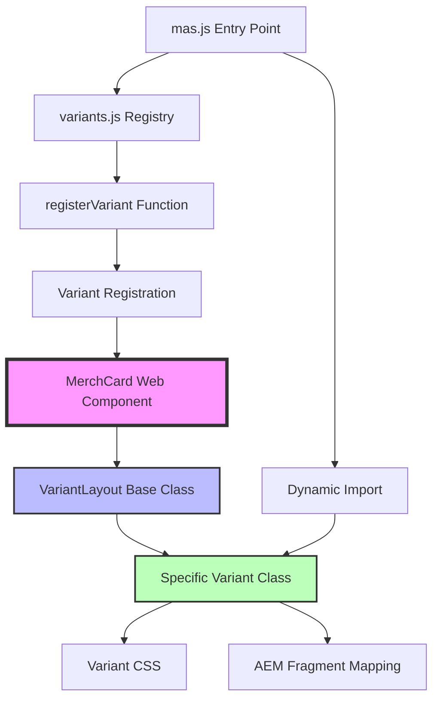
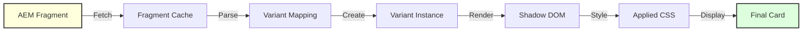
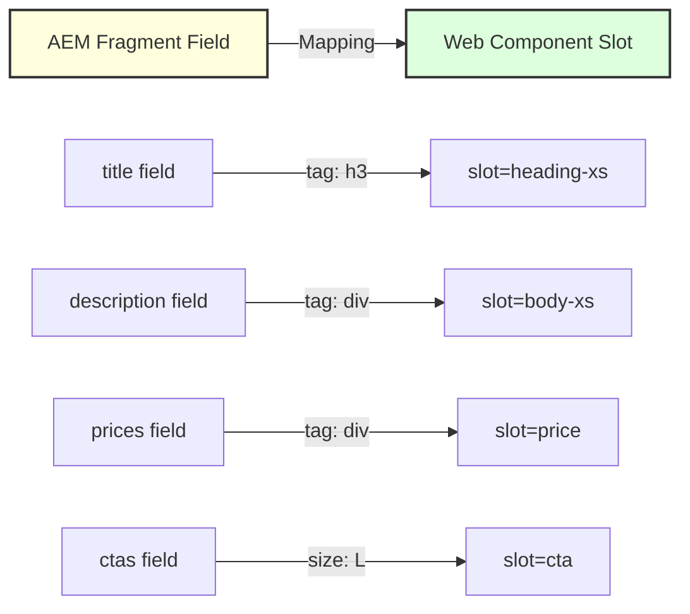
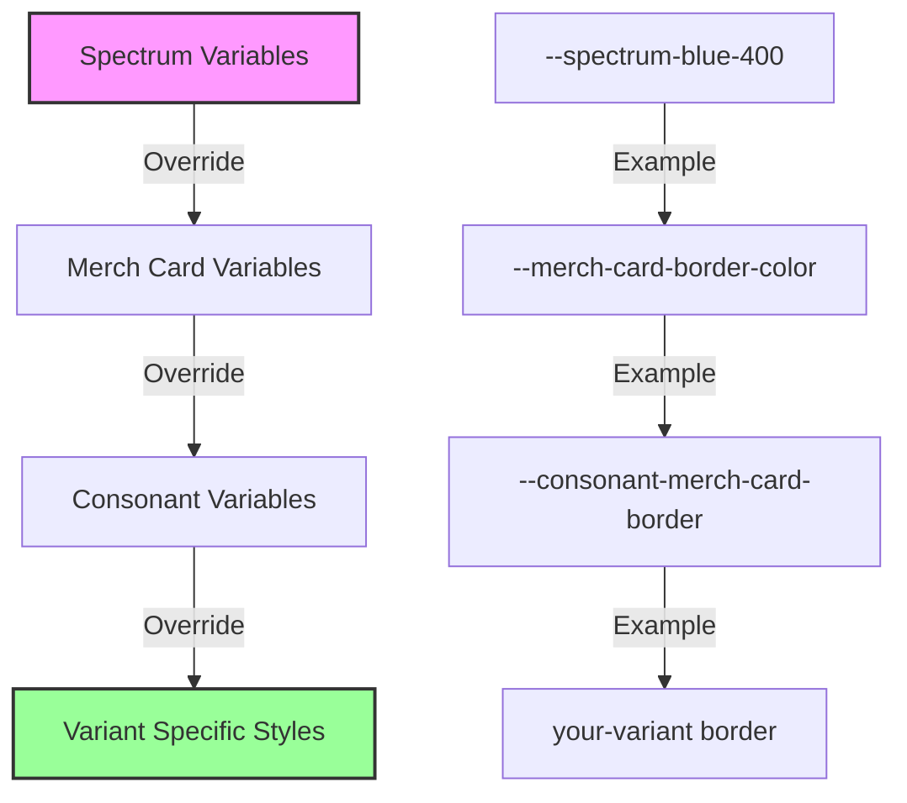
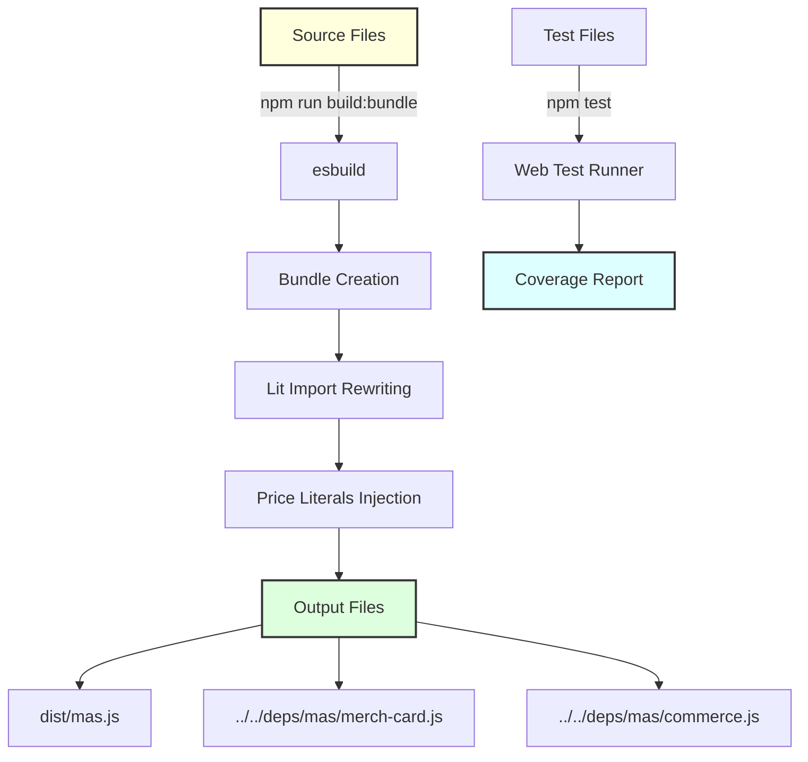
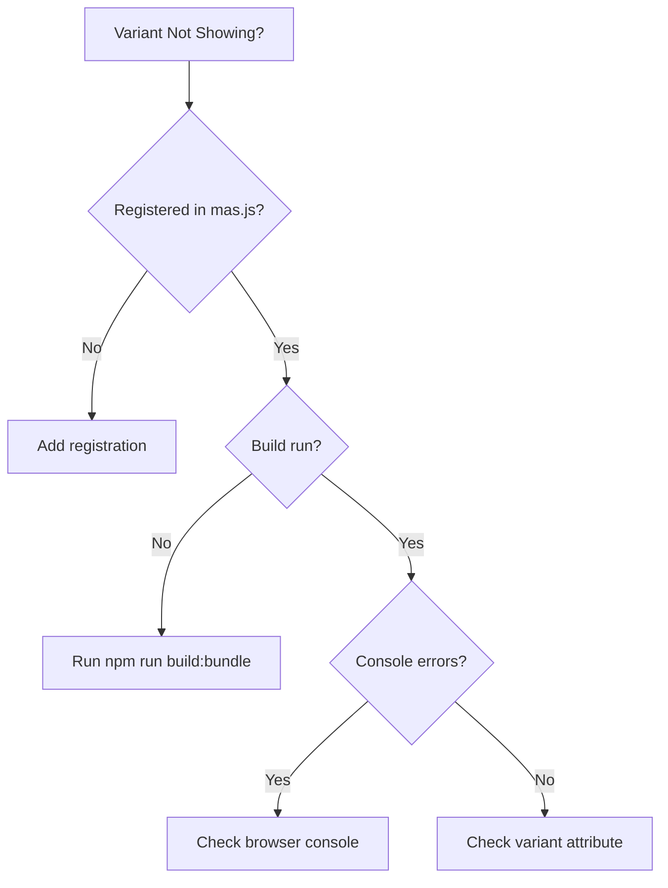

# MAS Variant Development Guide

## Table of Contents
1. [Architecture Overview](#architecture-overview)
2. [Key Concepts](#key-concepts)
3. [Creating a New Variant](#creating-a-new-variant)
4. [AEM Fragment Mapping](#aem-fragment-mapping)
5. [Styling Guidelines](#styling-guidelines)
6. [Testing Requirements](#testing-requirements)
7. [Build & Deployment](#build--deployment)
8. [Best Practices](#best-practices)
9. [Troubleshooting](#troubleshooting)

## Architecture Overview

MAS (Merch at Scale) uses a variant-based architecture built on Lit web components. Each variant represents a different card layout/design that can be used across Adobe surfaces.

### Component Hierarchy



### Variant Lifecycle



## Key Concepts

### 1. Variant Structure
Each variant consists of three main files:
- **variant-name.js** - Main logic extending VariantLayout
- **variant-name.css.js** - Styles as a JavaScript string export
- **Test file** - Testing the variant functionality

### 2. VariantLayout Base Class
All variants extend the `VariantLayout` class which provides:
- Common badge rendering
- Height synchronization
- Style injection
- Lifecycle hooks
- Fragment mapping support

### 3. Registration System
Variants are registered in the system using the `registerVariant` function with:
- Variant name (string identifier)
- Variant class
- AEM fragment mapping (optional)
- Static styles (optional)
- Collection options (optional)

## Creating a New Variant

Follow these steps to create a new variant:

### Step 1: Create the Variant Class

Create `/libs/features/mas/src/variants/your-variant.js`:

```javascript
import { VariantLayout } from './variant-layout.js';
import { html, css } from 'lit';
import { CSS } from './your-variant.css.js';

// Define AEM Fragment Mapping
export const YOUR_VARIANT_AEM_FRAGMENT_MAPPING = {
    title: {
        tag: 'h3',
        slot: 'heading-xs',
        maxCount: 250,
        withSuffix: true,
    },
    description: {
        tag: 'div',
        slot: 'body-xs',
        maxCount: 2000,
    },
    prices: {
        tag: 'div',
        slot: 'price',
    },
    ctas: {
        slot: 'cta',
        size: 'L', // S, M, L, XL
    },
    badge: {
        tag: 'div',
        slot: 'badge',
    },
};

export class YourVariant extends VariantLayout {
    // Return global CSS for this variant
    getGlobalCSS() {
        return CSS;
    }

    // Override to customize price options
    priceOptionsProvider(element, options) {
        options.displayAnnual = this.card.settings?.displayAnnual ?? false;
        // Add custom price display logic
    }

    // Lifecycle hook - called when connected to DOM
    connectedCallbackHook() {
        // Initialize variant-specific behavior
        // e.g., setup event listeners, initial state
    }

    // Called after card updates
    async postCardUpdateHook() {
        await this.card.updateComplete;
        // Perform post-update actions
        // e.g., adjust element heights, update calculations
    }

    // Render the variant layout
    renderLayout() {
        return html`
            ${this.badge}
            <div class="body">
                <slot name="heading-xs"></slot>
                <slot name="body-xs"></slot>
                <slot name="price"></slot>
                <slot name="cta"></slot>
                ${this.secureLabelFooter}
            </div>
        `;
    }

    // Static styles applied to shadow DOM
    static variantStyle = css`
        :host([variant='your-variant']) {
            min-width: 300px;
            background-color: var(--spectrum-background-base-color);
            border: 1px solid var(--consonant-merch-card-border-color);
        }
    `;
}
```

### Step 2: Create the CSS File

Create `/libs/features/mas/src/variants/your-variant.css.js`:

```javascript
export const CSS = `
merch-card[variant="your-variant"] {
    /* Card container styles */
    min-width: 300px;
    min-height: 400px;
    padding: var(--consonant-merch-spacing-m);
    background: var(--spectrum-background-base-color);
    border: 1px solid var(--consonant-merch-card-border-color);
    border-radius: var(--consonant-merch-card-border-radius);
}

merch-card[variant="your-variant"] [slot="heading-xs"] {
    font-size: var(--merch-card-heading-xs-font-size);
    font-weight: 700;
    line-height: 1.2;
    margin-bottom: var(--consonant-merch-spacing-xs);
}

merch-card[variant="your-variant"] [slot="body-xs"] {
    font-size: var(--merch-card-body-xs-font-size);
    line-height: 1.5;
    color: var(--spectrum-gray-700);
}

merch-card[variant="your-variant"] [slot="price"] {
    margin: var(--consonant-merch-spacing-s) 0;
    font-size: var(--merch-card-price-font-size);
}

merch-card[variant="your-variant"] [slot="cta"] {
    margin-top: auto;
    display: flex;
    gap: var(--consonant-merch-spacing-xs);
}

/* Responsive styles */
@media (max-width: 768px) {
    merch-card[variant="your-variant"] {
        min-width: 100%;
    }
}
`;
```

### Step 3: Register the Variant

Add to `/libs/features/mas/src/mas.js`:

```javascript
// Import your variant
import {
    YOUR_VARIANT_AEM_FRAGMENT_MAPPING,
    YourVariant,
} from './variants/your-variant.js';

// Register it
registerVariant(
    'your-variant',
    YourVariant,
    YOUR_VARIANT_AEM_FRAGMENT_MAPPING,
    YourVariant.variantStyle,
);
```

### Step 4: Update variants.js

Import and register in `/libs/features/mas/src/variants/variants.js`:

```javascript
import { YourVariant, YOUR_VARIANT_AEM_FRAGMENT_MAPPING } from './your-variant.js';

// Register in the static registration section
registerVariant(
    'your-variant',
    YourVariant,
    YOUR_VARIANT_AEM_FRAGMENT_MAPPING,
    YourVariant.variantStyle,
);
```

## AEM Fragment Mapping

### Mapping Structure



### Mapping Configuration Options

```javascript
export const FRAGMENT_MAPPING = {
    // Text content mapping
    title: {
        tag: 'h3',              // HTML tag to wrap content
        slot: 'heading-xs',     // Slot name in the component
        maxCount: 250,          // Max character count
        withSuffix: true,       // Add ellipsis if truncated
    },

    // Badge configuration
    badge: {
        tag: 'div',
        slot: 'badge',
        default: 'spectrum-blue-400',  // Default color
    },

    // Allowed badge colors
    allowedBadgeColors: [
        'spectrum-blue-400',
        'spectrum-gray-300',
        'gradient-purple-blue',
    ],

    // CTAs configuration
    ctas: {
        slot: 'cta',
        size: 'L',  // Button size: S, M, L, XL
    },

    // Special attributes
    borderColor: {
        attribute: 'border-color',
        specialValues: {
            gray: 'var(--spectrum-gray-300)',
            blue: 'var(--spectrum-blue-400)',
        },
    },

    // Features
    disabledAttributes: ['trialBadgeColor'],
    supportsDefaultChild: true,  // For accordion behavior
};
```

## Styling Guidelines

### CSS Variable Hierarchy



### Common CSS Variables

```css
/* Spectrum Design System */
--spectrum-background-base-color
--spectrum-gray-300
--spectrum-blue-400

/* Merch Card Specific */
--merch-card-border-radius: 4px
--merch-card-heading-xs-font-size: 18px
--merch-card-body-xs-font-size: 14px
--merch-card-price-font-size: 24px

/* Consonant Merch */
--consonant-merch-spacing-xs: 8px
--consonant-merch-spacing-s: 16px
--consonant-merch-spacing-m: 24px
--consonant-merch-card-border-color: #ddd

/* Variant-specific dynamic height */
--consonant-merch-card-your-variant-heading-height
--consonant-merch-card-your-variant-body-height
```

## Testing Requirements

### Create Test File

Create `/libs/features/mas/test/merch-card.your-variant.test.html`:

```html
<!DOCTYPE html>
<html>
<head>
    <meta charset="utf-8">
    <meta name="viewport" content="width=device-width">
    <title>Merch Card - Your Variant Tests</title>
    <script type="module" src="./merch-card.your-variant.test.html.js"></script>
</head>
<body>
    <merch-card variant="your-variant" id="test-card">
        <h3 slot="heading-xs">Test Title</h3>
        <div slot="body-xs">Test Description</div>
        <div slot="price">
            <mas-inline-price
                data-template="price"
                data-wcs-osi="test-osi">
            </mas-inline-price>
        </div>
        <div slot="cta">
            <a href="#" class="con-button blue">Buy Now</a>
        </div>
    </merch-card>
</body>
</html>
```

Create `/libs/features/mas/test/merch-card.your-variant.test.html.js`:

```javascript
import { expect } from '@esm-bundle/chai';
import { waitUntil } from './utils.js';
import '../src/merch-card.js';
import '../src/variants/your-variant.js';

describe('merch-card your-variant variant', () => {
    let card;

    beforeEach(async () => {
        card = document.getElementById('test-card');
        await card.updateComplete;
    });

    it('should render with correct variant', () => {
        expect(card.variant).to.equal('your-variant');
    });

    it('should display title', () => {
        const title = card.querySelector('[slot="heading-xs"]');
        expect(title.textContent).to.equal('Test Title');
    });

    it('should apply correct styles', async () => {
        const styles = window.getComputedStyle(card);
        expect(styles.minWidth).to.equal('300px');
    });

    it('should handle price updates', async () => {
        // Test price display logic
        const price = card.querySelector('[data-template="price"]');
        expect(price).to.exist;
    });

    it('should render CTA button', () => {
        const cta = card.querySelector('[slot="cta"] a');
        expect(cta.textContent).to.equal('Buy Now');
        expect(cta.classList.contains('con-button')).to.be.true;
    });
});
```

### Run Tests

```bash
# From mas directory
cd libs/features/mas
npm test

# Run specific test
npm run test:file test/merch-card.your-variant.test.html

# Watch mode for development
npm run test:watch
```

## Build & Deployment

### Build Process Flow



### Build Commands

```bash
# Build everything (tests + bundle)
npm run build

# Build bundle only (REQUIRED after changes)
npm run build:bundle

# Build with sourcemaps for debugging
npm run build:dev

# Run linter (REQUIRED before commit)
npm run lint
```

### Critical Build Steps

1. **Always rebuild after changes**: `npm run build:bundle`
2. **Run linter**: `npm run lint`
3. **Run tests**: `npm test`
4. **Verify coverage**: Ensure 85% coverage threshold

## Best Practices

### DO's ✅

1. **Extend VariantLayout**: Always extend the base class
2. **Use CSS Variables**: Leverage existing design tokens
3. **Test Coverage**: Maintain >85% test coverage
4. **Semantic Slots**: Use meaningful slot names
5. **Responsive Design**: Include mobile styles
6. **Accessibility**: Include ARIA attributes
7. **Performance**: Use lazy loading and yield to main thread
8. **Documentation**: Comment complex logic

### DON'Ts ❌

1. **Don't hardcode colors**: Use CSS variables
2. **Don't skip tests**: All variants need tests
3. **Don't forget to rebuild**: Run build:bundle after changes
4. **Don't use inline styles**: Keep styles in .css.js files
5. **Don't ignore linting**: Fix all lint issues
6. **Don't modify dist/**: Only edit src/ files

## Troubleshooting

### Common Issues

#### 1. Variant Not Rendering


#### 2. Styles Not Applied
- Check CSS file is imported in variant class
- Verify `getGlobalCSS()` returns the CSS string
- Check selector specificity
- Verify CSS variables are defined

#### 3. Build Failures
- Run `npm install` to ensure dependencies
- Check for syntax errors in JavaScript
- Verify imports are correct
- Run `npm run lint` to find issues

#### 4. Test Failures
- Ensure card.updateComplete is awaited
- Check test HTML structure matches variant slots
- Verify mock data is properly set up
- Use waitUntil for async operations

### Debug Tips

1. **Enable sourcemaps**: `npm run build:dev`
2. **Use browser DevTools**: Inspect Shadow DOM
3. **Check network tab**: Verify fragment loading
4. **Console logging**: Add temporary logs in lifecycle hooks
5. **Test in isolation**: Create standalone HTML test page

## Support Resources

### Internal Documentation
- Main Milo docs: `/libs/features/mas/README.md`
- CLAUDE.md files for AI assistance
- Test examples in `/test/` directory

### Key Files to Reference
- Base class: `src/variants/variant-layout.js`
- Simple example: `src/variants/mini.js`
- Complex example: `src/variants/simplified-pricing-express.js`
- Registration: `src/variants/variants.js`

### Development Workflow

```mermaid
graph LR
    A[Fork Repo] --> B[Create Branch]
    B --> C[Develop Variant]
    C --> D[Write Tests]
    D --> E[Run Build]
    E --> F[Run Linter]
    F --> G[Run Tests]
    G --> H[Create PR]
    H --> I[Code Review]
    I --> J[Merge to Stage]

    style A fill:#ffd,stroke:#333,stroke-width:2px
    style J fill:#dfd,stroke:#333,stroke-width:2px
```



## Questions?

For questions or support:
1. Check this guide and existing variants
2. Review test files for examples
3. Ask in project Slack channel
4. Create an issue in GitHub

---

*Last Updated: September 2024*
*Version: 1.0*