# MAS Variant Development Checklist

## Quick Reference Guide for Creating New Variants

### Development Process Flow


## ✅ Pre-Development Setup

- [ ] **Fork the Milo repository**
- [ ] **Clone your fork locally**
- [ ] **Create feature branch**: `MWPW-XXXXX` (ticket format)
- [ ] **Install dependencies**: `npm install` in `/libs/features/mas/`
- [ ] **Verify build works**: `npm run build`
- [ ] **Run existing tests**: `npm test`

## ✅ Required Files Checklist

### 1. Variant Class File
- [ ] Create `/libs/features/mas/src/variants/[variant-name].js`
- [ ] Extend `VariantLayout` class
- [ ] Define `[VARIANT_NAME]_AEM_FRAGMENT_MAPPING` export
- [ ] Implement required methods:
  - [ ] `getGlobalCSS()`
  - [ ] `renderLayout()`
- [ ] Add optional lifecycle hooks as needed:
  - [ ] `connectedCallbackHook()`
  - [ ] `postCardUpdateHook()`
  - [ ] `disconnectedCallbackHook()`
  - [ ] `syncHeights()`
  - [ ] `priceOptionsProvider()`

### 2. CSS File
- [ ] Create `/libs/features/mas/src/variants/[variant-name].css.js`
- [ ] Export CSS as `export const CSS = \`...\``
- [ ] Use variant-specific selectors: `merch-card[variant="variant-name"]`
- [ ] Include responsive styles (mobile, tablet, desktop)
- [ ] Use CSS variables from design system
- [ ] Add dark theme support if needed

### 3. Registration
- [ ] Import variant in `/libs/features/mas/src/mas.js`:
  ```javascript
  import { VariantName, VARIANT_NAME_AEM_FRAGMENT_MAPPING } from './variants/variant-name.js';
  ```
- [ ] Register variant in `mas.js`:
  ```javascript
  registerVariant(
      'variant-name',
      VariantName,
      VARIANT_NAME_AEM_FRAGMENT_MAPPING,
      VariantName.variantStyle,
  );
  ```

### 4. Test Files
- [ ] Create `/libs/features/mas/test/merch-card.[variant-name].test.html`
- [ ] Create `/libs/features/mas/test/merch-card.[variant-name].test.html.js`
- [ ] Include test cases for:
  - [ ] Basic rendering
  - [ ] Slot content display
  - [ ] Styling verification
  - [ ] State management
  - [ ] Edge cases
  - [ ] Accessibility

## ✅ Naming Conventions

| Item | Convention | Example |
|------|------------|---------|
| Variant name | kebab-case | `simplified-pricing-express` |
| Class name | PascalCase | `SimplifiedPricingExpress` |
| Mapping const | SCREAMING_SNAKE_CASE | `SIMPLIFIED_PRICING_EXPRESS_AEM_FRAGMENT_MAPPING` |
| CSS file | kebab-case.css.js | `simplified-pricing-express.css.js` |
| Test file | merch-card.kebab-case.test.html | `merch-card.simplified-pricing-express.test.html` |
| CSS selector | merch-card[variant="name"] | `merch-card[variant="simplified-pricing-express"]` |

## ✅ AEM Fragment Mapping Configuration

- [ ] Define mapping for each content field:
  ```javascript
  title: { tag: 'h3', slot: 'heading-xs', maxCount: 250 }
  ```
- [ ] Configure badge if needed:
  ```javascript
  badge: { tag: 'div', slot: 'badge', default: 'spectrum-blue-400' }
  ```
- [ ] Set up CTAs:
  ```javascript
  ctas: { slot: 'cta', size: 'L' }  // S, M, L, XL
  ```
- [ ] Add special attributes if needed:
  ```javascript
  borderColor: { attribute: 'border-color', specialValues: {...} }
  ```

## ✅ CSS Variables to Use

### Spectrum Design System
- [ ] `--spectrum-background-base-color`
- [ ] `--spectrum-gray-[50-900]`
- [ ] `--spectrum-blue-400`
- [ ] `--spectrum-red-400`

### Merch Card Specific
- [ ] `--merch-card-heading-xs-font-size`
- [ ] `--merch-card-body-xs-font-size`
- [ ] `--merch-card-price-font-size`
- [ ] `--merch-card-border-radius`

### Consonant Spacing
- [ ] `--consonant-merch-spacing-xs` (8px)
- [ ] `--consonant-merch-spacing-s` (16px)
- [ ] `--consonant-merch-spacing-m` (24px)
- [ ] `--consonant-merch-card-border-color`

## ✅ Build & Test Commands

```bash
# Navigate to MAS directory
cd libs/features/mas

# Build the bundle (REQUIRED after any changes)
npm run build:bundle

# Run all tests
npm test

# Run specific test file
npm run test:file test/merch-card.your-variant.test.html

# Run tests in watch mode for development
npm run test:watch

# Run linter (REQUIRED before commit)
npm run lint

# Build with sourcemaps for debugging
npm run build:dev
```

## ✅ Testing Checklist

- [ ] **Unit Tests**
  - [ ] Variant renders correctly
  - [ ] All slots display content
  - [ ] CSS styles applied
  - [ ] Badge functionality works
  - [ ] Price display is correct
  - [ ] CTA buttons render
  - [ ] States work (selected, failed, etc.)

- [ ] **Coverage Requirements**
  - [ ] Branches: ≥85%
  - [ ] Functions: ≥65%
  - [ ] Statements: ≥85%
  - [ ] Lines: ≥85%

- [ ] **Manual Testing**
  - [ ] Test in Chrome, Firefox, Safari, Edge
  - [ ] Test responsive breakpoints
  - [ ] Test dark theme (if applicable)
  - [ ] Test with real AEM fragments
  - [ ] Test in collection context
  - [ ] Test accessibility (keyboard nav, screen reader)

## ✅ Pre-Commit Checklist

- [ ] All files created and registered
- [ ] `npm run build:bundle` executed successfully
- [ ] `npm run lint` passes with no errors
- [ ] `npm test` passes with required coverage
- [ ] No changes in `/libs/deps/mas/` (auto-generated)
- [ ] No changes in `/dist/` (auto-generated)
- [ ] Code follows existing patterns
- [ ] Comments added for complex logic
- [ ] Console.log statements removed

## ✅ Pull Request Checklist

- [ ] **Branch naming**: `MWPW-XXXXX` format
- [ ] **PR title**: Clear description of variant
- [ ] **PR description includes**:
  - [ ] What variant does
  - [ ] Where it will be used
  - [ ] Screenshots/examples
  - [ ] Testing performed
- [ ] **Link to Jira ticket**
- [ ] **Request review from MAS team**
- [ ] **All CI checks passing**

## ⚠️ Common Pitfalls to Avoid

1. ❌ **Forgetting to rebuild**: Always run `npm run build:bundle` after changes
2. ❌ **Editing dist/ or deps/ files**: Only edit src/ files
3. ❌ **Hardcoding values**: Use CSS variables instead
4. ❌ **Skipping tests**: All variants need comprehensive tests
5. ❌ **Ignoring lint errors**: Fix all issues before committing
6. ❌ **Missing registration**: Variant won't work without registration
7. ❌ **Wrong import paths**: Lit imports are rewritten during build
8. ❌ **Not testing responsiveness**: Always test mobile/tablet/desktop

## 🚀 Quick Start Commands

```bash
# Clone and setup
git clone https://github.com/[your-fork]/milo.git
cd milo/libs/features/mas
npm install

# Create your variant (use template files as starting point)
cp src/variants/example-variant.js src/variants/my-variant.js
cp src/variants/example-variant.css.js src/variants/my-variant.css.js
cp test/merch-card.example-variant.test.html test/merch-card.my-variant.test.html
cp test/merch-card.example-variant.test.html.js test/merch-card.my-variant.test.html.js

# Edit files and implement your variant
# ... make your changes ...

# Build and test
npm run build:bundle
npm run lint
npm test

# Create branch and commit
git checkout -b MWPW-XXXXX
git add .
git commit -m "feat: Add new variant [variant-name]"
git push origin MWPW-XXXXX
```

## 📋 Final Verification

Before submitting your PR, verify:

```mermaid
graph LR
    A[Files Created] -->|✓| B[Variant Registered]
    B -->|✓| C[Build Successful]
    C -->|✓| D[Lint Passes]
    D -->|✓| E[Tests Pass]
    E -->|✓| F[Coverage Met]
    F -->|✓| G[Manual Testing]
    G -->|✓| H[PR Ready]

    style A fill:#e8f5e9,stroke:#4caf50,stroke-width:2px
    style H fill:#e8f5e9,stroke:#4caf50,stroke-width:2px
```



## 🆘 Need Help?

- Review existing variants for examples
- Look at test files in `/test/` directory
- Ask in project Slack channel #merch-at-scale

---

*Version: 1.0 | Last Updated: September 2024*
