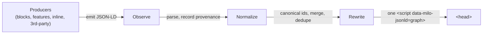
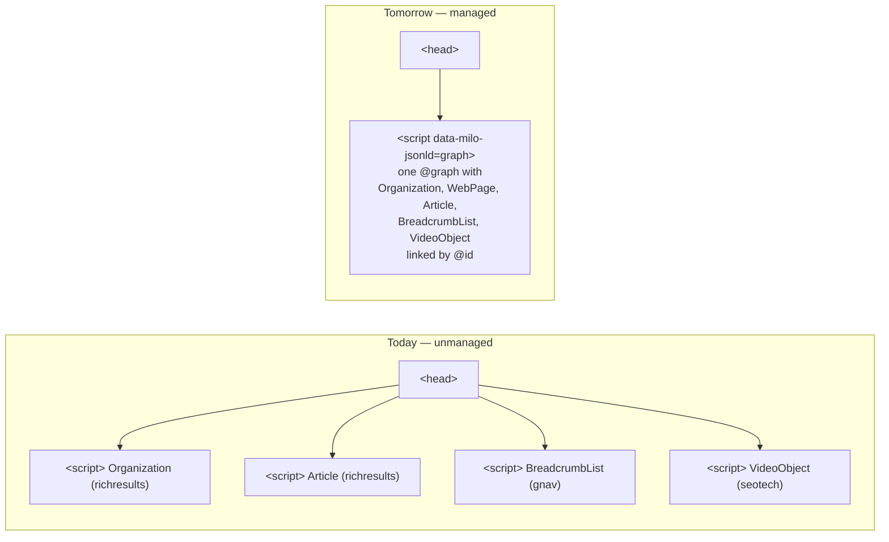
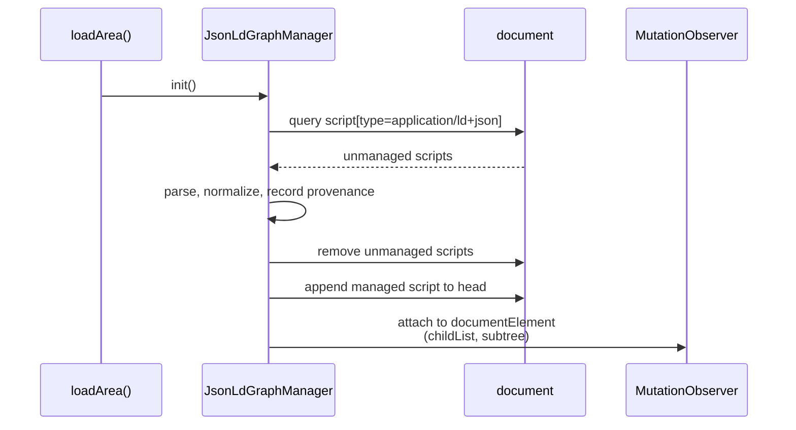
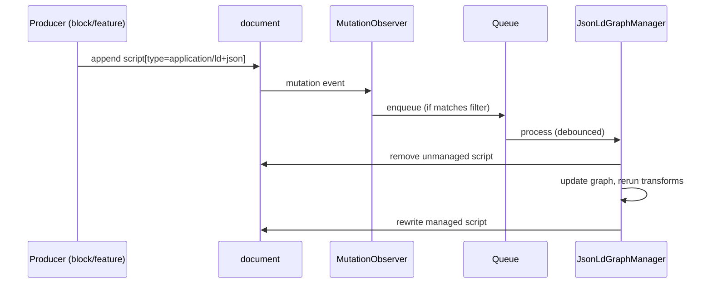
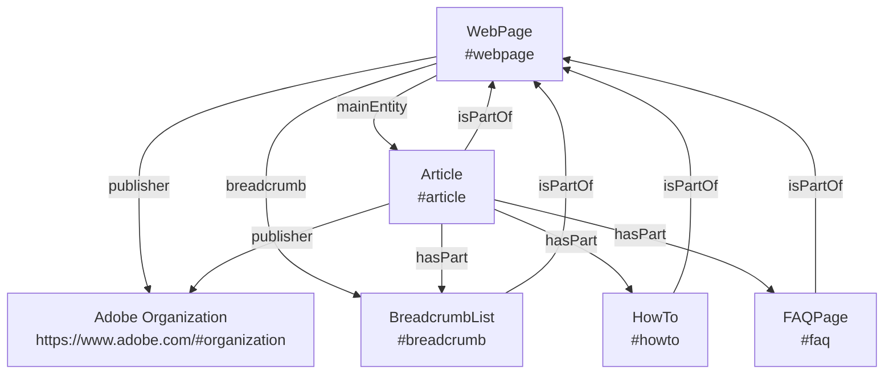
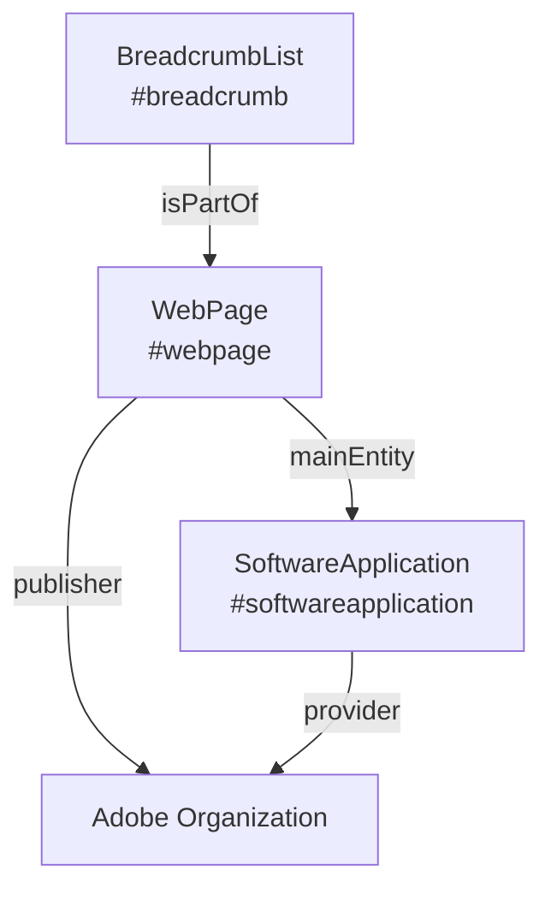

# JSON-LD Graph Manager

> **Status:** Design specification. The runtime described here is not yet implemented — there is no `JsonLdGraphManager` class, no `loadArea()` wiring, and no `jsonld-graph-manager` metadata flag in code today. This document describes the target runtime so that, once implementation lands, its behavior and contracts are already recorded. The approach is **observation-first, normalization-first**: meet the existing producer ecosystem where it is, then converge it into one canonical graph. Remove this banner when the runtime is in place.

## Quickstart

The `JsonLdGraphManager` replaces the N uncoordinated JSON-LD `<script>` tags a Milo page emits today with **one canonical, linked `@graph`** in `<head>`. Producers — blocks, features, inline page content, third-party scripts — do not need to change: the manager observes their output, normalizes it, records its origin, and rewrites a single managed script. Producers that want to skip the DOM can use a direct-push API instead.

Pages opt in with the `jsonld-graph-manager` metadata flag (`true`/`false`). Rollback uses the same flag — flip it off and producers resume the direct-write behavior they have today.

The biggest benefit is one coherent graph for search engines and LLMs. The biggest risk is that a producer's output breaks after normalization. Both are mitigated by cohort-based rollout, canonical identity rules, and observable per-source provenance.

## Who this is for

| Audience | What this document means for you |
| --- | --- |
| **Block / feature authors** | Your existing `document.head.appendChild(script)` keeps working. The manager picks up your payload and folds it into the page graph. Over time, migrate to direct push for cleaner provenance. |
| **SEO and content owners** | Pages under the feature flag emit one linked `@graph` so search engines and LLMs see a single coherent representation of each page, with canonical identity for `WebPage`, `Organization`, and `BreadcrumbList`. |
| **Platform engineers** | One runtime authority over JSON-LD output; a registered producer contract; per-source provenance; a bounded observer; a feature flag for rollback. |

## Table Of Contents

- [Part I — Motivation](#part-i--motivation)
  1. [Abstract](#abstract)
  1. [Problem Statement](#problem-statement)
  1. [Design Decision](#design-decision)
  1. [Purpose And Scope](#purpose-and-scope)
  1. [Glossary](#glossary)
- [Part II — Rollout](#part-ii--rollout)
  1. [Feature Flagging](#feature-flagging)
  1. [Rollout Timeline](#rollout-timeline)
  1. [Rollback And Coexistence](#rollback-and-coexistence)
- [Part III — Architecture](#part-iii--architecture)
  1. [Architecture Overview](#architecture-overview)
  1. [Before And After](#before-and-after)
  1. [Runtime Lifecycle](#runtime-lifecycle)
  1. [Data Model And Contracts](#data-model-and-contracts)
- [Part IV — Data Model And Validation](#part-iv--data-model-and-validation)
  1. [Producer Integration Model](#producer-integration-model)
  1. [Normalization And Merge Policy](#normalization-and-merge-policy)
  1. [Canonical Page Graph Model](#canonical-page-graph-model)
  1. [Validation Cohort And Target Coverage](#validation-cohort-and-target-coverage)
- [Part V — Operations](#part-v--operations)
  1. [Observability And Diagnostics](#observability-and-diagnostics)
  1. [Testing Strategy](#testing-strategy)
  1. [Performance Considerations](#performance-considerations)
  1. [Direct-Push API Surface](#direct-push-api-surface)
  1. [Security Considerations](#security-considerations)
- [Part VI — Reference](#part-vi--reference)
  1. [Relationship To The Authoring Catalog](#relationship-to-the-authoring-catalog)
  1. [Appendix A: Canonical Examples](#appendix-a-canonical-examples)
  1. [Appendix B: Open Questions](#appendix-b-open-questions)
  1. [Appendix C: Limitations And Future Work](#appendix-c-limitations-and-future-work)
  1. [References](#references)

---

## Part I — Motivation

Part I establishes why the `JsonLdGraphManager` exists, quantifies the current fragmentation, and records the core architectural decision. Readers who only need context should read Part I and stop.

### Abstract

*Today's pages speak with many voices. The manager makes them speak with one.*

Today, a single Milo page can emit JSON-LD from eight or more independent producers — `richresults`, `seotech`, `video-metadata`, `breadcrumbs`, `gnav`, `how-to`, `accordion`, `event-rich-results`, the review block — each writing its own `<script>` into `<head>`. The result is a fragmented, sometimes contradictory representation of the page for search engines and LLMs.

The `JsonLdGraphManager` is a document-level runtime that collects those fragments and emits **one canonical, linked `@graph`** per page. It achieves this by ingesting existing JSON-LD where it already exists, normalizing entities into canonical page-scoped identities, and rewriting a single managed JSON-LD payload into `document.head`. Its objective is to improve the accuracy, consistency, and coverage of structured data across ACOM and BACOM properties so search engines and LLMs can reliably understand, interpret, and surface Adobe content.

This document is the runtime source of truth for how structured data is collected and emitted on a Milo page.

### Problem Statement

*Structured data today is distributed across too many producers to rewrite safely in one pass.*

Structured data in the Milo ecosystem is not produced by a single subsystem. It is emitted by feature modules, blocks, inline page code, metadata-driven integrations, rendered DOM derivations, and external payloads. These producers exist across multiple repositories and do not share a uniform implementation contract.

Concretely: the structured data catalog currently documents **33 integrations spread across 7 active site or repo entries**, with only 17 of those integrations living in `milo` itself. Source: [structured-data-json-ld.json](https://milo.adobe.com/docs/authoring/structured-data-json-ld.json).

This fragmentation creates several problems:

* duplicate or conflicting JSON-LD can accumulate on the same page
* shared entities such as `Organization`, `WebPage`, and `BreadcrumbList` are emitted multiple times with inconsistent identifiers
* producer-specific failures can invalidate otherwise useful schema
* site-wide refactors are difficult because structured data behavior is distributed across many repos and components
* search engines and LLMs receive a fragmented representation of the page

The `JsonLdGraphManager` exists to convert this fragmented producer landscape into one coherent, provenance-aware graph.

### Design Decision

*Observation-first, normalization-first.*

The core decision is:

* use a document-level graph manager that observes, ingests, normalizes, and rewrites JSON-LD at runtime
* do not require an up-front synchronized migration of every existing producer to a new direct-write interface

The long-term preferred producer interface remains direct push into the `JsonLdGraphManager`. However, the initial system is deliberately designed to work with the current ecosystem as it exists, including legacy, external, and non-Milo producers.

Canonical entity identity is owned by the manager rather than by individual producers — see [Normalization And Merge Policy](#normalization-and-merge-policy) for the identity rules.

**Why observation-first?** The current structured data ecosystem is distributed across too many producers to rewrite safely in one pass. A document-level observer gives us one runtime authority without requiring immediate producer convergence.

**Why runtime, not build-time?** Much of today's JSON-LD is produced by runtime code (feature fetches, DOM derivations) and by author-hand-coded inline scripts. A build-time aggregator would miss both.

**Why `MutationObserver` instead of a publish-subscribe bus?** A bus would require every producer to opt in on day one. The observer captures today's DOM-appending producers for free, and the direct-push API is the opt-in path for producers that want richer provenance. Both can coexist.

### Purpose And Scope

This document defines:

* the problem the `JsonLdGraphManager` solves
* the architectural decision to aggregate and normalize JSON-LD at runtime
* the runtime lifecycle and DOM contract
* the canonical graph shape and entity-linking conventions
* the producer contract for blocks, features, and future direct integrations

This document is not a schema inventory for Adobe web properties. Type inventories, reusable field templates, and authoring-oriented schema references live in the authoring catalog — see [Relationship To The Authoring Catalog](#relationship-to-the-authoring-catalog).

### Glossary

* **Canonical identity** — the page-scoped `@id` the manager assigns to a known entity (e.g., `${canonicalUrl}#webpage`), overriding whatever the producer supplied.
* **Graph root** — the top-level entity of the page's `@graph`. For Milo pages, always `WebPage`.
* **Managed graph** — the single `<script type="application/ld+json" data-milo-jsonld="graph">` the manager owns in `<head>`.
* **Producer** — any source of JSON-LD on the page: a block, a feature, inline page content, a metadata-driven integration, or a third-party script.
* **Provenance** — the structured record the manager keeps per ingested source (`ingestMode`, `discoveryPhase`, `producerType`, `producerName`).
* **Singleton** — an entity type that must appear at most once in the managed graph (e.g., `WebPage`, `Organization`, `BreadcrumbList`).
* **Supplemental entity** — a linked entity referenced from the primary entity via `hasPart`, such as `FAQPage` or `HowTo`.
* **Transform** — a manager-internal function that adds, rewrites, or links entities during rebuild (e.g., synthesizing `WebPage` when none was supplied).
* **Unmanaged script** — any `<script type="application/ld+json">` that does not carry the manager's `data-milo-jsonld="graph"` marker.
* **Cohort** — the set of page families used to validate the manager during rollout, defined by the public `tests` dataset.

---

## Part II — Rollout

Part II answers **when and to whom** the manager ships. The flag is the gate; the timeline is the plan; rollback is the flag in reverse. Reviewers evaluating launch risk should read this part in full.

### Feature Flagging

*Metadata gates the manager. Absence means no-op.*

The manager is feature-gated by page metadata so it can be enabled on selected pages and page families without enabling it across an entire site at once.

The metadata flag is `jsonld-graph-manager`. The feature is enabled only when that metadata field is set to `true`. If the flag is absent or set to any other value, the manager does not load and no observer is attached.

This flagging model is intentionally similar to existing metadata-controlled integrations such as `seotech-video-url` and `seotech-structured-data`. The purpose is to support:

* controlled rollout by page family
* AEM-driven configuration without repo-wide code divergence
* experimentation and regression testing on limited cohorts
* safe coexistence with legacy JSON-LD producers during migration

Feature gating is also part of the rationale for the observation-first architecture: a document-level observer can be enabled on selected pages without requiring synchronized code changes across every existing producer.

### Rollout Timeline

*Canary first, then cohort, then family, then general.*

Rollout proceeds in four stages, each gated by explicit success criteria:

1. **Canary** — enable on a single low-risk page to validate boot behavior and confirm no regressions in `<head>` content. Hold for at least 24 hours under normal traffic before expanding.
1. **Cohort 1** — enable across the first row of the public `tests` dataset (e.g., Product Features). Expand when integration tests pass for 100% of cohort pages and the Rich Results Test pass rate is non-regressing for 72 hours.
1. **Cohort 2** — expand to remaining `tests` dataset rows. Same gate as Cohort 1.
1. **General availability** — remove the flag gate from new page templates. The flag remains respected on individual pages so a single-page rollback is always available.

Open question: specific dates, cohort ordering, and pass-rate thresholds are not yet set — they require alignment with SEO ownership. See [Appendix B: Open Questions](#appendix-b-open-questions).

### Rollback And Coexistence

*Flip the flag off; producers resume unmanaged direct-write.*

The feature flag is the primary rollback mechanism.

When `jsonld-graph-manager` metadata is `false` or absent:

* the manager does not initialize
* no observer is attached
* no managed script is written
* existing producers continue to write directly into `<head>` as they do today

When the flag is disabled mid-rollout on a page family:

* already-rendered managed graphs on prior pageviews are not retroactively rewritten — the flip takes effect on the next page load
* on subsequent loads, producers resume unmanaged direct-write behavior

When a defect is found in the manager itself:

1. flip the flag off for the affected page family via metadata configuration
1. verify on the next deploy or pageview that producers resume their prior behavior
1. land a fix under the flag on a limited cohort, then re-expand

Open question: whether disabling the flag should always be a full fallback to unmanaged output, or whether specific producers should be allow-listed to continue direct-writing even when the manager is active. The current design assumes full fallback. See [Appendix B: Open Questions](#appendix-b-open-questions).

---

## Part III — Architecture

Part III describes how the manager is organized internally and how it interacts with the DOM at runtime. The architecture overview gives the one-slide mental model; the before/after shows concrete output; the runtime lifecycle and data model give implementation detail.

### Architecture Overview

*Observe, normalize, rewrite.*

The `JsonLdGraphManager` is a document-level runtime object initialized from the document branch of `loadArea()` in `libs/utils/utils.js`.



The three beats are:

1. **Observe** — scan the DOM at boot, and watch for later appends via `MutationObserver`. Ingest and remove unmanaged JSON-LD scripts.
1. **Normalize** — apply canonical page-scoped identity to known entity types; merge conflicts by producer priority; dedupe singletons.
1. **Rewrite** — serialize one `@graph` into a single managed `<script>` in `<head>`.

The manager standardizes on **separated but linked** schema rather than deeply nested schema trees. This reduces redundant definitions of shared entities, limits the blast radius of producer-specific failures, lets blocks contribute nodes without owning the page payload, and models the page as a graph of referenced entities. This approach is consistent with Google's guidance for multiple structured data items on a page — see [General structured data guidelines](https://developers.google.com/search/docs/appearance/structured-data/sd-policies). Detailed producer rules are in [Producer Integration Model](#producer-integration-model).

### Before And After

*Today's fragmented head; tomorrow's one managed `@graph`.*

Consider a product page that today emits JSON-LD from `richresults` (Article, Organization), `gnav` (BreadcrumbList), and `seotech` (VideoObject). The `<head>` ends up with four independent scripts, with overlapping entity definitions and inconsistent identifiers:



Under the manager, those same four producers still emit whatever they emit today. The manager intercepts each payload, assigns canonical identity (e.g., `WebPage` → `${url}#webpage`, `Organization` → `https://www.adobe.com/#organization`), links related entities through `@id` references, and rewrites one managed script into `<head>`. Full worked examples are in [Appendix A: Canonical Examples](#appendix-a-canonical-examples).

### Runtime Lifecycle

*One boot scan plus one observer; everything else is the queue.*

#### Initialization phase

During document-level boot, the `JsonLdGraphManager`:

1. initializes a singleton manager instance
1. scans the full document for `script[type="application/ld+json"]`
1. ignores its own managed graph script if one already exists
1. parses all unmanaged JSON-LD payloads
1. normalizes discovered entities
1. removes the unmanaged JSON-LD scripts from the DOM
1. records provenance for each source
1. builds a canonical graph
1. writes the canonical graph to `document.head`
1. starts a `MutationObserver` for future additions



#### Mutation phase

When a block, feature, experiment, or third-party script appends JSON-LD later, the manager:

1. detects the new script anywhere in the document subtree
1. enqueues the event for sequential processing
1. parses and removes the unmanaged script
1. updates the in-memory entity graph
1. reruns graph transforms
1. rewrites the managed output in `document.head`



The observer target is `document.documentElement` with `childList` and `subtree` enabled. Only added nodes that are, or contain, `script[type="application/ld+json"]` are enqueued. Managed output is excluded by filtering on the manager-owned selector `script[type="application/ld+json"][data-milo-jsonld="graph"]`.

#### Queueing and rebuild policy

Although JavaScript execution is single-threaded, the manager still uses an explicit queue. The queue provides:

* deterministic processing order
* protection from re-entrant writes
* one rebuild path for all producer types
* batching during high DOM churn

The manager performs an immediate boot write, then batches later rewrites on a debounce interval. The target behavior is that rebuilds do not occur faster than roughly once per second during steady-state mutation bursts. Concrete budgets and bail-out behavior are documented in [Performance Considerations](#performance-considerations).

### Data Model And Contracts

*One managed `<script>`, one `@graph`, one provenance record per source.*

#### Managed DOM contract

The manager owns exactly one managed JSON-LD script in `head`:

```html
<script type="application/ld+json" data-milo-jsonld="graph"></script>
```

Optional attributes may include `data-milo-jsonld-version` and `data-milo-jsonld-updated`.

Rules:

* all non-managed JSON-LD scripts are candidates for ingestion and removal
* the manager ignores its own managed graph during scan and observation
* JSON-LD may be ingested from anywhere in the document, not only `<head>`
* the managed graph is the canonical page output

#### Canonical output shape

The manager emits one graph:

```json
{
  "@context": "https://schema.org",
  "@graph": []
}
```

Accepted input forms include a single JSON-LD object, an array of JSON-LD objects, or an object containing `@graph`. All accepted forms are flattened into one internal graph representation before transforms run.

#### Provenance contract

The manager tracks the origin of every ingested source as a structured record rather than a single flat label. A provenance record answers four questions: how the payload entered the manager, when it was discovered, what class of producer it came from, and which concrete producer supplied it.

The recommended provenance shape is:

```json
{
  "sourceId": "gm-src-0001",
  "ingestMode": "dom",
  "discoveryPhase": "initial",
  "producerType": "first-party",
  "producerName": "seotech"
}
```

Where:

* `sourceId` is an internal manager-generated identifier for the ingested source record
* `ingestMode` distinguishes `dom`, `push`, and `internal` manager generation
* `discoveryPhase` distinguishes `initial` discovery from later `mutation`
* `producerType` distinguishes `first-party`, `third-party`, `manager`, or `unknown`
* `producerName` identifies the concrete producer when known, such as `seotech`, `richresults`, `block:<name>`, `feature:<name>`, or `transform:webpage`

Representative scenarios:

| Scenario | ingestMode | discoveryPhase | producerType | producerName |
| --- | --- | --- | --- | --- |
| Page-authored JSON-LD found during boot | `dom` | `initial` | `unknown` | `unknown` |
| JSON-LD appended later by SEOTech | `dom` | `mutation` | `first-party` | `seotech` |
| Block pushes via the direct-push API | `push` | `mutation` | `first-party` | `block:richresults` |
| `WebPage` synthesized by the manager | `internal` | — | `manager` | `transform:webpage` |
| Third-party widget injects JSON-LD | `dom` | `mutation` | `third-party` | `unknown` |

Provenance supports debugging, trust, source attribution, and future policy decisions.

---

## Part IV — Data Model And Validation

Part IV follows the data's path through the manager: how producers hand data in, how incoming entities are normalized and merged, what shape the resulting canonical graph takes, and which pages are responsible for matching which expected shape.

### Producer Integration Model

*Keep emitting what you emit today. Or push direct to the manager.*

The manager supports two producer modes.

**Mode 1: DOM producers.** A block or feature appends JSON-LD to the page. The manager observes the new payload, ingests it, removes the unmanaged script, and incorporates the resulting nodes into the canonical graph. This mode accommodates today's existing producers — `richresults`, `seotech`, `video-metadata`, `breadcrumbs`, `how-to`, `accordion`, `event-rich-results`, the review block — plus hand-authored inline JSON-LD in AEM content, without requiring any producer to change at the same time.

**Mode 2: Direct push producers.** A producer submits one or more nodes directly to the manager. This is the preferred long-term integration model because it avoids unnecessary DOM churn and enables explicit provenance. The concrete signature is in [Direct-Push API Surface](#direct-push-api-surface).

Producer guidance:

* emit focused, independent entities rather than one giant nested payload
* use `@id` references to connect related entities
* do not assume that producer-local `@id` values will survive normalization unchanged — see [Normalization And Merge Policy](#normalization-and-merge-policy)
* do not rely on direct writes to `<head>` as the durable output contract
* do not emit duplicate top-level `WebPage` or Adobe `Organization` objects unless intentionally overriding the canonical model

### Normalization And Merge Policy

*Incoming `@id` values are hints. The manager owns canonical identity.*

#### Identity policy

The manager uses canonical page-scoped identities for known entity types rather than trusting incoming `@id` values unchanged:

| Entity | Canonical `@id` |
| --- | --- |
| `WebPage` | `${canonicalUrl}#webpage` |
| primary `Article` | `${canonicalUrl}#article` |
| `BreadcrumbList` | `${canonicalUrl}#breadcrumb` |
| `HowTo` | `${canonicalUrl}#howto` |
| `FAQPage` | `${canonicalUrl}#faq` |
| Adobe publisher `Organization` | `https://www.adobe.com/#organization` |

Incoming producer `@id` values are treated as merge hints, not as authoritative canonical identity. Source tracking and entity identity are separate concerns:

* source identity answers where a payload came from (provenance)
* entity identity answers which canonical node should exist in the managed graph

For recognized entities, the manager rewrites `@id` to canonical page-scoped values. Original producer ids may be retained as debugging metadata. Unknown nodes that lack stable identity are retained provisionally until they can be normalized or deduplicated.

#### Merge priority

When multiple sources describe the same entity, the default source priority is:

1. graph-manager-generated transforms
1. direct graph-manager push
1. Milo feature or block sources
1. third-party runtime sources
1. initial page DOM

#### Default merge rules

Unless a type-specific rule overrides them, the manager applies the following defaults:

* scalar field conflicts are resolved by source priority
* object fields are merged by key, with conflicting child fields resolved by source priority
* relationship arrays are unioned by canonical `@id`
* anonymous array members are deduplicated by normalized content hash when no stable `@id` exists
* unknown anonymous top-level nodes are retained provisionally until they can be normalized or deduplicated

#### Dedupe policy

Default page-level singletons (at most one instance per page):

* `WebPage`
* the primary content entity (e.g., `Article`, `SoftwareApplication`)
* `BreadcrumbList`
* the Adobe publisher `Organization`

Default page-level supplemental singletons:

* `FAQPage`
* `HowTo`

Legitimately repeatable types the manager may preserve as multiple instances:

* `VideoObject`
* `ImageObject`
* `Offer`
* `Question`

Relationship arrays such as `hasPart` are unioned by canonical `@id`.

### Canonical Page Graph Model

*`WebPage` is the page container; everything else links to it.*

The manager treats `WebPage` as the page container and links related entities to it. Canonical `@id` values are defined in [Normalization And Merge Policy](#normalization-and-merge-policy).

#### Editorial page shape



Governing rules:

* `WebPage` is the page container
* the primary content entity is referenced by `WebPage.mainEntity`
* `BreadcrumbList`, `HowTo`, and `FAQPage` link back to the page with `isPartOf`
* the primary content entity may reference supplemental entities with `hasPart`
* page-level publisher references resolve to the canonical Adobe `Organization`

This model is intended to be stable across separate producer implementations.

#### Product page shape



For product-oriented pages, `WebPage.mainEntity` points to `SoftwareApplication` when that entity is available. `BreadcrumbList` links back to the page with `isPartOf`; publisher references resolve to the canonical Adobe `Organization`.

The public `tests` dataset should be treated as the current representative source of truth for which page types map to which expected primary entities and required objects.

### Validation Cohort And Target Coverage

*The manager guarantees aggregation; it does not fabricate missing business entities.*

The public authoring catalog includes a `tests` dataset that serves as the current acceptance cohort for the `JsonLdGraphManager`. Each row declares:

* `URL`
* `Page Category`
* `Page Type`
* `Expected Graph Root`
* `Expected Primary Entity`
* `Expected Required Objects`

For the current cohort, the validation contract is intentionally simpler than the full implementation surface:

* `WebPage` is the expected graph root for every current test row
* `Organization`, `WebPage`, and `BreadcrumbList` are required across the current cohort
* the primary entity is selected by page family for the currently defined target state

Current target-state primary-entity expectations:

| Page family | Expected primary entity |
| --- | --- |
| `Product` | `SoftwareApplication` |
| `Product Feature` | `Article` |
| `Express Feature` | `Article` |
| `Express Discover` | `Article` |
| `Product Free Trial` | *not yet asserted in the tests dataset* |
| `Express Create` | *not yet asserted in the tests dataset* |

Blank primary-entity cells should be interpreted as unresolved target-state policy, not as proof that the page should never have a primary entity.

#### Manager guarantees vs. cohort expectations

| Concern | The manager guarantees | The cohort expects |
| --- | --- | --- |
| Graph root | `WebPage` is always produced | `WebPage` is the graph root for every current test row |
| Required entities | Preserves and canonicalizes `Organization`, `WebPage`, and `BreadcrumbList` when producers supply them | `Organization`, `WebPage`, and `BreadcrumbList` are present |
| Primary entity | Links a primary entity via `WebPage.mainEntity` if a producer supplied it | A page-family-specific primary entity (e.g., `SoftwareApplication`, `Article`) is present |
| Duplicates and conflicts | Dedupes singletons and reconciles by merge priority | The emitted graph is coherent and non-conflicting |
| Missing business data | Does not fabricate entities a producer never emitted | May fail target-state validation if no producer supplies the expected primary entity |

#### Validation boundary

The `tests` dataset describes the **target** structured-data contract for the cohort. It does not imply that the first release of the `JsonLdGraphManager` alone is responsible for producing every required entity.

The manager is responsible for:

* ingesting unmanaged JSON-LD
* removing unmanaged JSON-LD scripts after ingestion
* normalizing and deduplicating the resulting graph
* rewriting one canonical managed graph
* always producing `WebPage`
* preserving and linking `BreadcrumbList` and other supported entities when they are present
* preserving and linking entities that are already present or supplied by registered producers

The manager is **not**, by itself, the source of truth for missing business entities such as `Article` or `SoftwareApplication` when no producer currently emits them.

If no primary entity is available, the manager may still produce a legal graph centered on `WebPage` and any supported linked entities it can normalize. In that case:

* graph-manager validation confirms that aggregation, canonicalization, and managed output behave correctly
* full schema validation confirms that the page meets the expected contract declared in the public `tests` dataset

A page may therefore pass graph-manager validation while still failing full target-state schema validation. Absence of an expected primary entity in the managed graph does not by itself indicate graph-manager failure unless that entity was already present in source input or was explicitly supplied by a registered producer or transform.

---

## Part V — Operations

Part V is the reference for anyone operating, debugging, or extending the manager in production: how it logs, how it's tested, what performance it must hold to, what its direct-push surface looks like, and what security rules apply.

### Observability And Diagnostics

*Ordered queue debug locally, actionable warnings through Lana.*

The manager should expose both local debugging output and production-safe warning and error reporting.

#### Debug logging

For local development and non-production diagnosis, the manager should emit ordered debug output for key queue events:

* when unmanaged JSON-LD is discovered and queued
* the provenance record associated with each ingested source
* when a payload is parsed and removed
* when the managed graph is rewritten
* the resulting graph version or queue sequence number

Because all ingestion and rebuild work flows through one explicit queue, these messages should appear in queue order even when events happen in rapid succession.

Debug logging should follow existing Milo logging conventions:

* in non-production environments, debug output may be written to the console
* when `lanadebug` is enabled, Lana debug output may also surface in the console
* debug logging should be informative but not required for normal page behavior

#### Warning and error reporting

Warnings and errors should be reported through `window.lana?.log(...)` using the existing repo conventions for tags and severity.

Representative cases:

* invalid JSON-LD that fails to parse
* unsupported payload shapes
* rewrite failures
* transform failures
* producer payloads that violate required assumptions

Recommended logging behavior:

* warnings use Lana warning severity
* errors use Lana error severity
* tags should identify the manager and, when useful, the producer (e.g., `jsonld-graph-manager` or `jsonld-graph-manager,seotech`)
* high-volume success-path events should not be sent to Lana by default

### Testing Strategy

*Three layers: unit behavior, integration DOM, NALA cohort.*

Testing for the `JsonLdGraphManager` is organized at three levels:

1. **Unit tests** cover the manager's internal behavior: parsing the three accepted input shapes, identity-rewrite for known types, merge-priority resolution, dedupe for singletons, and provenance record construction. These run under the existing Milo unit-test harness and should not depend on the network.
1. **Integration tests** cover the boot and mutation lifecycle against representative DOM fixtures. Each fixture represents one page family (editorial, product, breadcrumb-only, multi-producer conflict, etc.) and asserts on the managed `@graph` output plus the removal of unmanaged scripts.
1. **End-to-end (NALA) tests** cover cohort pages listed in the public `tests` dataset. For each row, the test asserts the expected graph root, required objects, and — when declared — the expected primary entity.

Writing an acceptance test for a new page type:

1. identify the page family and its row in the `tests` dataset
1. add a DOM fixture that reproduces the producer payloads that page emits in production
1. assert the managed graph against the row's `Expected Graph Root`, `Expected Required Objects`, and `Expected Primary Entity`
1. when the page's producers do not yet emit the expected primary entity, mark the assertion as an `xfail`-style pending case linked to the relevant producer work

Regression coverage for producer changes should run both integration and unit tests. A producer change that silently stops emitting a primary entity should cause an integration-level failure, not only a broken e2e test in production.

Open question: whether the external `tests` dataset should also land as a local fixture in this repository. See [Appendix B: Open Questions](#appendix-b-open-questions).

### Performance Considerations

*Stay within `loadArea()`'s frame budget. Debounce rebuilds. Bail on pathological growth.*

The manager runs on every page where the feature flag is enabled and must not regress page performance.

Target performance envelope:

* boot work (document scan, ingest, normalize, first write) should complete within the same frame budget as other document-branch `loadArea()` work
* the `MutationObserver` callback must be non-blocking; all real work happens on a microtask or debounced interval
* steady-state rebuilds should not occur faster than roughly once per second
* total managed-graph size should remain within a conservative ceiling per page to keep JSON parsing, normalization, and serialization cheap

The observer is attached once per document to `document.documentElement` with `childList` and `subtree` enabled, and its callback filters added nodes to JSON-LD scripts only. The manager must not add observers elsewhere in the tree.

If the graph grows pathologically — for example, a producer appends thousands of JSON-LD scripts — the manager should log a warning through Lana and bail out of rewriting rather than block the main thread.

Open question: concrete numeric budgets. See [Appendix B: Open Questions](#appendix-b-open-questions).

### Direct-Push API Surface

*One call, one provenance record, one rebuild.*

This section specifies the preferred long-term integration described in [Producer Integration Model](#producer-integration-model).

Draft direct-push surface:

```js
// illustrative — exact module path TBD
const manager = getJsonLdGraphManager();

manager.push({
  producerName: 'richresults',
  producerType: 'first-party',
  nodes: [
    {
      '@type': 'Article',
      headline: 'How to Remove Unwanted Objects in Photoshop Elements',
      // producer-local @id is a hint; manager will rewrite
      '@id': 'richresults:article:1',
    },
  ],
});
```

Contract:

* `push` accepts one or more JSON-LD nodes and a producer descriptor
* `producerName` and `producerType` populate the provenance record
* producer-supplied `@id` values are preserved as hints only; the manager applies canonical identity per [Normalization And Merge Policy](#normalization-and-merge-policy)
* `push` is synchronous but does not guarantee an immediate rewrite — the manager may batch the resulting rebuild on the debounce interval

Error semantics:

* invalid JSON-LD shapes are logged through Lana with tags `jsonld-graph-manager,<producerName>` and discarded
* schema violations that the manager can recover from (unknown fields, unknown types) are retained provisionally and logged as warnings
* failures during rewrite are logged at error severity and do not throw into the caller

Migration — converting an existing producer from direct DOM write to direct push:

1. identify the producer's current `document.head.appendChild(script)` site
1. extract the JSON-LD payload into a plain object (or array of objects)
1. call `manager.push({ producerName, producerType: 'first-party', nodes })`
1. remove the script-append code once the manager is enabled for the producer's target pages

Open question: exact module path and accessor signature. See [Appendix B: Open Questions](#appendix-b-open-questions).

### Security Considerations

*Parse safe. Serialize safe. Third-party loses conflicts.*

The manager ingests JSON-LD from arbitrary page origins, including producers outside this repository. The following rules apply:

* **Parsing is string-only.** Ingested payloads are parsed with `JSON.parse`. The manager does not `eval` or execute producer content.
* **Rewrite is string-only.** The managed graph is serialized with `JSON.stringify` and written as a `textContent` assignment to the managed script, never as `innerHTML`. This prevents producer payloads from injecting HTML into `<head>`.
* **Type allow-listing.** The manager's canonical identity, merge, and dedupe rules only act on a known set of schema types. Unknown types may be retained provisionally, but they do not participate in canonicalization and cannot acquire canonical identity solely by being present in the graph.
* **Third-party producers.** Third-party runtime sources sit at the bottom of the merge priority ladder. A third-party producer cannot override a graph-manager transform or a direct-push contribution, and cannot win conflicts for canonical singleton entities such as `WebPage` or `Organization`.
* **Provenance preservation.** The manager records the origin of every ingested source so that a suspicious payload can be attributed after the fact.

Open question: whether to strip or quarantine specific fields (`url`, `sameAs`) when the producer is `third-party` and `unknown`. See [Appendix B: Open Questions](#appendix-b-open-questions).

---

## Part VI — Reference

### Relationship To The Authoring Catalog

*Runtime truth here; authoring truth in the catalog.*

This document and [structured-data-json-ld.json](https://milo.adobe.com/docs/authoring/structured-data-json-ld.json) serve complementary but different roles.

This document is the runtime source of truth for `JsonLdGraphManager` behavior. The public catalog is the source of truth for the current validation cohort, supported schema inventory, and related authoring references. When the two disagree, this document is authoritative for runtime behavior and the catalog is authoritative for authoring and cohort membership.

Use this document for:

* runtime behavior
* architectural rationale
* graph aggregation rules
* canonical identity conventions
* page-level entity relationships
* producer contracts

Use [structured-data-json-ld.json](https://milo.adobe.com/docs/authoring/structured-data-json-ld.json) for:

* schema inventories
* reusable field templates
* supported type references
* site-specific mappings
* authoring-oriented examples

As conventions stabilize, these are good candidates to add or strengthen in the authoring catalog:

* the linked `WebPage` plus primary-entity pattern
* the canonical Adobe `Organization` definition and stub
* page-scoped canonical id conventions for common entity types

### Appendix A: Canonical Examples

Appendix A favors a small number of representative graph-level examples over many isolated entity snippets, so canonical ids, cross-entity linking, and overall graph shape can be seen in one place.

#### Example 1: Editorial page graph

Canonical linked pattern for an editorial page with a `WebPage`, `Article`, `BreadcrumbList`, `HowTo`, `FAQPage`, and shared Adobe `Organization`.

```json
{
  "@context": "https://schema.org",
  "@graph": [
    {
      "@type": "Organization",
      "@id": "https://www.adobe.com/#organization",
      "name": "Adobe",
      "url": "https://www.adobe.com/"
    },
    {
      "@type": "WebPage",
      "@id": "https://www.adobe.com/products/photoshop-elements/features/tips-tricks-object-removal.html#webpage",
      "url": "https://www.adobe.com/products/photoshop-elements/features/tips-tricks-object-removal.html",
      "name": "Remove Objects from Photos | Photoshop Elements Tips & Tricks",
      "publisher": {
        "@id": "https://www.adobe.com/#organization"
      },
      "breadcrumb": {
        "@id": "https://www.adobe.com/products/photoshop-elements/features/tips-tricks-object-removal.html#breadcrumb"
      },
      "mainEntity": {
        "@id": "https://www.adobe.com/products/photoshop-elements/features/tips-tricks-object-removal.html#article"
      }
    },
    {
      "@type": "Article",
      "@id": "https://www.adobe.com/products/photoshop-elements/features/tips-tricks-object-removal.html#article",
      "headline": "How to Remove Unwanted Objects in Photoshop Elements",
      "description": "Learn how to remove unwanted objects and distractions from photos using the Remove Object tool in Adobe Photoshop Elements.",
      "isPartOf": {
        "@id": "https://www.adobe.com/products/photoshop-elements/features/tips-tricks-object-removal.html#webpage"
      },
      "publisher": {
        "@id": "https://www.adobe.com/#organization"
      },
      "mainEntityOfPage": {
        "@id": "https://www.adobe.com/products/photoshop-elements/features/tips-tricks-object-removal.html#webpage"
      },
      "hasPart": [
        {
          "@id": "https://www.adobe.com/products/photoshop-elements/features/tips-tricks-object-removal.html#breadcrumb"
        },
        {
          "@id": "https://www.adobe.com/products/photoshop-elements/features/tips-tricks-object-removal.html#howto"
        },
        {
          "@id": "https://www.adobe.com/products/photoshop-elements/features/tips-tricks-object-removal.html#faq"
        }
      ]
    },
    {
      "@type": "BreadcrumbList",
      "@id": "https://www.adobe.com/products/photoshop-elements/features/tips-tricks-object-removal.html#breadcrumb",
      "isPartOf": {
        "@id": "https://www.adobe.com/products/photoshop-elements/features/tips-tricks-object-removal.html#webpage"
      },
      "itemListElement": [
        {
          "@type": "ListItem",
          "position": 1,
          "name": "Photoshop Elements",
          "item": "https://www.adobe.com/products/photoshop-elements.html"
        },
        {
          "@type": "ListItem",
          "position": 2,
          "name": "Features",
          "item": "https://www.adobe.com/products/photoshop-elements/features.html"
        }
      ]
    },
    {
      "@type": "HowTo",
      "@id": "https://www.adobe.com/products/photoshop-elements/features/tips-tricks-object-removal.html#howto",
      "isPartOf": {
        "@id": "https://www.adobe.com/products/photoshop-elements/features/tips-tricks-object-removal.html#webpage"
      },
      "name": "How to Remove Objects from Photos in Photoshop Elements",
      "description": "Step-by-step instructions for removing unwanted objects from photos using the Remove Object tool in Photoshop Elements."
    },
    {
      "@type": "FAQPage",
      "@id": "https://www.adobe.com/products/photoshop-elements/features/tips-tricks-object-removal.html#faq",
      "isPartOf": {
        "@id": "https://www.adobe.com/products/photoshop-elements/features/tips-tricks-object-removal.html#webpage"
      },
      "mainEntity": [
        {
          "@type": "Question",
          "name": "What is Photoshop Elements and who is it for?",
          "acceptedAnswer": {
            "@type": "Answer",
            "text": "Photoshop Elements is an easy-to-use photo editing application designed for anyone who wants to enhance and create photos without professional experience."
          }
        }
      ]
    }
  ]
}
```

**What to notice:**

* `Organization` is declared once and referenced by `@id` from both `WebPage.publisher` and `Article.publisher`.
* `Article.hasPart` references `BreadcrumbList`, `HowTo`, and `FAQPage` by `@id` rather than nesting their content — this is the linked-entity pattern.
* Every canonical `@id` is either the canonical Adobe `Organization` URL or `${pageUrl}#<role>`.

#### Example 2: Product-oriented page graph

A page whose primary entity is `SoftwareApplication` rather than `Article`, following the same page-container and shared-organization conventions.

```json
{
  "@context": "https://schema.org",
  "@graph": [
    {
      "@type": "Organization",
      "@id": "https://www.adobe.com/#organization",
      "name": "Adobe",
      "url": "https://www.adobe.com/"
    },
    {
      "@type": "WebPage",
      "@id": "https://www.adobe.com/products/photoshop.html#webpage",
      "url": "https://www.adobe.com/products/photoshop.html",
      "name": "Adobe Photoshop",
      "publisher": {
        "@id": "https://www.adobe.com/#organization"
      },
      "mainEntity": {
        "@id": "https://www.adobe.com/products/photoshop.html#softwareapplication"
      }
    },
    {
      "@type": "SoftwareApplication",
      "@id": "https://www.adobe.com/products/photoshop.html#softwareapplication",
      "name": "Adobe Photoshop",
      "url": "https://www.adobe.com/products/photoshop.html",
      "applicationCategory": "DesignApplication",
      "applicationSuite": "Adobe Creative Cloud",
      "operatingSystem": "Windows, macOS",
      "provider": {
        "@id": "https://www.adobe.com/#organization"
      },
      "brand": {
        "@type": "Brand",
        "@id": "https://www.adobe.com/#photoshop-brand",
        "name": "Photoshop"
      },
      "offers": [
        {
          "@type": "Offer",
          "@id": "https://www.adobe.com/products/photoshop.html#paid-offer",
          "name": "Photoshop subscription",
          "price": "19.99",
          "priceCurrency": "USD",
          "url": "https://www.adobe.com/products/photoshop.html",
          "availability": "https://schema.org/InStock"
        },
        {
          "@type": "Offer",
          "@id": "https://www.adobe.com/products/photoshop.html#free-trial",
          "name": "Free trial",
          "price": "0.00",
          "priceCurrency": "USD",
          "url": "https://www.adobe.com/products/photoshop.html",
          "availability": "https://schema.org/InStock"
        }
      ]
    }
  ]
}
```

**What to notice:**

* `WebPage.mainEntity` points to `SoftwareApplication`, not `Article` — the graph container is stable across page families, the primary entity varies.
* `Offer` is a legitimately repeatable type, so the manager preserves both the paid offer and free trial rather than deduping them.
* `Brand` is a supplemental entity with its own `@id`, not nested anonymously inside `SoftwareApplication`.

### Appendix B: Open Questions

Decisions flagged throughout the document, collected here for focused review.

| # | Question | Context | Current default |
| --- | --- | --- | --- |
| 1 | Rollout: specific dates, cohort ordering, and pass-rate thresholds? | [Rollout Timeline](#rollout-timeline) | Not yet set — awaiting SEO alignment |
| 2 | Rollback: should disabling the flag always be a full fallback to unmanaged output, or should specific producers be allow-listed to continue direct-writing even when the manager is active? | [Rollback And Coexistence](#rollback-and-coexistence) | Full fallback |
| 3 | Testing: should the external `tests` dataset also land as a local fixture for offline validation? | [Testing Strategy](#testing-strategy) | Treat external as the single source of truth |
| 4 | Performance: concrete numeric budgets (max entities per page, max rebuild cost, max debounce catch-up size)? | [Performance Considerations](#performance-considerations) | Calibrate empirically during early rollout |
| 5 | Direct push: exact module path and accessor signature? | [Direct-Push API Surface](#direct-push-api-surface) | `getJsonLdGraphManager()` accessor, path TBD |
| 6 | Security: should third-party fields like `url` and `sameAs` be stripped or quarantined? | [Security Considerations](#security-considerations) | Trust producer URLs subject to normalization |

### Appendix C: Limitations And Future Work

The current document intentionally does not fully specify:

* type-specific field-level merge semantics for every schema type
* the full transform catalog
* every possible primary-entity precedence rule outside the current editorial and product examples

Future work should converge first-party producers toward direct push while preserving backward compatibility with observed JSON-LD in the page.

### References

1. [General structured data guidelines](https://developers.google.com/search/docs/appearance/structured-data/sd-policies)
1. [Structured data catalog: structured-data-json-ld.json](https://milo.adobe.com/docs/authoring/structured-data-json-ld.json)
