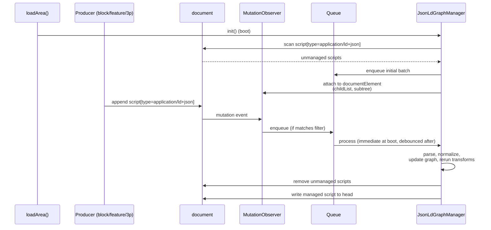
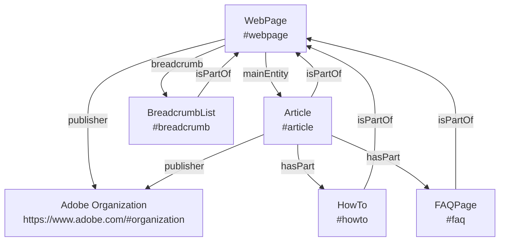
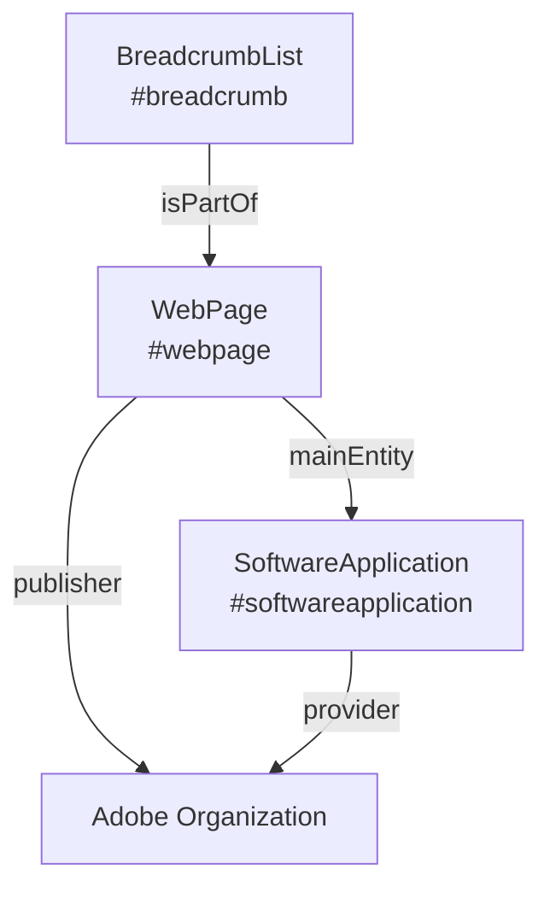

# Milo JSON-LD Graph Manager

> **Status:** DRAFT  

## Summary 

The JSON-LD Graph Manager is a Milo feature that collects all the JSON-LD on a page and rewrites it as **one canonical, linked `@graph`**. This centralization enables the manager to automatically apply JSON-LD graph features that may improve search engine and LLM visibility, such as cross-entity `@id` linking and singleton enforcement for certain types.

The feature is **disabled by default**. To enable, set the `jsonld-graph-manager` page metadata or URL query parameter to the string `true` (case-insensitive). The string `false` explicitly disables it. Presence without a value does not enable the feature. To enable debug logging of queue lifecycle events, add `jsonld-graph-manager-debug=true` as a URL query parameter.

## 1. Introduction

One strategy which may improve Adobe.com visibility across search engines and LLMs is to improve the consistency of JSON-LD across pages. We can define default nodes and relate individual nodes to one another to eliminate duplicated and contradictory nested nodes. This relationship may also improve understanding. Methods include using `@id` references, `mainEntity`, `sameAs`, `isPartOf`, etc.

Many Milo blocks and features produce JSON-LD. The problem is these producers write their JSON-LD to the page independently without any coordination or knowledge of each other. As of April 17, 2026 there were **33 integrations spread across 7 active sites**. Only 17 of those integrations are in `milo` itself. This makes these techniques difficult to coordinate manually.

The `JsonLdGraphManager` exists to convert these entities into a single graph. Consider a product page that today emits JSON-LD from `richresults` (Article, Organization), `gnav` (BreadcrumbList), `seotech` (VideoObject). The `<head>` ends up with four independent scripts, with overlapping entity definitions and inconsistent identifiers:

**Before** — `jsonld-graph-manager: false` — four isolated scripts, no links between them:

```html
<head>
  <!-- richresults -->
  <script type="application/ld+json">
  {
    "@type": "Organization",
    "name": "Adobe",
    "url": "https://www.adobe.com/"
  }
  </script>
  <!-- richresults -->
  <script type="application/ld+json">
  {
    "@type": "Article",
    "headline": "Photoshop",
    "author": { 
      "@type": "Organization",
      "name": "Adobe"
    }
  }
  </script>
  <!-- gnav -->
  <script type="application/ld+json">
  {
    "@type": "BreadcrumbList",
    "itemListElement": [ … ]
  }
  </script>
  <!-- seotech -->
  <script type="application/ld+json">
  {
    "@type": "VideoObject",
    "name": "Photoshop overview"
  }
  </script>
</head>
```

`Organization` is emitted twice (once standalone, once anonymous inside `Article`). Nothing links `Article` to `WebPage`.

**After** — `jsonld-graph-manager: true` — one script, entities linked by `@id`:

```html
<head>
  <script type="application/ld+json" data-milo-jsonld="graph">
  {
    "@context": "https://schema.org",
    "@graph": [
      {
        "@type": "Organization",
        "@id": "https://www.adobe.com/#organization",
        "name": "Adobe"
      },
      {
        "@type": "WebPage",
        "@id": "…#webpage",
        "publisher": { "@id": "https://www.adobe.com/#organization" },
        "breadcrumb": { "@id": "…#breadcrumb" },
        "mainEntity": { "@id": "…#article" }
      },
      {
        "@type": "Article",
        "@id": "…#article",
        "headline": "Photoshop",
        "isPartOf": { "@id": "…#webpage" },
        "mainEntityOfPage": { "@id": "…#webpage" },
        "publisher": { "@id": "https://www.adobe.com/#organization" }
      },
      {
        "@type": "BreadcrumbList",
        "@id": "…#breadcrumb",
        "isPartOf": { "@id": "…#webpage" },
        "itemListElement": [ … ]
      },
      {
        "@type": "VideoObject",
        "@id": "…#videoobject",
        "name": "Photoshop overview"
      }
    ]
  }
  </script>
</head>
```

`Organization` appears once and is referenced by `@id` from both `WebPage.publisher` and `Article.publisher`. `WebPage` is the graph root — it declares its `breadcrumb` and `mainEntity` by reference. `Article` links back via `isPartOf` and `mainEntityOfPage`. `BreadcrumbList` also declares `isPartOf` the `WebPage`. Every relationship is bidirectional and traversable.

See the `requirements` sheet of [structured-data-json-ld.json](https://milo.adobe.com/docs/authoring/structured-data-json-ld.json) for the list of rules for the managed graph. It is used together with this document to generate the implementation.

## 2. Design

### 2.1 Architecture Overview

The `JsonLdGraphManager` is a document-level runtime object initialized from the document branch of `loadArea()` in `libs/utils/utils.js`.

There are three main stages:

1. **Observe** — scan the DOM at boot, and watch for later appends via `MutationObserver`. Ingest and remove unmanaged JSON-LD scripts.
1. **Normalize** — apply canonical page-scoped identity to known entity types; merge conflicts by producer priority; dedupe singletons.
1. **Rewrite** — serialize one `@graph` into a single managed `<script>` in `<head>`.

### 2.2 Runtime Lifecycle

#### Ingestion and rebuild

Unmanaged JSON-LD reaches the manager through two entry points — a one-time boot scan and an ongoing `MutationObserver` — that both feed the same rebuild pipeline.

**At boot**, during document-level `loadArea()`, the manager initializes a singleton instance, scans the full document for `script[type="application/ld+json"]`, ignoring its own managed graph if one already exists, and attaches a `MutationObserver` for future additions.

**At runtime**, when a block, feature, experiment, or third-party script appends JSON-LD anywhere in the document subtree, the observer detects it and enqueues the event for sequential processing.

Both entry points converge on the same pipeline: for each unmanaged payload, the manager parses it, normalizes discovered entities, removes the unmanaged script from the DOM, updates the in-memory graph, reruns graph transforms, and rewrites the managed script in `document.head`.



The observer target is `document.documentElement` with `childList` and `subtree` enabled. Only added nodes that are, or contain, `script[type="application/ld+json"]` are enqueued. Managed output is excluded by filtering on the manager-owned selector `script[type="application/ld+json"][data-milo-jsonld="graph"]`.

#### Queueing and rebuild policy

Although JavaScript execution is single-threaded, the manager still uses an explicit queue. The queue provides:

- deterministic processing order
- protection from re-entrant writes
- one rebuild path for all producer types
- batching during high DOM churn

The manager performs an immediate boot write, then batches later rewrites on a debounce interval. The target behavior is that rebuilds do not occur faster than roughly once per second during steady-state mutation bursts.

### 2.3 Output Contract

The shape of the managed `<script>` and `@graph`, including required and optional attributes, identity rules, singletons, and entity linkage, is defined by the `requirements` sheet in [structured-data-json-ld.json](https://milo.adobe.com/docs/authoring/structured-data-json-ld.json). The manager's job is to produce output that satisfies every `error`-severity rule in that sheet.

Accepted input forms include a single JSON-LD object, an array of JSON-LD objects, or an object containing `@graph`. All accepted forms are flattened into one internal graph representation before transforms run.

Non-managed JSON-LD scripts are candidates for ingestion and removal regardless of where they appear in the document; the manager ignores its own managed graph (identified by the `data-milo-jsonld="graph"` attribute) during scan and observation.

### 2.4 Normalization And Merge Policy

The canonical `@id` values the manager assigns to each recognized entity type are defined in the `requirements` sheet (see `page-scoped-id-format` and `organization-site-wide-id`). Incoming producer `@id` values are treated as merge hints — for recognized entities, the manager rewrites `@id` to the canonical value. Unknown nodes that lack stable identity are retained provisionally until they can be normalized or deduplicated.

#### Merge priority

When multiple sources describe the same entity, the default source priority is:

1. graph-manager-generated transforms
1. Milo feature or block sources
1. third-party runtime sources
1. initial page DOM

#### Default merge rules

Unless a type-specific rule overrides them, the manager applies the following defaults:

- scalar field conflicts are resolved by source priority
- object fields are merged by key, with conflicting child fields resolved by source priority
- relationship arrays are unioned by canonical `@id`
- anonymous array members are deduplicated by normalized content hash when no stable `@id` exists
- unknown anonymous top-level nodes are retained provisionally until they can be normalized or deduplicated

Singleton, supplemental, and repeatable type policies are defined by the `requirements` sheet (`webpage-singleton`, `organization-singleton`, `breadcrumblist-singleton`, `required-primary-type`, `supplemental-singletons`, `repeatable-types`). Relationship arrays such as `hasPart` are unioned by canonical `@id`.

### 2.5 Canonical Page Graph Model

The manager treats `WebPage` as the page container and links related entities to it. Canonical `@id` values are defined in the preceding section.

#### Editorial page shape



This model is intended to be stable across separate producer implementations. The relationships shown — `mainEntity`, `breadcrumb`, `publisher`, `isPartOf`, `hasPart` — and their cardinality constraints are encoded as rules in the `requirements` sheet.

#### Product page shape



For product-oriented pages, `WebPage.mainEntity` points to `SoftwareApplication` rather than `Article`. The page-family-to-primary-entity mapping is owned by the public `tests` dataset.

### 2.6 Alternatives Considered

There are two additional approaches that have been tabled but should be reexamined in future.

**Coordinated producer migration.** Require every producer to adopt a shared interface — a direct-push API, a publish-subscribe bus, a declarative schema — before shipping anything. Rejected: the producer landscape currently spans 33 integrations across 7 repos, including legacy, external, and non-Milo sources, plus inline author-authored JSON-LD. Any such approach requires every producer to opt in on day one, cannot be feature-flagged per page, and strands producers that cannot be refactored at all. The observation-first design lets the ecosystem converge incrementally without blocking on any single producer. In the future we can offer a direct-push function as the preferred method and refactor existing components.

**Build-time aggregation.** Collect and normalize JSON-LD at publish time instead of at runtime. Rejected: much of today's JSON-LD is produced by runtime code (feature fetches, DOM derivations, experimentation) and by author-hand-coded inline scripts. A build-time aggregator would miss both categories, and the managed graph would not reflect what the browser actually renders. There are still valid use-cases for this approach to perform major portions of node generation.

## 3. Conformance

Testing for the `JsonLdGraphManager` is organized at three levels:

1. **Unit tests** cover the manager's internal behavior: parsing the accepted input shapes, identity-rewrite for known types, merge-priority resolution, and dedupe for singletons. These run under the existing Milo unit-test harness and should not depend on the network. Part of Milo.

2. **Integration tests** cover the boot and mutation lifecycle against representative DOM fixtures. Each fixture represents one page family (editorial, product, breadcrumb-only, multi-producer conflict, etc.) and asserts on the managed `@graph` output plus the removal of unmanaged scripts. Part of Milo.

3. **End-to-end tests** cover cohort pages listed in the public `tests` dataset. For each row, the test asserts the JSON-LD on the page meets all `requirements` and matches the row's defined Expected Primary Entity. End-to-end testing depends on a dev or stage deployment: once the branch is pushed, we can load AEM `.live` or `.page` URLs with `milolib=${BRANCH_NAME}` and `jsonld-graph-manager=true` to exercise the feature before merge. This feature could be considered complete once all `requirements` pass for every row in `tests`. Due to its complexity this test may exist outside of Milo.

Evaluating whether this feature actually improves how search engines and LLMs surface content is not in the scope of this document. 

## 4. Operations

### 4.1 Feature Flagging

**Flag:** `jsonld-graph-manager` (page metadata or URL query parameter, `true`/`false`, default `false`)

The manager is feature-gated by AEM page metadata so it can be enabled or disabled on selected pages and page families without affecting the entire site at once. You can also use the query parameter for quick testing.

**Debug flag:** `jsonld-graph-manager-debug` (URL query parameter only, `true` to enable)

### 4.2 Observability And Diagnostics

The manager should expose both local debugging output and production-safe warning and error reporting.

#### Debug logging

Add `jsonld-graph-manager-debug=true` to the URL query string to enable lifecycle logging via `console.log`. Events logged in queue order:

- **enqueue** — source (`bootDom` or `runtime`), DOM location, original captured payload
- **rebuild** — batch size, current graph size
- **parsed** — source, node count, `@type` values found
- **removed from DOM** — parent element of the ingested script
- **rewrite** — node count, full expandable `@graph` object

Debug mode is the appropriate place to surface per-source origin when needed; the production manager does not persist a provenance record on the canonical graph.

#### Warning and error reporting

Warnings and errors should be reported through `window.lana?.log(...)` using the existing repo conventions for tags and severity.

Representative cases:

- invalid JSON-LD that fails to parse
- unsupported payload shapes
- rewrite failures
- transform failures
- producer payloads that violate required assumptions

Recommended logging behavior:

- warnings use Lana warning severity
- errors use Lana error severity
- tags should identify the manager and, when useful, the producer (e.g., `jsonld-graph-manager` or `jsonld-graph-manager,seotech`)
- high-volume success-path events should not be sent to Lana by default

## References

[General structured data guidelines](https://developers.google.com/search/docs/appearance/structured-data/sd-policies). developers.google.com.

[Structured data catalog: structured-data-json-ld.json](https://milo.adobe.com/docs/authoring/structured-data-json-ld.json). milo.adobe.com. This AEM spreadsheet is the authoritative source for the normative graph specification, the validation cohort, the supported type inventory, and the integration registry. The `requirements` sheet in particular is consumed directly by the validator and transformer, so this document and that sheet must stay aligned. The catalog is organized into the following sheets:

- `sites` — `adobecom` AEM sites in scope, with their GitHub URLs.
- `requirements` — normative graph requirements that drive transformation and validation code.
- `tests` — validation cohort pages with their expected primary entity.
- `types` — reference of supported schema types with Milo, Google, and Schema.org status and documentation links.
- `integrations` — reference of known JSON-LD producer integrations across sites, with location, trigger, configuration source, and last-updated date.

## A. Canonical Examples

### Example 1: Editorial page graph

Nodes: `WebPage`, `Article`, `BreadcrumbList`, `HowTo`, `FAQPage`, and shared Adobe `Organization`.

```json
{
  "@context": "https://schema.org",
  "@graph": [
    {
      "@type": "Organization",
      "@id": "https://www.adobe.com/#organization",
      "name": "Adobe",
      "url": "https://www.adobe.com/"
    },
    {
      "@type": "WebPage",
      "@id": "https://www.adobe.com/products/photoshop-elements/features/tips-tricks-object-removal.html#webpage",
      "url": "https://www.adobe.com/products/photoshop-elements/features/tips-tricks-object-removal.html",
      "name": "Remove Objects from Photos | Photoshop Elements Tips & Tricks",
      "publisher": {
        "@id": "https://www.adobe.com/#organization"
      },
      "breadcrumb": {
        "@id": "https://www.adobe.com/products/photoshop-elements/features/tips-tricks-object-removal.html#breadcrumb"
      },
      "mainEntity": {
        "@id": "https://www.adobe.com/products/photoshop-elements/features/tips-tricks-object-removal.html#article"
      }
    },
    {
      "@type": "Article",
      "@id": "https://www.adobe.com/products/photoshop-elements/features/tips-tricks-object-removal.html#article",
      "headline": "How to Remove Unwanted Objects in Photoshop Elements",
      "description": "Learn how to remove unwanted objects and distractions from photos using the Remove Object tool in Adobe Photoshop Elements.",
      "isPartOf": {
        "@id": "https://www.adobe.com/products/photoshop-elements/features/tips-tricks-object-removal.html#webpage"
      },
      "publisher": {
        "@id": "https://www.adobe.com/#organization"
      },
      "mainEntityOfPage": {
        "@id": "https://www.adobe.com/products/photoshop-elements/features/tips-tricks-object-removal.html#webpage"
      },
      "hasPart": [
        {
          "@id": "https://www.adobe.com/products/photoshop-elements/features/tips-tricks-object-removal.html#howto"
        },
        {
          "@id": "https://www.adobe.com/products/photoshop-elements/features/tips-tricks-object-removal.html#faq"
        }
      ]
    },
    {
      "@type": "BreadcrumbList",
      "@id": "https://www.adobe.com/products/photoshop-elements/features/tips-tricks-object-removal.html#breadcrumb",
      "isPartOf": {
        "@id": "https://www.adobe.com/products/photoshop-elements/features/tips-tricks-object-removal.html#webpage"
      },
      "itemListElement": [
        {
          "@type": "ListItem",
          "position": 1,
          "name": "Photoshop Elements",
          "item": "https://www.adobe.com/products/photoshop-elements.html"
        },
        {
          "@type": "ListItem",
          "position": 2,
          "name": "Features",
          "item": "https://www.adobe.com/products/photoshop-elements/features.html"
        }
      ]
    },
    {
      "@type": "HowTo",
      "@id": "https://www.adobe.com/products/photoshop-elements/features/tips-tricks-object-removal.html#howto",
      "isPartOf": {
        "@id": "https://www.adobe.com/products/photoshop-elements/features/tips-tricks-object-removal.html#webpage"
      },
      "name": "How to Remove Objects from Photos in Photoshop Elements",
      "description": "Step-by-step instructions for removing unwanted objects from photos using the Remove Object tool in Photoshop Elements."
    },
    {
      "@type": "FAQPage",
      "@id": "https://www.adobe.com/products/photoshop-elements/features/tips-tricks-object-removal.html#faq",
      "isPartOf": {
        "@id": "https://www.adobe.com/products/photoshop-elements/features/tips-tricks-object-removal.html#webpage"
      },
      "mainEntity": [
        {
          "@type": "Question",
          "name": "What is Photoshop Elements and who is it for?",
          "acceptedAnswer": {
            "@type": "Answer",
            "text": "Photoshop Elements is an easy-to-use photo editing application designed for anyone who wants to enhance and create photos without professional experience."
          }
        }
      ]
    }
  ]
}
```

### Example 2: Product-oriented page graph

Primary node/entity is `SoftwareApplication` rather than `Article`.

```json
{
  "@context": "https://schema.org",
  "@graph": [
    {
      "@type": "Organization",
      "@id": "https://www.adobe.com/#organization",
      "name": "Adobe",
      "url": "https://www.adobe.com/"
    },
    {
      "@type": "WebPage",
      "@id": "https://www.adobe.com/products/photoshop.html#webpage",
      "url": "https://www.adobe.com/products/photoshop.html",
      "name": "Adobe Photoshop",
      "publisher": {
        "@id": "https://www.adobe.com/#organization"
      },
      "mainEntity": {
        "@id": "https://www.adobe.com/products/photoshop.html#softwareapplication"
      }
    },
    {
      "@type": "SoftwareApplication",
      "@id": "https://www.adobe.com/products/photoshop.html#softwareapplication",
      "name": "Adobe Photoshop",
      "url": "https://www.adobe.com/products/photoshop.html",
      "applicationCategory": "DesignApplication",
      "applicationSuite": "Adobe Creative Cloud",
      "operatingSystem": "Windows, macOS",
      "provider": {
        "@id": "https://www.adobe.com/#organization"
      },
      "brand": {
        "@type": "Brand",
        "@id": "https://www.adobe.com/#photoshop-brand",
        "name": "Photoshop"
      },
      "offers": [
        {
          "@type": "Offer",
          "@id": "https://www.adobe.com/products/photoshop.html#paid-offer",
          "name": "Photoshop subscription",
          "price": "19.99",
          "priceCurrency": "USD",
          "url": "https://www.adobe.com/products/photoshop.html",
          "availability": "https://schema.org/InStock"
        },
        {
          "@type": "Offer",
          "@id": "https://www.adobe.com/products/photoshop.html#free-trial",
          "name": "Free trial",
          "price": "0.00",
          "priceCurrency": "USD",
          "url": "https://www.adobe.com/products/photoshop.html",
          "availability": "https://schema.org/InStock"
        }
      ]
    }
  ]
}
```
