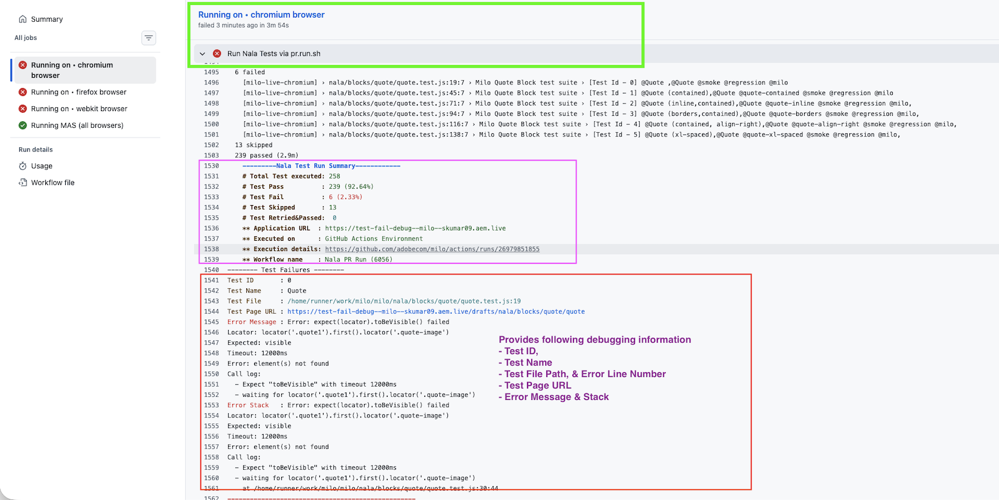

# Debugging NALA Test Failures in GitHub Pull Requests

This guide describes how Engineers can quickly investigate NALA test failures directly from GitHub Actions logs.

## Open the Failed GitHub Actions Run

1. Open the Pull Request.
2. Navigate to the **Checks** tab.
3. Open the failed GitHub Actions workflow.
4. Select the browser-specific job (for example, **Nala E2E UI Tests / Running on • chromium browser (pull_request)**).
5. Expand the **Run Nala Tests via pr.run.sh** step.

The NALA execution summary and failure details are printed under this step.

```text
chromium browser
└── Run Nala Tests via pr.run.sh
    └── Nala Test Run Summary
```

## Locate the Failure Summary

Scroll to the end of the **Run Nala Tests via pr.run.sh** logs and look for:

```text
---------Nala Test Run Summary------------
```

If any tests fail, a **Test Failures** section will be displayed.

Example:

```text
-------- Test Failures --------

Test ID       : 1
Test Name     : Quote (contained)
Test File     : /home/runner/work/milo/milo/nala/blocks/quote/quote.test.js:45
Test Page URL : https://test-fail-debug--milo--skumar09.aem.live/drafts/nala/blocks/quote/quote-contained

Error Message : Error: expect(locator).toBeVisible() failed
Locator: locator('.quote1').first().locator('.quote-image')
Expected: visible
Timeout: 12000ms
Error: element(s) not found

Error Stack   : expect(locator).toBeVisible() failed
Locator: locator('.quote1').first().locator('.quote-image')
Expected: visible
Timeout: 12000ms
Error: element(s) not found

Call log:
  - Expect "toBeVisible" with timeout 12000ms
  - waiting for locator('.quote1').first().locator('.quote-image')

    at /home/runner/work/milo/milo/nala/blocks/quote/quote.test.js:56:44
```

## Understanding the Failure Output

| Field | Description |
|---------|-------------|
| Test ID | Unique identifier associated with the test case |
| Test Name | Name of the failing test |
| Test File | Source test file and line number where the failing test is implemented |
| Test Page URL | URL under test when the failure occurred |
| Error Message | High-level reason for the failure |
| Error Stack | Detailed Playwright stack trace and assertion failure information |

## Example Screenshot


## Recommended Debugging Workflow

1. Open the failed GitHub Actions run.
2. Expand **Run Nala Tests via pr.run.sh**.
3. Locate the **Test Failures** section.
4. Open the referenced test file.
5. Reproduce the issue using the Test Page URL.
6. Review the Error Message and Error Stack.
7. Determine whether the failure is caused by:
   - Application defect
   - Test script issue
   - Environment issue
   - Data/content issue

##
